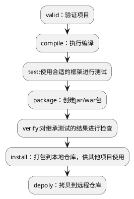

## java

### 1.Stream

#### 定义：

Stream（流）是一个来自数据源的元素队列并支持聚合操作

- 元素是特定类型的对象，形成一个队列。 Java中的Stream并不会存储元素，而是按需计算。
- **数据源** 流的来源。 可以是集合，数组，I/O channel， 产生器generator 等---不可以是map！！
- **聚合操作** 类似SQL语句一样的操作， 比如filter, map, reduce, find, match, sorted等。l

#### 接口继承关系图：

.jpg)


图中4种*stream*接口继承自`BaseStream`，其中`IntStream, LongStream, DoubleStream`对应三种基本类型（`int, long, double`，注意不是包装类型），`Stream`对应所有剩余类型的*stream*视图。为不同数据类型设置不同*stream*接口，可以1.提高性能，2.增加特定接口函数。

#### 和collections的比较

- **无存储**。*stream*不是一种数据结构，它只是某种数据源的一个视图，数据源可以是一个数组，Java容器或I/O channel等。
- **为函数式编程而生**。对*stream*的任何修改都不会修改背后的数据源，比如对*stream*执行过滤操作并不会删除被过滤的元素，而是会产生一个不包含被过滤元素的新*stream*。
- **惰式执行**。*stream*上的操作并不会立即执行，只有等到用户真正需要结果的时候才会执行。
- **可消费性**。*stream*只能被“消费”一次，一旦遍历过就会失效，就像容器的迭代器那样，想要再次遍历必须重新生成。

#### 常见api：

对*stream*的操作分为为两类，**中间操作(\*intermediate operations\*)和结束操作(\*terminal operations\*)**，二者特点是：

1. **中间操作总是会惰式执行**，调用中间操作只会生成一个标记了该操作的新*stream*，仅此而已。
2. **结束操作会触发实际计算**，计算发生时会把所有中间操作积攒的操作以*pipeline*的方式执行，这样可以减少迭代次数。计算完成之后*stream*就会失效。

| 操作类型 | 接口方法                                                     |
| -------- | ------------------------------------------------------------ |
| 中间操作 | concat() distinct() filter() flatMap() limit() map() peek() skip() sorted() parallel() sequential() unordered() |
| 结束操作 | allMatch() anyMatch() collect() count() findAny() findFirst() forEach() forEachOrdered() max() min() noneMatch() reduce() toArray() |

区分中间操作和结束操作最简单的方法，就是看方法的返回值，返回值为*stream*的大都是中间操作，否则是结束操作。

##### forEach

```java
// 使用Stream.forEach()迭代
Stream<String> stream = Stream.of("I", "love", "you", "too");
stream.forEach(str -> System.out.println(str));
```

##### filter

```java
// 保留长度等于3的字符串
Stream<String> stream= Stream.of("I", "love", "you", "too");
stream.filter(str -> str.length()==3)
    .forEach(str -> System.out.println(str));
```

##### distinct

```java
Stream<String> stream= Stream.of("I", "love", "you", "too", "too");
stream.distinct()
    .forEach(str -> System.out.println(str));
//去重 将第二个too去掉
```

##### sorted

排序函数有两个，一个是用自然顺序排序，一个是使用自定义比较器排序，函数原型分别为`Stream<T>　sorted()`和`Stream<T>　sorted(Comparator<? super T> comparator)`

```java
Stream<String> stream= Stream.of("I", "love", "you", "too");
stream.sorted((str1, str2) -> str1.length()-str2.length())
    .forEach(str -> System.out.println(str));
//按照长度升序排序
```

##### map

函数原型为`<R> Stream<R> map(Function<? super T,? extends R> mapper)`，作用是返回一个对当前所有元素执行执行`mapper`之后的结果组成的`Stream`。直观的说，就是对每个元素按照某种操作进行转换，转换前后`Stream`中元素的个数不会改变，但元素的类型取决于转换之后的类型。

```java
Stream<String> stream　= Stream.of("I", "love", "you", "too");
stream.map(str -> str.toUpperCase())
    .forEach(str -> System.out.println(str));
```

项目常用：

```java
List<ADto> rules = elist.stream().map(e -> {
            ADto aDto = new ADto();
            aDto.setBagId(e.getBagId());
            aDto.setLocale(e.getLocale());
            aDto.setRuleId(e.getRuleId());
            return aDto;
        }).collect(Collectors.toList());
//或者封装一个方法
List<ADto> rules = elist.stream().map(e -> convertA(e)
        ).collect(Collectors.toList());
```

##### peek

`Stream<T> peek(Consumer<? super T> action)`

> map和peek的区别

首先看定义

>  Stream<T> peek(Consumer<? super T> action);
>
> peek方法接收一个Consumer的入参。了解λ表达式的应该明白 Consumer的实现类 应该只有一个方法，该方法返回类型为void如:Consumer<Integer> c =  i -> System.out.println("hello" + i);

> map方法的入参为 Function。<R> Stream<R> map(Function<? super T, ? extends R> mapper);
>
> Function 的 λ表达式 可以这样写Function<Integer,String> f = x -> {return  "hello" + i;};

map函数对Stream中元素执行的是映射操作，会以新的元素(map的结果)填充新的Stream，严格的讲map不是修改原来的元素。peek只能消费Stream中的元素，是否可以更该Stream中的元素，取决于Stream中的元素是否是不可变对象。如果是不可变对象，则不可修改Stream中的元素；如果是可变对象，则可以修改对象的值，但是无法修改对象的引用.

不可变对象:

```java
List<String> list = Stream.of("one", "two", "three", "four")
        .filter(e -> e.length() > 3)
        .peek(s -> {
            s = s + "-" + s;
            System.out.println(s);
        })
        .map(String::toUpperCase)
        .peek(e -> System.out.println("Mapped value: " + e))
        .collect(Collectors.toList());
System.out.println(list);
```

结果:

```
three-three
Mapped value: THREE
four-four
Mapped value: FOUR
[THREE, FOUR]
```

可变对象:

```java
//peek常用案例
  List<User> userList=Stream.of(new User("a"),new User("b"),new User("c")).peek(u->u.setName("kkk")).collect(Collectors.toList());
        log.info("{}",userList);
//10:25:59.784 [main] INFO com.flydean.PeekUsage - [PeekUsage.User(name=kkk), PeekUsage.User(name=kkk), PeekUsage.User(name=kkk)]
```

##### flatmap

函数原型为`<R> Stream<R> flatMap(Function<? super T,? extends Stream<? extends R>> mapper)`，作用是对每个元素执行`mapper`指定的操作，并用所有`mapper`返回的`Stream`中的元素组成一个新的`Stream`作为最终返回结果。说起来太拗口，通俗的讲`flatMap()`的作用就相当于把原*stream*中的所有元素都"摊平"之后组成的`Stream`，转换前后元素的个数和类型都可能会改变。

```java
Stream<List<Integer>> stream = Stream.of(Arrays.asList(1,2), Arrays.asList(3, 4, 5));
stream.flatMap(list -> list.stream())
    .forEach(i -> System.out.println(i));
```

上述代码中，原来的`stream`中有两个元素，分别是两个`List<Integer>`，执行`flatMap()`之后，将每个`List`都“摊平”成了一个个的数字，所以会新产生一个由5个数字组成的`Stream`。所以最终将输出1~5这5个数字。

形象的例子：

现在学校通知关于数学教学的通知给家长。思路：找到所有教数学的老师，找到老师教的学生，找到学生的家长进行通知。

```java
public static void main(String[] args) {
        // 找到所有数学老师的学生的家长的电话,并找他们开家长会
        List<Parents> collect = teacs.stream()
                // 过滤数学老师
                .filter(t -> Subject.Math.getValue().equals(t.getSubject()))
                // 通过老师找学生
                .flatMap(t -> stus.stream().filter(s -> s.getTechId().equals(t.getId())))
                // 过滤重复的学生(使用student的equals和hashCode方法)
                .distinct()
                // 通过学生找家长(这里就简化为创建家长对象)
                .map(s -> {
                    Parents p = new Parents();
                    p.setId(UUID.randomUUID().toString());
                    p.setChirldId(s.getId());
                    p.setName(s.getName().toUpperCase() + "'s Parent");
                    p.setEmail((int) (Math.random() * 1000000) + "@qq.com");
                    return p;
                })
                .collect(Collectors.toList());
        // 打印到控制台看看
        collect.stream()
                .forEach(System.out::println);
    }
```

对于调用flatmap的流的每一个元素，执行flatmap入参中的函数式方法，由于该函数式方法必须返回一个stream<T>类型的流，这样对于调用flatmap的操作来说，就收集了另一种类型(<T>)的流，并在后续的操作中将<T>类型进行合并，最终产生一个stream<T>的流，而不是一个stream<stream<T>>类型的流。

> flapmap和map的区别：

#### 规约操作

规约操作（*reduction operation*）又被称作折叠操作（*fold*），是通过某个连接动作将所有元素汇总成一个汇总结果的过程。元素求和、求最大值或最小值、求出元素总个数、将所有元素转换成一个列表或集合，都属于规约操作。*Stream*类库有两个通用的规约操作`reduce()`和`collect()`，也有一些为简化书写而设计的专用规约操作，比如`sum()`、`max()`、`min()`、`count()`等。

##### reduce

`Optional<T> reduce(BinaryOperator<T> accumulator)`

`T reduce(T identity, BinaryOperator<T> accumulator)`

`<U> U reduce(U identity, BiFunction<U,? super T,U> accumulator, BinaryOperator<U> combiner)`

！！擅长生成一个值！！

`reduce()`最常用的场景就是从一堆值中生成一个值。用这么复杂的函数去求一个最大或最小值，你是不是觉得设计者有病。其实不然，因为“大”和“小”或者“求和"有时会有不同的语义。

```java
// 找出最长的单词
Stream<String> stream = Stream.of("I", "love", "you", "too");
Optional<String> longest = stream.reduce((s1, s2) -> s1.length()>=s2.length() ? s1 : s2);
//Optional<String> longest = stream.max((s1, s2) -> s1.length()-s2.length());
System.out.println(longest.get());
```

```java
//求出一组单词的长度之和。这是个“求和”操作，操作对象输入类型是String，而结果类型是Integer。
Stream<String> stream = Stream.of("I", "love", "you", "too");
Integer lengthSum = stream.reduce(0,　// 初始值　// (1)
        (sum, str) -> sum+str.length(), // 累加器 // (2)
        (a, b) -> a+b);　// 部分和拼接器，并行执行时才会用到 // (3)
// int lengthSum = stream.mapToInt(str -> str.length()).sum();
System.out.println(lengthSum);
```

##### collect！！！！！！

！！擅长生成一个集合或者是Map等复杂对象！！

```java
// 将Stream转换成容器或Map
//上述代码分别列举了如何将Stream转换成List、Set和Map
Stream<String> stream = Stream.of("I", "love", "you", "too");
List<String> list = stream.collect(Collectors.toList()); // (1)
// Set<String> set = stream.collect(Collectors.toSet()); // (2)
// Map<String, Integer> map = stream.collect(Collectors.toMap(Function.identity(), String::length)); // (3)
//System.out.println(map);
//{love=4, too=3, I=1, you=3}
```

> *Function*是一个接口，那么`Function.identity()`是什么意思呢？这要从两方面解释：

1. Java 8允许在接口中加入具体方法。接口中的具体方法有两种，*default*方法和*static*方法，`identity()`就是*Function*接口的一个静态方法。
2. `Function.identity()`是Lambda表达式对象，意思是返回的输出和输入一样，等价于形如`t -> t`形式的Lambda表达式。

> ::

诸如`String::length`的语法形式叫做方法引用（*method references*），这种语法用来替代某些特定形式Lambda表达式。如果Lambda表达式的全部内容就是调用一个已有的方法，那么可以用方法引用来替代Lambda表达式。方法引用可以细分为四类：

| 方法引用类别       | 举例             |
| ------------------ | ---------------- |
| 引用静态方法       | `Integer::sum`   |
| 引用某个对象的方法 | `list::add`      |
| 引用某个类的方法   | `String::length` |
| 引用构造方法       | `HashMap::new`   |

>转成list，set

*collect()*方法定义为`<R> R collect(Supplier<R> supplier, BiConsumer<R,? super T> accumulator, BiConsumer<R,R> combiner)`，三个参数依次对应上述三条分析。不过每次调用*collect()*都要传入这三个参数太麻烦，收集器*Collector*就是对这三个参数的简单封装。

```java
//　将Stream规约成List
Stream<String> stream = Stream.of("I", "love", "you", "too");
List<String> list = stream.collect(ArrayList::new, ArrayList::add, ArrayList::addAll);// 方式１
//List<String> list = stream.collect(Collectors.toList());// 方式2
System.out.println(list);
```

当想要确切的制定返回的类型，而不是接口类型的时候

```java
// 使用toCollection()指定规约容器的类型
ArrayList<String> arrayList = stream.collect(Collectors.toCollection(ArrayList::new));// (3)
HashSet<String> hashSet = stream.collect(Collectors.toCollection(HashSet::new));// (4)
```

> 转成map

```java
// 使用toMap()统计学生GPA
Map<Student, Double> studentToGPA =
     students.stream().collect(Collectors.toMap(Functions.identity(),// 如何生成key
                                     student -> computeGPA(student)));// 如何生成value
```

```java
// Partition students into passing and failing
Map<Boolean, List<Student>> passingFailing = students.stream()
         .collect(Collectors.partitioningBy(s -> s.getGrade() >= PASS_THRESHOLD));
```

```java
// Group employees by department
Map<Department, List<Employee>> byDept = employees.stream()
            .collect(Collectors.groupingBy(Employee::getDepartment));
//增强版groupingBy
// 使用下游收集器统计每个部门的人数
Map<Department, Integer> totalByDept = employees.stream()
                    .collect(Collectors.groupingBy(Employee::getDepartment,
                                                   Collectors.counting()));// 下游收集器
//下游收集器还可以有更下游的收集器
// 按照部门对员工分布组，并只保留员工的名字
Map<Department, List<String>> byDept = employees.stream()
                .collect(Collectors.groupingBy(Employee::getDepartment,
                        Collectors.mapping(Employee::getName,// 下游收集器
                                Collectors.toList())));// 更下游的收集器
                               
```

```java
//Collectors.joining()
// 使用Collectors.joining()拼接字符串
Stream<String> stream = Stream.of("I", "love", "you");
//String joined = stream.collect(Collectors.joining());// "Iloveyou"
//String joined = stream.collect(Collectors.joining(","));// "I,love,you"
String joined = stream.collect(Collectors.joining(",", "{", "}"));// "{I,love,you}"
```

#### 收集器

收集器（*Collector*）是为`Stream.collect()`方法量身打造的工具接口（类）。考虑一下将一个*Stream*转换成一个容器（或者*Map*）需要做哪些工作？我们至少需要两样东西：

1. 目标容器是什么？是*ArrayList*还是*HashSet*，或者是个*TreeMap*。
2. 新元素如何添加到容器中？是`List.add()`还是`Map.put()`

如果并行的进行规约，还需要告诉*collect()* 3. 多个部分结果如何合并成一个。

详情见上面的例子。

```java
//测试代码
public class Java8TestStream {
    public static void main(String args[]){
        System.out.println("使用 Java 7: ");

        // 计算空字符串
        List<String> strings = Arrays.asList("abc", "", "bc", "efg", "abcd","", "jkl");
        System.out.println("列表: " +strings);
        long count = getCountEmptyStringUsingJava7(strings);

        System.out.println("空字符数量为: " + count);
        count = getCountLength3UsingJava7(strings);

        System.out.println("字符串长度为 3 的数量为: " + count);

        // 删除空字符串
        List<String> filtered = deleteEmptyStringsUsingJava7(strings);
        System.out.println("筛选后的列表: " + filtered);

        // 删除空字符串，并使用逗号把它们合并起来
        String mergedString = getMergedStringUsingJava7(strings,", ");
        System.out.println("合并字符串: " + mergedString);
        List<Integer> numbers = Arrays.asList(3, 2, 2, 3, 7, 3, 5);

        // 获取列表元素平方数
        List<Integer> squaresList = getSquares(numbers);
        System.out.println("平方数列表: " + squaresList);
        List<Integer> integers = Arrays.asList(1,2,13,4,15,6,17,8,19);

        System.out.println("列表: " +integers);
        System.out.println("列表中最大的数 : " + getMax(integers));
        System.out.println("列表中最小的数 : " + getMin(integers));
        System.out.println("所有数之和 : " + getSum(integers));
        System.out.println("平均数 : " + getAverage(integers));
        System.out.println("随机数: ");

        // 输出10个随机数
        Random random = new Random();

        for(int i=0; i < 10; i++){
            System.out.println(random.nextInt());
        }

        System.out.println("使用 Java 8: ");
        
        
        System.out.println("列表: " +strings);
		//过滤器！！！！！
        count = strings.stream().filter(string->string.isEmpty()).count();
        System.out.println("空字符串数量为: " + count);

        count = strings.stream().filter(string -> string.length() == 3).count();
        System.out.println("字符串长度为 3 的数量为: " + count);
		
        
        //过滤器后转化为其他类型
        filtered = strings.stream().filter(string ->!string.isEmpty()).limit(3).collect(Collectors.toList());
        System.out.println("筛选后的列表: " + filtered);
/**
	//用这种方法也已将类集合选择其中两个属性转化为map形式
	Map<String, String> map = tagsList.stream().collect(Collectors.toMap(Tag::getTagName, Tag::getTagColor));
	
*/
        mergedString = strings.stream().filter(string ->!string.isEmpty()).collect(Collectors.joining(", "));
        System.out.println("合并字符串: " + mergedString);

        squaresList = numbers.stream().map( i ->i*i).distinct().collect(Collectors.toList());
        System.out.println("Squares List: " + squaresList);
        System.out.println("列表: " +integers);

        IntSummaryStatistics stats = integers.stream().mapToInt((x) ->x).summaryStatistics();
        List<Integer> reverseIntegers = integers.stream().map(i -> i * i).sorted((x, y) -> y - x).collect(Collectors.toList());
        System.out.println("数字平方倒序输出："+reverseIntegers);

        System.out.println("列表中最大的数 : " + stats.getMax());
        System.out.println("列表中最小的数 : " + stats.getMin());
        System.out.println("所有数之和 : " + stats.getSum());
        System.out.println("平均数 : " + stats.getAverage());
        System.out.println("随机数: ");

        random.ints().limit(10).sorted().forEach(System.out::println);

        // 并行处理
        count = strings.parallelStream().filter(string -> string.isEmpty()).count();
        System.out.println("空字符串的数量为: " + count);
    }

    private static int getCountEmptyStringUsingJava7(List<String> strings){
        int count = 0;

        for(String string: strings){

            if(string.isEmpty()){
                count++;
            }
        }
        return count;
    }

    private static int getCountLength3UsingJava7(List<String> strings){
        int count = 0;

        for(String string: strings){

            if(string.length() == 3){
                count++;
            }
        }
        return count;
    }

    private static List<String> deleteEmptyStringsUsingJava7(List<String> strings){
        List<String> filteredList = new ArrayList<String>();

        for(String string: strings){

            if(!string.isEmpty()){
                filteredList.add(string);
            }
        }
        return filteredList;
    }

    private static String getMergedStringUsingJava7(List<String> strings, String separator){
        StringBuilder stringBuilder = new StringBuilder();

        for(String string: strings){

            if(!string.isEmpty()){
                stringBuilder.append(string);
                stringBuilder.append(separator);
            }
        }
        String mergedString = stringBuilder.toString();
        return mergedString.substring(0, mergedString.length()-2);
    }

    private static List<Integer> getSquares(List<Integer> numbers){
        List<Integer> squaresList = new ArrayList<Integer>();

        for(Integer number: numbers){
            Integer square = new Integer(number.intValue() * number.intValue());

            if(!squaresList.contains(square)){
                squaresList.add(square);
            }
        }
        return squaresList;
    }

    private static int getMax(List<Integer> numbers){
        int max = numbers.get(0);

        for(int i=1;i < numbers.size();i++){

            Integer number = numbers.get(i);

            if(number.intValue() > max){
                max = number.intValue();
            }
        }
        return max;
    }

    private static int getMin(List<Integer> numbers){
        int min = numbers.get(0);

        for(int i=1;i < numbers.size();i++){
            Integer number = numbers.get(i);

            if(number.intValue() < min){
                min = number.intValue();
            }
        }
        return min;
    }

    private static int getSum(List numbers){
        int sum = (int)(numbers.get(0));

        for(int i=1;i < numbers.size();i++){
            sum += (int)numbers.get(i);
        }
        return sum;
    }

    private static int getAverage(List<Integer> numbers){
        return getSum(numbers) / numbers.size();
    }
}

```

### 2.时间

> java.util.Date。实现类，其对象具有时间、日期组件。
>
> java.util.Calendar。抽象类，其对象具有时间、日期组件。
>
> java.sql.Date。实现类，其对象具有日期组件。---无日期组件
>
> java.sql.Time。实现类，其对象具有时间组件。----无时间组件
>
> java.sql.Timestamp。实现类，其对象具有时间日期组件。
>
> java.text.DateFormat。抽象类，其对象格式化时间日期。

#### 例子：

```java
/**
		*	展示各个日期时间组件的输出类型
		*/
		java.sql.Date sqlDate = new java.sql.Date(System.currentTimeMillis());
		System.out.println(sqlDate.toString()); // 输出结果：2015-06-25
		
		java.sql.Time sqlTime = new java.sql.Time(System.currentTimeMillis());
		System.out.println(sqlTime.toString()); // 输出结果：09:13:43
		
		java.sql.Timestamp sqlTimestamp = new java.sql.Timestamp(System.currentTimeMillis());
		System.out.println(sqlTimestamp.toString()); // 输出结果：2015-06-25 09:13:43.561
		
		java.util.Date utilDate = new java.util.Date(System.currentTimeMillis());
		System.out.println(utilDate.toString()); // 输出结果：Thu Jun 25 09:13:43 CST 2015
		
		java.util.Calendar cl = java.util.Calendar.getInstance();
		System.out.println(cl.getTime().toString()); // 输出结果：Thu Jun 25 09:13:43 CST 2015

```

#### SimpleDateFormat

```java
/**
		 * java.text.SimpleDateFormat的用法
		 */
		SimpleDateFormat df = new SimpleDateFormat("yyyy-MM-dd HH:mm:ss");
		Timestamp now = new Timestamp(System.currentTimeMillis());
		System.out.println(now); // 2015-06-25 14:27:41.477
		String time = df.format(now);
		System.out.println(time); // 2015-06-25 14:27:41
		System.out.println(Timestamp.valueOf(time)); // 2015-06-25 14:27:41.0
 
		Date now1 = new Date();
		System.out.println(now); // 2015-06-25 14:27:41.477
		String time1 = df.format(now1);
		System.out.println(time1); // 2015-06-25 14:27:41
		System.out.println(Timestamp.valueOf(time1)); // 2015-06-25 14:27:41.0

		//字符串类型转换为日期类型
		Date date;
        date = df.parse(strTime);
```

#### Calendar

```java
/**
	 * java.util.Calendar的用法
	 */
	Calendar calendar1 = Calendar.getInstance();
	System.out.println(calendar1); // java.util.GregorianCalendar[time=1435214975097,areFieldsSet=true,
	// areAllFieldsSet=true,lenient=true,zone=sun.util.calendar.ZoneInfo[id="Asia/Shanghai",
	// offset=28800000,dstSavings=0,useDaylight=false,transitions=19,lastRule=null],
	// firstDayOfWeek=1,minimalDaysInFirstWeek=1,ERA=1,YEAR=2015,MONTH=5,
	// WEEK_OF_YEAR=26,WEEK_OF_MONTH=4,DAY_OF_MONTH=25,DAY_OF_YEAR=176,DAY_OF_WEEK=5,DAY_OF_WEEK_IN_MONTH=4,
	// AM_PM=1,HOUR=2,HOUR_OF_DAY=14,MINUTE=49,SECOND=35,MILLISECOND=97,ZONE_OFFSET=28800000,DST_OFFSET=0]
 
	// 获取时间
	Date date1 = calendar1.getTime();
	System.out.println(date1); // Thu Jun 25 14:49:35 CST 2015
	System.out.println(calendar1.getWeeksInWeekYear()); // 52
	System.out.println(calendar1.get(Calendar.DAY_OF_MONTH)); // 25
	System.out.println(calendar1.get(Calendar.HOUR_OF_DAY)); // 14

```

#### 获取几天前的日期

##### timestamp

```java
/**
	 * 获取系统的当前时间
	 * 
	 * @return 返回 Timestamp 类型的时间
	 */
	public static Timestamp getNowTime_tamp() {
		// 获取当前时间
		Date now = new Date();
		Long tim = now.getTime();
		Timestamp time = new Timestamp(tim);
		return time;
    }
//获取7天前的日期
public static Timestamp getA_Few_dayTWOTime_tamp(int n) {
 Calendar c = Calendar.getInstance();
        c.setTime(new Date());
        c.add(Calendar.DATE,-7);
        Date dateBegin = c.getTime();
        Timestamp beginTime = new Timestamp(dateBegin.getTime());
    return beginTime;
    /**
    *   返回字符串形式
    *	String yesterday = new SimpleDateFormat("yyyy-MM-dd ").format(cal.getTime());
	*	yesterday = yesterday.trim();
	*	return yesterday;
	*/
}
```


### 3.mapstruct

> 属性映射：专门用来处理 domin 实体类与 model 类的属性映射的，和BeanUtils的copyProperties作用差不多，但是比起强大。

#### [github地址](https://github.com/mapstruct/mapstruct/)

#### [例子](https://github.com/mmzsblog/mapstructDemo/tree/master/src/main)

- 依赖

```xml
 <dependency>
        <groupId>org.mapstruct</groupId>
        <artifactId>mapstruct-jdk8</artifactId>
        <version>1.2.0.Final</version>
    </dependency>
    <dependency>
        <groupId>org.mapstruct</groupId>
        <artifactId>mapstruct-processor</artifactId>
        <version>1.2.0.Final</version>
    </dependency>
```

- 实体类和被映射类

```java
// 实体类
@Data
@NoArgsConstructor
@AllArgsConstructor
@Builder
public class User {
    private Integer id;
    private String name;
    private String createTime;
    private LocalDateTime updateTime;
}

// 被映射类VO1:和实体类一模一样
@Data
@NoArgsConstructor
@AllArgsConstructor
@Builder
public class UserVO1 {
    private Integer id;
    private String name;
    private String createTime;
    private LocalDateTime updateTime;
}

// 被映射类VO1:比实体类少一个字段
@Data
@NoArgsConstructor
@AllArgsConstructor
@Builder
public class UserVO2 {
    private Integer id;
    private String name;
    private String createTime;

}
```

- 接口

```java
//spring: 生成的实现类上面会自动添加一个@Component注解，可以通过Spring的 @Autowired方式进行注入
//default: 这是默认的情况，mapstruct 不使用任何组件类型, 可以通过Mappers.getMapper(Class)方式获取自动生成的实例对象。
@Mapper(componentModel = "spring")
public interface UserCovertBasic {
    UserCovertBasic INSTANCE = Mappers.getMapper(UserCovertBasic.class);

    /**
     * 字段数量类型数量相同，利用工具BeanUtils也可以实现类似效果
     * @param source
     * @return
     */
    UserVO1 toConvertVO1(User source);
    User fromConvertEntity1(UserVO1 userVO1);
    //集合的转换
    List<UserVO1> toConvertVOList(List<User> source);

    /**
     * 字段数量类型相同,数量少：仅能让多的转换成少的，故没有fromConvertEntity2
     * @param source
     * @return
     */
    UserVO2 toConvertVO2(User source);
}
```

- 使用

```java
@RestController
public class TestController {

    @GetMapping("convert")
    public Object convertEntity() {
        User user = User.builder()
                .id(1)
                .name("张三")
                .createTime("2020-04-01 11:05:07")
                .updateTime(LocalDateTime.now())
                .build();
        List<Object> objectList = new ArrayList<>();

        objectList.add(user);

        // 使用mapstruct
        UserVO1 userVO1 = UserCovertBasic.INSTANCE.toConvertVO1(user);
        objectList.add("userVO1:" + UserCovertBasic.INSTANCE.toConvertVO1(user));
        objectList.add("userVO1转换回实体类user:" + UserCovertBasic.INSTANCE.fromConvertEntity1(userVO1));
        // 输出转换结果
        objectList.add("userVO2:" + " | " + UserCovertBasic.INSTANCE.toConvertVO2(user));
        // 使用BeanUtils
        UserVO2 userVO22 = new UserVO2();
        BeanUtils.copyProperties(user, userVO22);
        objectList.add("userVO22:" + " | " + userVO22);

        return objectList;
    }
}
```

可以查看IDE的编译结果

```java
@Component
public class UserCovertBasicImpl implements UserCovertBasic {
    public UserCovertBasicImpl() {
    }

    public UserVO1 toConvertVO1(User source) {
        if (source == null) {
            return null;
        } else {
            UserVO1 userVO1 = new UserVO1();
            userVO1.setId(source.getId());
            userVO1.setName(source.getName());
            userVO1.setCreateTime(source.getCreateTime());
            userVO1.setUpdateTime(source.getUpdateTime());
            return userVO1;
        }
    }

    public User fromConvertEntity1(UserVO1 userVO1) {
        if (userVO1 == null) {
            return null;
        } else {
            User user = new User();
            user.setId(userVO1.getId());
            user.setName(userVO1.getName());
            user.setCreateTime(userVO1.getCreateTime());
            user.setUpdateTime(userVO1.getUpdateTime());
            return user;
        }
    }

    public UserVO2 toConvertVO2(User source) {
        if (source == null) {
            return null;
        } else {
            UserVO2 userVO2 = new UserVO2();
            userVO2.setId(source.getId());
            userVO2.setName(source.getName());
            userVO2.setCreateTime(source.getCreateTime());
            return userVO2;
        }
    }
}
```

#### 特殊情况：

##### 类型不一致

- 新的被映射对象

```java
@Data
@NoArgsConstructor
@AllArgsConstructor
@Builder
public class UserVO3 {
    private String id;
    private String name;
    // 实体类该属性是String
    private LocalDateTime createTime;
    // 实体类该属性是LocalDateTime
    private String updateTime;
}
```

- 接口

```java
@Mappings({
            @Mapping(target = "createTime", expression = "java(com.java.mmzsblog.util.DateTransform.strToDate(source.getCreateTime()))"),
    })
    UserVO3 toConvertVO3(User source);

    User fromConvertEntity3(UserVO3 userVO3);
```

上面 `expression` 指定的表达式内容如下：

```java
public class DateTransform {
    public static LocalDateTime strToDate(String str){
        DateTimeFormatter df = DateTimeFormatter.ofPattern("yyy-MM-dd HH:mm:ss");
        return LocalDateTime.parse("2018-01-12 17:07:05",df);
    }

}
```

当字段类型不一致时，以下的类型之间是 `mapstruct` 自动进行类型转换的:

- 1、基本类型及其他们对应的包装类型。
  此时 `mapstruct` 会自动进行拆装箱。不需要人为的处理
- 2、基本类型的包装类型和string类型之间

除此之外的类型转换我们可以通过定义表达式来进行指定转换。

##### 字段不一致

- 新的被映射对象

```java
@Data
@NoArgsConstructor
@AllArgsConstructor
@Builder
public class UserVO4 {
    // 实体类该属性名是id
    private String userId;
    // 实体类该属性名是name
    private String userName;
    private String createTime;
    private String updateTime;
}
```

- 定义接口


```java
 @Mappings({
            @Mapping(source = "id", target = "userId"),
            @Mapping(source = "name", target = "userName")
    })
    UserVO4 toConvertVO(User source);
    
    User fromConvertEntity(UserVO4 userVO4);
```

当字段名不一致时，通过使用 `@Mappings` 注解指定对应关系，编译后即可实现对应字段的赋值。

##### 属性是枚举类型

- 实体类

```java
@Data
@NoArgsConstructor
@AllArgsConstructor
@Builder
public class UserEnum {
    private Integer id;
    private String name;
    private UserTypeEnum userTypeEnum;
}
```

- 被映射对象

```java
@Data
@NoArgsConstructor
@AllArgsConstructor
@Builder
public class UserVO5 {
    private Integer id;
    private String name;
    private String type;
}
```

- 枚举类对象

```java
@Getter
@AllArgsConstructor
public enum UserTypeEnum {
    Java("000", "Java开发工程师"),
    DB("001", "数据库管理员"),
    LINUX("002", "Linux运维员");
    
    private String value;
    private String title;

}
```

- 接口

```java
    @Mapping(source = "userTypeEnum", target = "type")
    UserVO5 toConvertVO5(UserEnum source);

    UserEnum fromConvertEntity5(UserVO5 userVO5);
```

`mapstruct` 通过枚举类型的内容，帮我们把枚举类型转换成字符串，并给type赋值

### 4.PageHelper

#### 例子：

```java
public PageBean<ProjectEntity> queryAllByConditionAndPage(List<Long> projectIdList, String name, String productLine, String source, Integer status, Integer creator, Date submitTimeFrom, Date submitTimeTo, Date deadlineFrom, Date deadlineTo, Date estimateCompleteFrom, Date estimateCompleteTo,
                                                              String sortName, String sortOrder, Boolean isFilterCreated, int pageNo, int pageSize) {


        ProjectExample example = initSelectProjectExample(projectIdList, name, productLine, creator, status == null ? null : Collections.singletonList(status), source, submitTimeFrom, submitTimeTo, deadlineFrom, deadlineTo, estimateCompleteFrom, estimateCompleteTo, isFilterCreated);
        example.setOrderByClause(sortName + " " + sortOrder);
      //直接使用Pagehelper
        PageHelper.startPage(pageNo, pageSize);
        List<Project> list = projectMapper.selectByExample(example);
    //用PageInfo将结果集封装
        PageInfo<Project> pageInfo = new PageInfo<>(list);
        List<ProjectEntity> entityList = list.stream().map(this::converetToProjectEntity).collect(Collectors.toList());
    //pageInfo就可以方便的得到pageNum,pageSize,total,list
        return new PageBean<>(pageInfo.getPageNum(), pageInfo.getPageSize(), pageInfo.getTotal(), entityList);
    }
```

### 5.复制

```java
//map是一个已有数据的值		
Map<String, Long> projectTabTotal = new HashMap<>();
        map.forEach((k, v) -> projectTabTotal.put(k.toString(), v));
```

```java
	List<Tag> tags = tumaTagQconfig.getTagsList();
        ArrayList<TagDTO> tagDTOS = new ArrayList<>();

        tags.forEach(tag->{
            TagDTO tagDTO = ConvertUtil.convert(tag, TagDTO.class);
            tagDTOS.add(tagDTO);
        });

```

### 6.[属性描述器PropertyDescriptor](https://unclecatmyself.github.io/2019/01/19/propertyDescriptor/)

> 简介：就是通过，传入属性名和类名，获取某个类的实例(也可以先改变类的属性值，再获取类的实例)

例：

```java
//set get toString 方法省略
public class Cat {

    private String name;

    private String describe;

    private int age;

    private int weight;
}
```

```
 //三种构造函数
 //1.传入属性名和类名 （实际是调用第二种构造函数，内部拼接了get和set方法调用了第二种构造函数）
 PropertyDescriptor CatPropertyOfName = new PropertyDescriptor("name", Cat.class);
 //2.第二种构造函数，传入属性名 类名 对应属性的get和set方法名
 PropertyDescriptor CatPropertyOfName = new PropertyDescriptor("name", Cat.class,"getName","setName");
 //3.第三种构造函数，属性名 属性对应的get和set方法名
        Class<?> classType = Cat.class;
        Method CatNameOfRead = classType.getMethod("getName");
        Method CatNameOfWrite = classType.getMethod("setName", String.class);
        PropertyDescriptor CatPropertyOfName = new PropertyDescriptor("name", CatNameOfRead,CatNameOfWrite);
        
        
     System.out.println(CatPropertyOfName.getPropertyType());
     System.out.println(CatPropertyOfName.getPropertyEditorClass());
     System.out.println(CatPropertyOfName.getReadMethod());
     System.out.println(CatPropertyOfName.getWriteMethod());     
```

```
结果：
class java.lang.String
null
public java.lang.String entity.Cat.getName()
public void entity.Cat.setName(java.lang.String)
```

应用：

1.

```java
 public static void main(String[] args) throws Exception {
        //获取类
        Class classType = Class.forName("com.example.demo.beans.Cat");
        Object catObj = classType.newInstance();
        //获取Name属性
        PropertyDescriptor catPropertyOfName = new PropertyDescriptor("name",classType);
        //得到对应的写方法
        Method writeOfName = catPropertyOfName.getWriteMethod();
        //将值赋进这个类中
        writeOfName.invoke(catObj,"river");
        Cat cat = (Cat)catObj;
        System.out.println(cat.toString());
    }
输出：
    Cat{name=’river’, describe=’null’, age=0, weight=0}
```

2.

```java
 public static void main(String[] args) throws Exception {
        //一开始的默认对象
        Cat cat = new Cat("river","黑猫",2,4);
        //获取name属性
        PropertyDescriptor catPropertyOfName = new PropertyDescriptor("name",Cat.class);
        //得到读方法
        Method readMethod = catPropertyOfName.getReadMethod();
        //获取属性值
        String name = (String) readMethod.invoke(cat);
        System.out.println("默认：" + name);
        //得到写方法
        Method writeMethod = catPropertyOfName.getWriteMethod();
        //修改值
        writeMethod.invoke(cat,"copy");
        System.out.println("修改后：" + cat);
    }
输出：
    默认：river 修改后：Cat{name=’copy’, describe=’黑猫’, age=2, weight=4}
```

3.取http的请求头中的token和appid（见携程实习 work 2 切面）：

```java
public class ReflectUtils {
//instance传入请求的实例，fieldname传入字符串 “requestHeader”
public static Object invokeGetter(Object instance, String fieldName) throws IntrospectionException, InvocationTargetException, IllegalAccessException {
    PropertyDescriptor pd = new PropertyDescriptor(fieldName, instance.getClass());
    return pd.getReadMethod().invoke(instance);
}
}
```

```java
 RequestHeaderType questHeader=(RequestHeaderType) ReflectUtils.invokeGetter(request,“requestHeader”);
questHeader.getToken();
questHeader.getAppId();
```

### 7.[Optional](https://www.cnblogs.com/rjzheng/p/9163246.html)

#### 使用例子：

例1：

```java
//嵌套式对象判断---旧写法
public String getCity(User user)  throws Exception{
		if(user!=null){
			if(user.getAddress()!=null){
				Address address = user.getAddress();
				if(address.getCity()!=null){
					return address.getCity();
				}
			}
		}
		throw new Excpetion("取值错误"); 
	}
//新的写法
public String getCity(User user) throws Exception{
	return Optional.ofNullable(user)
				   .map(u-> u.getAddress())
				   .map(a->a.getCity())
				   .orElseThrow(()->new Exception("取指错误"));
}
```

例2：

```java
//单个判断----旧
if(user!=null){
	dosomething(user);
}
//新的写法
 Optional.ofNullable(user)
         .ifPresent(u->{
		    dosomething(u);
		 });
```

例3：

```java
//单个 属性判断----旧
public User getUser(User user) throws Exception{
	if(user!=null){
		String name = user.getName();
		if("zhangsan".equals(name)){
			return user;
		}
	}else{
		user = new User();
		user.setName("zhangsan");
		return user;
	}
}
//新
public User getUser(User user) {
	return Optional.ofNullable(user)
	               .filter(u->"zhangsan".equals(u.getName()))
	               .orElseGet(()-> {
                		User user1 = new User();
                		user1.setName("zhangsan");
                		return user1;
	               });
}
```

#### api

- (1)Optional(T value),empty(),of(T value),ofNullable(T value) 均是返回Optional对象

  ​	Optional(T value)是构造函数

  ​	of(T value)内部使用了构造函数，value为空的时候报，NullPointerException

  ​															value不为空的时候，正常构造一个Optional对象

  ​	empty()的作用是返回一个value=null的Optional对象

  ​	ofNullable不会报空指针异常，都会返回一个Option对象

- (2)orElse(T other)，orElseGet(Supplier<? extends T> other)和orElseThrow(Supplier<? extends X> exceptionSupplier)

  ```java
  @Test
  public void test() {
  	User user = null;
  	user = Optional.ofNullable(user).orElse(createUser());
  	user = Optional.ofNullable(user).orElseGet(() -> createUser());
  	User user = null;
  	Optional.ofNullable(user).orElseThrow(()->new Exception("用户不存在"));
  }
  public User createUser(){
  	User user = new User();
  	user.setName("zhangsan");
  	return user;
  }
  ```

  区别：当user值不为null时，orElse函数依然会执行createUser()方法，而orElseGet函数并不会执行createUser()方法；orElseThrow是value值为null时,直接抛一个异常出去

- (3) map(Function<? super T, ? extends U> mapper)和flatMap(Function<? super T, Optional<U>> mapper)

  ```java
  //map
  public class User {
  	private String name;
  	public String getName() {
  		return name;
  	}
  }
  String city = Optional.ofNullable(user).map(u-> u.getName()).get();
  
  ```

  ```java
  //flatmap
  public class User {
  	private String name;
  	public Optional<String> getName() {
  		return Optional.ofNullable(name);
  	}
  }
  
  String city = Optional.ofNullable(user).flatMap(u-> u.getName()).get();
  ```

- (4) isPresent()和ifPresent(Consumer<? super T> consumer)

  ```java
  User user = Optional.ofNullable(user);
  if (Optional.isPresent()){
     // TODO: do something
  }
  
  Optional.ofNullable(user).ifPresent(u->{
  			// TODO: do something
  		});
  ```

- (5) filter(Predicate<? super T> predicate)

  ```java
  Optional<User> user1 = Optional.ofNullable(user).filter(u -> u.getName().length()<6);
  ```

### 8.[动态代理](https://louluan.blog.csdn.net/article/details/24589193)

#### class文件简介和加载

Java编译器编译好Java文件之后，产生.class 文件在磁盘中。这种class文件是二进制文件，内容是只有JVM虚拟机能够识别的机器码。JVM虚拟机读取字节码文件，取出二进制数据，加载到内存中，解析.class 文件内的信息，生成对应的 Class对象:

.jpg)

代码模拟字节码加载成class对象的过程：

```java

/**
 * 程序猿类
 * @author louluan
 */
public class Programmer {
 
	public void code()
	{
		System.out.println("I'm a Programmer,Just Coding.....");
	}

```

```java

/**
 * 自定义一个类加载器，用于将字节码转换为class对象
 * @author louluan
 */
public class MyClassLoader extends ClassLoader {
 
	public Class<?> defineMyClass( byte[] b, int off, int len) 
	{
		return super.defineClass(b, off, len);
	}
	
```

```java
public class MyTest {
 
	public static void main(String[] args) throws IOException {
		//读取本地的class文件内的字节码，转换成字节码数组
		File file = new File(".");
		InputStream  input = new FileInputStream(file.getCanonicalPath()+"\\bin\\samples\\Programmer.class");
		byte[] result = new byte[1024];
		
		int count = input.read(result);
		// 使用自定义的类加载器将 byte字节码数组转换为对应的class对象
		MyClassLoader loader = new MyClassLoader();
		Class clazz = loader.defineMyClass( result, 0, count);
		//测试加载是否成功，打印class 对象的名称
		System.out.println(clazz.getCanonicalName());
                
               //实例化一个Programmer对象
               Object o= clazz.newInstance();
               try {
                   //调用Programmer的code方法
                    clazz.getMethod("code", null).invoke(o, null);
                   } catch (IllegalArgumentException | InvocationTargetException
                        | NoSuchMethodException | SecurityException e) {
                     e.printStackTrace();
                  }
 }
}
```

#### 运行期间生成二进制字节码(即运行时动态创建类）

 由于JVM通过字节码的二进制信息加载类的，那么，如果我们在运行期系统中，遵循Java编译系统组织.class文件的格式和结构，生成相应的二进制数据，然后再把这个二进制数据加载转换成对应的类，这样，就完成了在代码中，动态创建一个类的能力了。

.jpg)


##### 	ASM框架

ASM 是一个 Java 字节码操控框架。它能够以二进制形式修改已有类或者动态生成类。ASM 可以直接产生二进制 class 文件，也可以在类被加载入 Java 虚拟机之前动态改变类行为。ASM 从类文件中读入信息后，能够改变类行为，分析类信息，甚至能够根据用户要求生成新类。

通俗的说：就是在代码里生成字节码，并且动态的加载class对象，创建实例。

##### 	Javassist

​		Javassist是一个开源的分析、编辑和创建Java字节码的类库。

#### 代理的构成

代理模式上，基本上有Subject角色，RealSubject角色，Proxy角色。其中：Subject角色负责定义RealSubject和Proxy角色应该实现的接口；RealSubject角色用来真正完成业务服务功能；Proxy角色负责将自身的Request请求，调用realsubject 对应的request功能来实现业务功能，自己不真正做业务。
.jpg)

​			这张图是**静态代理模式**，`当在代码阶段规定这种代理关系，Proxy类通过编译器编译成class文件，当系统运行时，此class已经存在了。这种静态的代理模式固然在访问无法访问的资源，增强现有的接口业务功能方面有很大的优点，但是大量使用这种静态代理，会使我们系统内的类的规模增大，并且不易维护；并且由于Proxy和RealSubject的功能 本质上是相同的，Proxy只是起到了中介的作用，这种代理在系统中的存在，导致系统结构比较臃肿和松散。`

 为了解决这个问题，就有了动态地创建Proxy的想法：在运行状态中，需要代理的地方，根据Subject 和RealSubject，动态地创建一个Proxy，用完之后，就会销毁，这样就可以避免了Proxy 角色的class在系统中冗杂的问题了。

##### 	实例：

​	 将车站的售票服务抽象出一个接口TicketService,包含问询，卖票，退票功能，车站类Station实现了TicketService接口，车票代售点StationProxy则实现了代理角色的功能。

​	.jpg)

​		> 静态代理模式

```java

/**
 * 售票服务接口 
 * @author louluan
 */
public interface TicketService {
 
	//售票
	public void sellTicket();
	
	//问询
	public void inquire();
	
	//退票
	public void withdraw();
}
```

```java
/**
 * 售票服务接口实现类，车站
 * @author louluan
 */
public class Station implements TicketService {
 
	@Override
	public void sellTicket() {
		System.out.println("\n\t售票.....\n");
	}
 
	@Override
	public void inquire() {
        System.out.println("\n\t问询。。。。\n");
	}
 
	@Override
	public void withdraw() {
        System.out.println("\n\t退票......\n");
	}
 
}
```

```java

/**
 * 车票代售点
 * @author louluan
 *
 */
public class StationProxy implements TicketService {
 
	private Station station;
 
	public StationProxy(Station station){
		this.station = station;
	}
	
	@Override
	public void sellTicket() {
 
		// 1.做真正业务前，提示信息
		this.showAlertInfo("××××您正在使用车票代售点进行购票，每张票将会收取5元手续费！××××");
		// 2.调用真实业务逻辑
		station.sellTicket();
		// 3.后处理
		this.takeHandlingFee();
		this.showAlertInfo("××××欢迎您的光临，再见！××××\n");
 
	}
 
	@Override
	public void inquire() {
		// 1做真正业务前，提示信息
		this.showAlertInfo("××××欢迎光临本代售点，问询服务不会收取任何费用，本问询信息仅供参考，具体信息以车站真实数据为准！××××");
		// 2.调用真实逻辑
		station.inquire();
		// 3。后处理
		this.showAlertInfo("××××欢迎您的光临，再见！××××\n");
	}
 
	@Override
	public void withdraw() {
		// 1。真正业务前处理
		this.showAlertInfo("××××欢迎光临本代售点，退票除了扣除票额的20%外，本代理处额外加收2元手续费！××××");
		// 2.调用真正业务逻辑
		station.withdraw();
		// 3.后处理
		this.takeHandlingFee();
 
	}
 
	/*
	 * 展示额外信息
	 */
	private void showAlertInfo(String info) {
		System.out.println(info);
	}
 
	/*
	 * 收取手续费
	 */
	private void takeHandlingFee() {
		System.out.println("收取手续费，打印发票。。。。。\n");
	}
 
}

```

如果我们用上述的ASM或者Javassist框架创建动态代理的时候，需要书写许多业务代码。所以....

#### InvocationHandler

将业务代码部分分割出来，

.jpg)

有上图可以看出，代理类处理的逻辑很简单：在调用某个方法前及方法后做一些额外的业务。换一种思路就是：在触发（invoke）真实角色的方法之前或者之后做一些额外的业务。那么，为了构造出具有通用性和简单性的代理类，可以将所有的触发真实角色动作交给一个触发的管理器，让这个管理器统一地管理触发。这种管理器就是Invocation Handler。
通俗的理解，静态代理的方法中，代理Proxy中的方法，都是调用了realSubject中的对应的方法

而动态代理中，外界对Proxy校色中每个方法的调用，Proxy都会交给InvocationHandler来处理，而InvocationHandler则调用具体对象的角色进行处理。

.jpg)

所以，**代理Proxy 和RealSubject 应该实现相同的功能**，也就是都具有某个类的public方法！！！！

在面向对象的编程之中，如果我们想要约定Proxy 和RealSubject可以实现相同的功能，有两种方式：

    a.一个比较直观的方式，就是定义一个功能接口，然后让Proxy 和RealSubject来实现这个接口。
    
    b.还有比较隐晦的方式，就是通过继承。因为如果Proxy 继承自RealSubject，这样Proxy则拥有了RealSubject的功能，Proxy还可以通过重写RealSubject中的方法，来实现多态。
这就对用了两种动态代理的方式jdk！！和cglib！！！

#### JDK动态代理

 比如现在想为RealSubject这个类创建一个动态代理对象，JDK主要会做以下工作：

    1.   获取 RealSubject上的所有接口列表；
    2.   确定要生成的代理类的类名，默认为：com.sun.proxy.$ProxyXXXX ；
    
    3.   根据需要实现的接口信息，在代码中动态创建 该Proxy类的字节码；
    
    4 .  将对应的字节码转换为对应的class 对象；
    
    5.   创建InvocationHandler 实例handler，用来处理Proxy所有方法调用；
    
    6.   Proxy 的class对象 以创建的handler对象为参数，实例化一个proxy对象
##### 	理论：

​		通过java.lang.reflect.Proxy的newProxyInstance（ClassLoader loader,Class<?>[] interfaces,InvocationHandler）方法创建代理。

​	对于参数InvocationHandler，我们需要实现invoke方法：
​	在调用代理对象中的每一个方法时，在代码内部，都是直接调用了InvocationHandler 的invoke方法，而invoke方法根据代理类传递给自己的method参数来区分是什么方法。

##### 	实例：


​	现在定义两个接口Vehicle和Rechargable，Vehicle表示交通工具类，有drive()方法；Rechargable接口表示可充电的（工具），有recharge() 方法；

  定义一个实现两个接口的类ElectricCar，类图如下：

​	.jpg)

为ElectricCar创建动态代理类：

```java
public class Test {
 
	public static void main(String[] args) {
 
		ElectricCar car = new ElectricCar();
		// 1.获取对应的ClassLoader
		ClassLoader classLoader = car.getClass().getClassLoader();
 
		// 2.获取ElectricCar 所实现的所有接口
		Class[] interfaces = car.getClass().getInterfaces();
		// 3.设置一个来自代理传过来的方法调用请求处理器，处理所有的代理对象上的方法调用
		InvocationHandler handler = new InvocationHandlerImpl(car);
		/*
		  4.根据上面提供的信息，创建代理对象 在这个过程中， 
                         a.JDK会通过根据传入的参数信息动态地在内存中创建和.class 文件等同的字节码
		                 b.然后根据相应的字节码转换成对应的class， 
                         c.然后调用newInstance()创建实例
		 */
		Object o = Proxy.newProxyInstance(classLoader, interfaces, handler);
		Vehicle vehicle = (Vehicle) o;
		vehicle.drive();
		Rechargable rechargeable = (Rechargable) o;
		rechargeable.recharge();
	}
}

```

```java
public class InvocationHandlerImpl implements InvocationHandler {
 
	private ElectricCar car;
	
	public InvocationHandlerImpl(ElectricCar car)
	{
		this.car=car;
	}
	
	@Override
	public Object invoke(Object paramObject, Method paramMethod,
			Object[] paramArrayOfObject) throws Throwable {
		System.out.println("You are going to invoke "+paramMethod.getName()+" ...");
		paramMethod.invoke(car, null);
		System.out.println(paramMethod.getName()+" invocation Has Been finished...");
		return null;
	}
 /**
 * 电能车类，实现Rechargable，Vehicle接口
 * @author louluan
 */
public class ElectricCar implements Rechargable, Vehicle {
 
	@Override
	public void drive() {
		System.out.println("Electric Car is Moving silently...");
	}
 
	@Override
	public void recharge() {
		System.out.println("Electric Car is Recharging...");
	}
 
}

/**
 * 可充电设备接口
 * @author louluan
 */
public interface Rechargable {
 
	public void recharge();
}

/**
 * 交通工具接口
 * @author louluan
 */
public interface Vehicle {
	public void drive();
}
```

结果：

.jpg)

##### 保存动态代理的字节码：

```java
public class ProxyUtils {
 
	/*
	 * 将根据类信息 动态生成的二进制字节码保存到硬盘中，
	 * 默认的是clazz目录下
         * params :clazz 需要生成动态代理类的类
         * proxyName : 为动态生成的代理类的名称
         */
	public static void generateClassFile(Class clazz,String proxyName)
	{
		//根据类信息和提供的代理类名称，生成字节码
                byte[] classFile = ProxyGenerator.generateProxyClass(proxyName, clazz.getInterfaces()); 
		String paths = clazz.getResource(".").getPath();
		System.out.println(paths);
		FileOutputStream out = null;  
        
        try {
            //保留到硬盘中
            out = new FileOutputStream(paths+proxyName+".class");  
            out.write(classFile);  
            out.flush();  
        } catch (Exception e) {  
            e.printStackTrace();  
        } finally {  
            try {  
                out.close();  
            } catch (IOException e) {  
                e.printStackTrace();  
            }  
        }  
	}
	
}

```


数据库现在我们想将生成的代理类起名为“ElectricCarProxy”，并保存在硬盘，应该使用以下语句：

```java
ProxyUtils.generateClassFile(car.getClass(), "ElectricCarProxy");
```

可以用但编译工具jd-gui.exe进行查看。

##### 总结：

仔细观察可以看出生成的动态代理类有以下特点:
1.继承自 java.lang.reflect.Proxy，实现了 Rechargable,Vehicle 这两个ElectricCar实现的接口；

2.类中的所有方法都是final 的；

3.所有的方法功能的实现都统一调用了InvocationHandler的invoke()方法。

.jpg)

#### Cglib动态代理

​	JDK中提供的生成动态代理类的机制有个鲜明的特点是： 某个类必须有实现的接口，而生成的代理类也只能代理某个类接口定义的方法，比如：如果上面例子的ElectricCar实现了继承自两个接口的方法外，另外实现了方法bee() ,则在产生的动态代理类中不会有这个方法了！更极端的情况是：如果某个类没有实现接口，那么这个类就不能同JDK产生动态代理了！

​	幸好我们有cglib。“CGLIB（Code Generation Library），是一个强大的，高性能，高质量的Code生成类库，它可以在运行期扩展Java类与实现Java接口。”

cglib 创建某个类A的动态代理类的模式是：

1. 查找A上的所有非final 的public类型的方法定义；

2. 将这些方法的定义转换成字节码；

3. 将组成的字节码转换成相应的代理的class对象；

4. 实现 MethodInterceptor接口，用来处理 对代理类上所有方法的请求（这个接口和JDK动态代理InvocationHandler的功能和角色是一样的）

   ##### 实例：

   ```java
   
   /**
    * 程序猿类
    * @author louluan
    */
   public class Programmer {
    
   	public void code()
   	{
   		System.out.println("I'm a Programmer,Just Coding.....");
   	}
   }
   
   ```

   ```java
   
   /*
    * 实现了方法拦截器接口
    */
   public class Hacker implements MethodInterceptor {
   	@Override
   	public Object intercept(Object obj, Method method, Object[] args,
   			MethodProxy proxy) throws Throwable {
   		System.out.println("**** I am a hacker,Let's see what the poor programmer is doing Now...");
   		proxy.invokeSuper(obj, args);
   		System.out.println("****  Oh,what a poor programmer.....");
   		return null;
   	}
    
   
   ```

   ```java
   
   public class Test {
    
   	public static void main(String[] args) {
   		Programmer progammer = new Programmer();
   		
   		Hacker hacker = new Hacker();
   		//cglib 中加强器，用来创建动态代理
   		Enhancer enhancer = new Enhancer();  
                    //设置要创建动态代理的类
   		enhancer.setSuperclass(progammer.getClass());  
                  // 设置回调，这里相当于是对于代理类上所有方法的调用，都会调用CallBack，而Callback则需要实行intercept()方法进行拦截
                   enhancer.setCallback(hacker);
                   Programmer proxy =(Programmer)enhancer.create();
                   proxy.code();
           
   	}
   }
   
   ```

   结果：

   .jpg)

### 9.String.format

文本处理工具，为我们提供了强大的字符串转化功能。

#### api：

```java
// 使用当前本地区域对象（Locale.getDefault()）格式化字符串
String String.format(String fmt, Object... args);

// 自定义本地区域对象格式化字符串
String String.format(Locale locale, String fmt, Object... args);
```

#### 字符、字符串的格式化：

> 格式：%【index$】【标识】【最小宽度】

常用标识：

 -  -标识最小宽度内左对齐，右边用空格补上

可用转化符：

```
  s，字符串类型。
  c，字符类型，实参必须为char或int、short等可转换为char类型的数据类型，否则抛IllegalFormatConversionException异常。

  b，布尔类型，只要实参为非false的布尔类型，均格式化为字符串true，否则为字符串false。

  n，平台独立的换行符（与通过 System.getProperty("line.separator") 是一样的）
```

实例：

```java
String raw = "hello";
//用于设置格式化后的字符串最小长度，若使用 [最小宽度] 而无设置 [标识] ，那么当字符串长度小于最小宽度时，则以左边补空格的方式凑够最小宽度。
String str = String.format("%1$7s", raw);
// 简化,
//String str = String.format("%7s", raw);
//输出：将"hello"格式化为"  hello"

String raw = "hello";
//此时设置了标识-  标识最小宽度内左对齐，右边用空格补上
String str = String.format("%1$-7s", raw);
// 简化
//String str = String.format("%-7s", raw);
//输出：将"hello"格式化为"hello  "

//1$标识占位符对应的索引
String str = String.format("%1$s，%2$s", raw,"baby");
//输出：hello，baby
String str = String.format("%1$s，%1$s", raw,"baby");
//输出：hello，hello
```

#### 整数的格式化：

> 格式：%【index$】【标识】*【最小宽度】转换符 （布尔b,十进制整数d,十六进制整数x，）

常用标识：

```
-，在最小宽度内左对齐,不可以与0标识一起使用。
0，若内容长度不足最小宽度，则在左边用0来填充。
#，对8进制和16进制，8进制前添加一个0,16进制前添加0x。
+，结果总包含一个+或-号。
空格，正数前加空格，负数前加-号。
,，只用与十进制，每3位数字间用,分隔。
(，若结果为负数，则用括号括住，且不显示符号。
```

可用转化符：

```
b，布尔类型，只要实参为非false的布尔类型，均格式化为字符串true，否则为字符串false。
d，整数类型（十进制）。
x，整数类型（十六进制）。
o，整数类型（八进制）
n，平台独立的换行符, 也可通过System.getProperty("line.separator")获取
```

实例：

```java
int num = 1;
String str = String.format("%04d", num)
//结果：将1显示为0001
int num = -1000;
String str = String.format("%(,d", num)
//结果：将-1000显示为(1,000)
```

#### 浮点数格式化：

> 格式：%【index$】【标识】*【最小宽度】【.精度】

可用标识：

```
-，在最小宽度内左对齐,不可以与0标识一起使用。
0，若内容长度不足最小宽度，则在左边用0来填充。
#，对8进制和16进制，8进制前添加一个0,16进制前添加0x。
+，结果总包含一个+或-号。
空格，正数前加空格，负数前加-号。
,，只用与十进制，每3位数字间用,分隔。
(，若结果为负数，则用括号括住，且不显示符号。
```

可用转化符：

```
b，布尔类型，只要实参为非false的布尔类型，均格式化为字符串true，否则为字符串false。
n，平台独立的换行符, 也可通过System.getProperty("line.separator")获取。
f，浮点数型（十进制）。显示9位有效数字，且会进行四舍五入。如99.99。
a，浮点数型（十六进制）。
e，指数类型。如9.38e+5。
g，浮点数型（比%f，%a长度短些，显示6位有效数字，且会进行四舍五入）
```

实例：

```
double num = 123.4567899;
System.out.print(String.format("%f %n", num)); // 123.456790 
System.out.print(String.format("%a %n", num)); // 0x1.edd3c0bb46929p6 
System.out.print(String.format("%g %n", num)); // 123.457
```

#### 日期格式化：

>格式：%【index$】t转化符

可用转换符：

```
//日期
c，星期六 十月 27 14:21:20 CST 2007
F，2007-10-27
D，10/27/07
r，02:25:51 下午
T，14:28:16
R，14:28
b, 月份简称
B, 月份全称
a, 星期简称
A, 星期全称
C, 年前两位（不足两位补零）
y, 年后两位（不足两位补零）
j, 当年的第几天
m, 月份（不足两位补零）
d, 日期（不足两位补零）
e, 日期（不足两位不补零）

//时间
H, 24小时制的小时（不足两位补零）
k, 24小时制的小时（不足两位不补零）
I, 12小时制的小时（不足两位补零）
i, 12小时制的小时（不足两位不补零）
M, 分钟（不足两位补零）
S, 秒（不足两位补零）
L, 毫秒（不足三位补零）
N, 毫秒（不足9位补零）
p, 小写字母的上午或下午标记，如中文为“下午”，英文为pm
z, 相对于GMT的时区偏移量，如+0800
Z, 时区缩写，如CST
s, 自1970-1-1 00:00:00起经过的秒数
Q, 自1970-1-1 00:00:00起经过的豪秒
```

#### 特殊转换符：

<，用于格式化前一个转换符所描述的参数。

```
int num = 1000;
String str = String.format("%d %<,d", num);
// 结果"1000 1,000
```

### 11.常用工具类

#### 	11.1.JsonUtils

```java
public class JsonUtils {

    private static Logger log = LoggerFactory.getLogger(JsonUtils.class);

    private static final Gson GSON = new Gson();

    public static String toJsonGson(Object object) {
        try {
            return GSON.toJson(object);
        } catch (Exception e) {
            log.error("toJsonGson error", e);
        }
        return null;
    }

    public static <T> T fromJsonGson(String json, Class<T> clazz) {
        try {
            return GSON.fromJson(json, clazz);
        } catch (Exception e) {
            log.error("fromJsonGson error", e);
        }
        return null;
    }

    public static <T> List<T> fromJsonListGson(String json, Class<T> clazz) {
        return GSON.fromJson(json, TypeToken.getParameterized(List.class, clazz).getType());
    }

}
```

#### 11.2.BeanUtils

```java

import com.ctrip.ibu.tuma.exception.BeanUtilsException;
import org.springframework.beans.BeanWrapper;
import org.springframework.beans.BeanWrapperImpl;
import org.springframework.util.CollectionUtils;

import java.beans.PropertyDescriptor;
import java.lang.reflect.Field;
import java.util.*;

/**
 * 类转换
 */
public class BeanUtils {
    /**
     * <pre>
     *     List<UserBean> userBeans = userDao.queryUsers();
     *     List<UserDTO> userDTOs = BeanUtil.batchTransform(UserDTO.class, userBeans);
     * </pre>
     */
    public static <T> List<T> batchTransform(final Class<T> clazz, List<?> srcList) {
        if (CollectionUtils.isEmpty(srcList)) {
            return Collections.emptyList();
        }

        List<T> result = new ArrayList<>(srcList.size());
        for (Object srcObject : srcList) {
            result.add(transform(clazz, srcObject));
        }
        return result;
    }

    /**
     * 封装{@link org.springframework.beans.BeanUtils  copyProperties}，惯用与直接将转换结果返回
     *
     * <pre>
     *      UserBean userBean = new UserBean("username");
     *      return BeanUtil.transform(UserDTO.class, userBean);
     * </pre>
     */
    public static <T> T transform(Class<T> clazz, Object src) {
        if (src == null) {
            return null;
        }
        T instance;
        try {
            instance = clazz.newInstance();
        } catch (Exception e) {
            throw new BeanUtilsException(e);
        }
        org.springframework.beans.BeanUtils.copyProperties(src, instance, getNullPropertyNames(src));
        return instance;
    }

    private static String[] getNullPropertyNames(Object source) {
        final BeanWrapper src = new BeanWrapperImpl(source);
        PropertyDescriptor[] pds = src.getPropertyDescriptors();

        Set<String> emptyNames = new HashSet<>();
        for (PropertyDescriptor pd : pds) {
            Object srcValue = src.getPropertyValue(pd.getName());
            if (srcValue == null) {
                emptyNames.add(pd.getName());
            }
        }
        String[] result = new String[emptyNames.size()];
        return emptyNames.toArray(result);
    }


    /**
     * 用于将一个列表转换为列表中的对象的某个属性映射到列表中的对象
     *
     * <pre>
     *      List<UserDTO> userList = userService.queryUsers();
     *      Map<Integer, userDTO> userIdToUser = BeanUtil.mapByKey("userId", userList);
     * </pre>
     *
     * @param key 属性名
     */
    @SuppressWarnings("unchecked")
    public static <K, V> Map<K, V> mapByKey(String key, List<?> list) {
        Map<K, V> map = new HashMap<>();
        if (CollectionUtils.isEmpty(list)) {
            return map;
        }
        try {
            Class<?> clazz = list.get(0).getClass();
            Field field = deepFindField(clazz, key);
            if (field == null) throw new IllegalArgumentException("Could not find the key");
            field.setAccessible(true);
            for (Object o : list) {
                map.put((K) field.get(o), (V) o);
            }
        } catch (Exception e) {
            throw new BeanUtilsException(e);
        }
        return map;
    }

    /**
     * 根据列表里面的属性聚合
     *
     * <pre>
     *       List<ShopDTO> shopList = shopService.queryShops();
     *       Map<Integer, List<ShopDTO>> city2Shops = BeanUtil.aggByKeyToList("cityId", shopList);
     * </pre>
     */
    @SuppressWarnings("unchecked")
    public static <K, V> Map<K, List<V>> aggByKeyToList(String key, List<?> list) {
        Map<K, List<V>> map = new HashMap<>();
        if (CollectionUtils.isEmpty(list)) {// 防止外面传入空list
            return map;
        }
        try {
            Class<?> clazz = list.get(0).getClass();
            Field field = deepFindField(clazz, key);
            if (field == null) {
                throw new IllegalArgumentException("Could not find the key");
            }
            field.setAccessible(true);
            for (Object o : list) {
                K k = (K) field.get(o);
                map.computeIfAbsent(k, k1 -> new ArrayList<>());
                map.get(k).add((V) o);
            }
        } catch (Exception e) {
            throw new BeanUtilsException(e);
        }
        return map;
    }

    /**
     * 用于将一个对象的列表转换为列表中对象的属性集合
     *
     * <pre>
     *     List<UserDTO> userList = userService.queryUsers();
     *     Set<Integer> userIds = BeanUtil.toPropertySet("userId", userList);
     * </pre>
     */
    @SuppressWarnings("unchecked")
    public static <K> Set<K> toPropertySet(String key, List<?> list) {
        Set<K> set = new HashSet<>();
        if (CollectionUtils.isEmpty(list)) {// 防止外面传入空list
            return set;
        }
        try {
            Class<?> clazz = list.get(0).getClass();
            Field field = deepFindField(clazz, key);
            if (field == null) {
                throw new IllegalArgumentException("Could not find the key");
            }
            field.setAccessible(true);
            for (Object o : list) {
                set.add((K) field.get(o));
            }
        } catch (Exception e) {
            throw new BeanUtilsException(e);
        }
        return set;
    }


    private static Field deepFindField(Class<?> clazz, String key) {
        Field field = null;
        while (!clazz.getName().equals(Object.class.getName())) {
            try {
                field = clazz.getDeclaredField(key);
                if (field != null) {
                    break;
                }
            } catch (Exception e) {
                clazz = clazz.getSuperclass();
            }
        }
        return field;
    }


    /**
     * 获取某个对象的某个属性
     */
    public static Object getProperty(Object obj, String fieldName) {
        try {
            Field field = deepFindField(obj.getClass(), fieldName);
            if (field != null) {
                field.setAccessible(true);
                return field.get(obj);
            }
        } catch (Exception e) {
            throw new BeanUtilsException(e);
        }
        return null;
    }

    /**
     * 设置某个对象的某个属性
     */
    public static void setProperty(Object obj, String fieldName, Object value) {
        try {
            Field field = deepFindField(obj.getClass(), fieldName);
            if (field != null) {
                field.setAccessible(true);
                field.set(obj, value);
            }
        } catch (Exception e) {
            throw new BeanUtilsException(e);
        }
    }

    /**
     * @param source
     * @param target
     */
    public static void copyProperties(Object source, Object target, String... ignoreProperties) {
        org.springframework.beans.BeanUtils.copyProperties(source, target, ignoreProperties);
    }
}

```

#### 11.3DateUtils

```java
//日期的获取和各个格式的转换

import java.sql.Timestamp;
import java.time.DayOfWeek;
import java.time.LocalDate;
import java.time.LocalDateTime;
import java.time.ZoneId;
import java.time.ZoneOffset;
import java.util.Date;

public class DateUtils {
    private static final ZoneId ZONE_ID = ZoneOffset.of("+8");

    public static LocalDateTime nowAtTime() {
        return LocalDateTime.now(ZONE_ID);
    }

    public static LocalDate nowAtDate() {
        return LocalDate.now(ZONE_ID);
    }

    public static Timestamp nowAtTimestamp() {
        return toTimestamp(nowAtTime());
    }

    public static Date toDate(LocalDate localDate) {
        return Date.from(localDate.atStartOfDay().atZone(ZONE_ID).toInstant());
    }

    public static Date toDate(LocalDateTime localDateTime) {
        return Date.from(localDateTime.atZone(ZONE_ID).toInstant());
    }

    public static Timestamp toTimestamp(LocalDate localDate) {
        return Timestamp.valueOf(localDate.atStartOfDay());
    }

    public static Timestamp toTimestamp(LocalDateTime localDateTime) {
        return Timestamp.valueOf(localDateTime);
    }

    public static LocalDate toLocalDate(Date date) {
        return date.toInstant().atZone(ZONE_ID).toLocalDate();
    }

    public static LocalDateTime toLocalDateTime(Date date) {
        return date.toInstant().atZone(ZONE_ID).toLocalDateTime();
    }

    public static boolean isWeekend(LocalDate startDate) {
        DayOfWeek dayOfWeek = startDate.getDayOfWeek();
        return DayOfWeek.SATURDAY.equals(dayOfWeek) || DayOfWeek.SUNDAY.equals(dayOfWeek);
    }

    public static boolean isWorkday(LocalDate startDate) {
        return !isWeekend(startDate);
    }

    public static int getWorkdaysBetween(LocalDate startDate, LocalDate endDate) {
        int workdays = 0;
        for (LocalDate tempDate = startDate; tempDate.isBefore(endDate); tempDate = tempDate.plusDays(1)) {
            if (isWorkday(tempDate)) {
                workdays++;
            }
        }
        return workdays;
    }

}
```

#### 11.4 okhttp3工具类

```java
public interface OsgClient {

    List<CostCenterDto> getCostCenter();

}

```


```java
public class AbstractOsgClient {
    protected Optional<JSONObject> postForJson(String url, String accessToken, JSONObject requestBody) {

        JSONObject postJson = new JSONObject();
        postJson.put("access_token", accessToken);
        postJson.put("request_body", requestBody);

        String res = null;
        try {
            res = HttpHelper.post(url, JSON.toJSONString(postJson));
        } catch (IOException e) {
            log.error("[[type=OsgAppServiceImpl]] can not connect to url:{} ", url, e);
            return Optional.empty();
        }
        JSONObject responseJson = JSON.parseObject(res);
        return Optional.of(responseJson);
    }
}
```

```java
public class HttpHelper {
    public static final MediaType JSON
            = MediaType.get("application/json; charset=utf-8");

    private static final OkHttpClient client = new OkHttpClient();

    private HttpHelper(){

    }

    public static  String post(String url, String json) throws IOException {
        RequestBody body = RequestBody.create(JSON, json);
        Request request = new Request.Builder()
                .url(url)
                .post(body)
                .build();
        try (Response response = client.newCall(request).execute()) {
            ResponseBody responseBody = response.body();
            if(responseBody == null){
                return null;
            }
            return responseBody.string();
        }
    }
}


```

```java
public class OsgClientImpl extends AbstractOsgClient implements OsgClient{
    TumaQconfig tumaQconfig;
    public OsgClientImpl(TumaQconfig tumaQconfig){
        this.tumaQconfig=tumaQconfig;
    }
    @Override
    public List<CostCenterDto> getCostCenter() {
        JSONObject requestBody = new JSONObject();
        requestBody.put("start", 0);
        requestBody.put("length", 10);
        //参数：请求路径，请求头，请求体
        Optional<JSONObject> resOptional = postForJson(OsgApiConstant.API_GET_COST_CENTER, tumaQconfig.getAccessTokenGetAllCostCenter(), requestBody);
        if (!resOptional.isPresent()) {
            log.error("[[type=OsgClientImpl]] can not get costcenter info");
            return Collections.emptyList();
        }

        JSONObject res = resOptional.get();
        JSONArray responseData = res.getJSONArray("data");
        if (ObjectUtils.isEmpty(responseData)) {
            String errorMessage = res.getString("message");
            log.error("[[type=OsgClientImpl]] can not get costcenter info, osg response message: {}", errorMessage);
            return Collections.emptyList();
        }
        return JSON.parseArray(responseData.toJSONString(), CostCenterDto.class);

    }


}

```

#### 11.5 分页查询再做某事

```java
 batchExecuteAndDo(bagTaskId,(data -> {
                    List<BagTaskInfo> bagTaskInfos= (List<BagTaskInfo>) data;
                    try {
                        dealMachineTranslation(bagTaskInfos, finalBagMtConfigs,bagTaskId,requirement,costcenterName,costcenterCode,bagTask);
                    } catch (Exception e) {
                        log.error("[[type=BagMachineTranslationService]]Error dealMachineTranslation");
                    }
                }));
```

```java
protected void batchExecuteAndDo(Long bagTaskId,BatchExecutor executor) throws SQLException {
        int pageNo = 1;
        int pageSize = 1000;
        BootStrapTableData<BagTaskInfo> bootStrapTableData;
        do {
            bootStrapTableData = bagTaskInfoDao.queryByBagTaskIdPageable(bagTaskId,pageNo, pageSize);
            if (ObjectUtils.isEmpty(bootStrapTableData.getRows())) {
                break;
            }
            executor.execute(bootStrapTableData.getRows());
            ++pageNo;
        } while (bootStrapTableData.getRows().size() == pageSize);
    }
protected  void dealMachineTranslation(){
    
}
```

```java
public interface BatchExecutor {

   void execute(Object data) throws SQLException;

}
```

#### 11.6文件上传下载

##### 异步形式：


点击下载：出现


右边的提示，当变为绿色对号时，生成报表成功，点击文件名可下载相应的excel表格。

##### 表设计：


##### 步骤：

1.先创建notify_record，状态为正在生成报表

2.qmq发送消息异步上传到s3，然后生成file_stroe数据，更新notify_record

3.用户点击文件名下载：根据id找notify_record，找到的对应的fileStorage，下载。

##### 代码：

```java
//生产者
String fileName = String.format("MT_cost_report_%1$s-%2$s.xlsx", DateFormatUtils.format(bagMtReportRequestDto.getBeginTime(), DATE_FORMAT_FILE_EXPORT),DateFormatUtils.format(bagMtReportRequestDto.getEndTime(), DATE_FORMAT_FILE_EXPORT));
        NotifyRecordEntity notifyRecordEntity = new NotifyRecordEntity();
        notifyRecordEntity.setTitle(NotifyType.ReportExporting.getDesc());
        notifyRecordEntity.setContent(fileName);
        notifyRecordEntity.setType(NotifyType.ReportExporting.getIndex());
        notifyRecordEntity.setSender(NotifyConstant.DEFAULT_MAIL_SENDER);
        notifyRecordEntity.setReceiverId(user.getId());
        notifyRecordEntity.setReceiverType(NotifyReceiverType.User.getIndex());
        notifyRecordEntity.setStatus(NotifyStatus.INITIATED.getIndex());
        notifyRecordEntity.setCreateTime(new Date());
        notifyRecordEntity.setRefTable(NotifyRefTable.ReportExport.getIndex());
        notifyRecordEntity.setCreateTime(new Date());
        notifyRecordEntity.setRefTableId(-1L);
        Long notifyRecordId = notifyRecordDao.insertWithKeyHolder(notifyRecordEntity);
        BagMtExportEntity bagMtExportEntity = new BagMtExportEntity();
        bagMtExportEntity.setFilename(fileName);
        bagMtExportEntity.setCurrentUserId(user.getId());
        bagMtExportEntity.setNotifyId(notifyRecordId);
        bagMtExportEntity.setBagMtReportRequestDto(bagMtReportRequestDto);

        bagDataPushQmQProducer.sendBagMtReportExport(bagMtExportEntity);
```

```java
//消费者
public void export(BagMtExportEntity bagMtReportEntity) throws SQLException, IOException {

        byte[] fileByteArrayToUpload = getFileByteArrayToUpload(bagMtReportEntity.getFilename(), bagMtReportEntity.getBagMtReportRequestDto());
        String s3FilePath = tumaFileHelper.uploadFile(fileByteArrayToUpload);
        FileStorageEntity fileStorageEntity = new FileStorageEntity();
        fileStorageEntity.setFileStorageType(FileStorageType.BAG.getIndex());
        fileStorageEntity.setFileStorageRefId(bagMtReportEntity.getNotifyId());
        fileStorageEntity.setCreator(bagMtReportEntity.getCurrentUserId());
        fileStorageEntity.setFileId(bagMtReportEntity.getFilename());
        fileStorageEntity.setFileUrl(s3FilePath);
        fileStorageEntity.setFileHash(ShaMd5.encryptMD5(fileByteArrayToUpload));
        Long fileStorageId = fileStorageDao.insert(fileStorageEntity);

        NotifyRecordEntity notifyRecord = notifyRecordDao.queryById(bagMtReportEntity.getNotifyId());
        notifyRecord.setExtraData(JsonUtils.toJsonGson(fileStorageEntity));
        notifyRecord.setTitle(NotifyType.processed.getDesc());
        notifyRecord.setType(NotifyType.processed.getIndex());
        notifyRecord.setRefTableId(fileStorageId);
        notifyRecord.setStatus(NotifyStatus.TO_NOTIFY.getIndex());
        notifyRecordDao.updateById(notifyRecord);
    }

    private byte[] getFileByteArrayToUpload(String fileName, BagMtReportRequestDto bagMtReportRequestDto) throws IOException, SQLException {
        List<BagMtReportDto> bagMtReportDtos = bagMachineTransaltionService.queryBagMachineTranslationReport(bagMtReportRequestDto.getBeginTime(), bagMtReportRequestDto.getEndTime(), bagMtReportRequestDto.getBagTaskId());

        Class typeClass=BagMtReportDto.class;
        List<Object> dataList = bagMtReportDtos.stream().filter(Objects::nonNull).collect(Collectors.toList());
        return ExcelHelper.writeBytes(fileName, dataList, typeClass);
    }
```

```java
//下载
public ResponseEntity<byte[]> downloadFile(Long id) throws SQLException, IOException {
        NotifyRecord record = notifyRecordDao.queryByPk(id);
        if (record == null) {
            throw new IllegalStateException("download failed.");
        }
        String extraData = record.getExtraData();
        FileStorage fileStorage = SerializeHelper.deserializeJson(extraData, FileStorage.class);
        byte[] fileBytes = IOUtils.toByteArray(fileWSService.getFileStream(fileStorage.getFileUrl()));
        HttpHeaders headers = Servlets.getFileDownloadHeader(fileStorage.getFileId());
        headers.set("Set-Cookie", "fileDownload=true;Path=/");
        return new ResponseEntity<>(fileBytes, headers, HttpStatus.OK);

    }
```

#### 11.7 发送邮件

```html
//定义邮件模板
<html lang="en" xml:lang="en" xmlns="http://www.w3.org/1999/xhtml" xmlns:Web="http://schemas.live.com/Web/">

<head>
    <meta content="text/html; charset=utf-8" http-equiv="content-type" />
</head>
<body>
<strong>Content:</strong><br />

    #if( $wfStatus &&  $wfStatus == "rejected")
    <p>You translation project<a href="$projectUrl"> [$projectName]</a> has been rejected. Please check the comment below:</p>
    <p>
        Reject comment:
        If you need to send the project again, please do so after modifying it as requested the soonest, or there will be a risk of delay. Thank you.
    </p>>
    #end
    #if( $wfStatus &&  $wfStatus == "sending")
    <p>Please check <a href="$projectUrl"> [$projectName]</a> and send again.</p>

    #end
    #if( $wfStatus &&  $wfStatus == "deadline")
    <p><a href="$projectUrl">[$projectName]</a> will be completed by $projectCompletedTime</p>
    #end
    #if( $wfStatus &&  $wfStatus == "completed")
    <p>See details here: <a href="$projectUrl">[$projectName]</a></p>
    #end

</body>
```

```java
//定义主题和模板位置
public interface EmailConstant {

    String EMAIL_SUBJECT_COMMENT_NOTIFY = "New comments for [%1$d][%2$s] - Tuma";

    String TEMPLATE_PATH_COMMENT_NOTIFY = "mail/comment_notify.vm";

    String EMAIL_SUBJECT_PROJECT_STATUS_CHANGED= "Your translation project [%1$s] has been %2$s";

    String  TEMPLATE_PATH_PROJECT_STATUS_CHANGED= "mail/project_status_changed_notify.vm";

}
```

发送邮件业务代码：

```java
private void sendEmailWhenProjectStatusChanged(ProjectEntity project,String estCompletionTimeStr,String subjectContent,String wfStatus){
        String subject=String.format(EmailConstant.EMAIL_SUBJECT_PROJECT_STATUS_CHANGED,project.getName(),subjectContent);
        Map<String, Object> contentMap = new HashMap<>();
        contentMap.put("projectName",project.getName());
        String projectUrl="http://shark.ibu.ctripcorp.com/project/"+project.getProjectId()+"/key";
        contentMap.put("projectUrl",projectUrl);
        contentMap.put("wfStatus",wfStatus);
        if(!StringUtils.isEmpty(estCompletionTimeStr)){
            contentMap.put("projectCompletedTime",estCompletionTimeStr);
        }
        String userName = securityUserIf.queryUserById(project.getCreator()).getUserName();
        String[] userNames={userName};
        YemailMailEntity entity = yemailService.convertToCtranUserYemailEntity(contentMap,EmailConstant.TEMPLATE_PATH_PROJECT_STATUS_CHANGED,userNames,subject);
        CommonResponse send = yemailService.send(entity);
        if(!send.isSuccess()){
            log.error("[[type=ProjectService]] can not send email, maybe the user not existed or not enabled, mail:{}", JsonUtils.toJsonGson(entity));
        }
   }

```

使用到的工具类：

```java
public class YemailServiceImpl implements IYemailService {


    @Override
    public CommonResponse send(YemailMailEntity entity) {
        try {
            YemailClient.send(entity);
            return CommonResponse.success();
        } catch (YemailException e) {
            log.error("[[type=YemailServiceImpl]] can not send email, maybe the user not existed or not enabled, mail:{}", JsonUtils.toJsonGson(entity), e);
            return CommonResponse.error("can not send email, maybe the user not existed or not enabled");
        }
    }

    @Override
    public YemailMailEntity convertToYemailEntity(Map<String, Object> templateVariableMap, String templatePath, String[] groups, String subject) {
        String mailBody = VelocityEngineUtils.mergeTemplate(templatePath, templateVariableMap);
        YemailMailEntity entity = new YemailMailEntity();
        entity.setBodyContent(mailBody);
        entity.setRecipientGroups(groups);
        entity.setSubject(subject);
        return entity;
    }

    @Override
    public YemailMailEntity convertToCtranUserYemailEntity(Map<String, Object> templateVariableMap, String templatePath, String[] users, String subject) {
        YemailMailEntity entity = convertToYemailEntity(templateVariableMap, templatePath, users, subject);
        entity.setMailGroupType(YemailGroupType.TUMA_USER);
        return entity;
    }

    @Override
    public YemailMailEntity convertToCtranGroupYemailEntity(Map<String, Object> templateVariableMap, String templatePath, String[] users, String subject) {
        YemailMailEntity entity = convertToYemailEntity(templateVariableMap, templatePath, users, subject);
        entity.setMailGroupType(YemailGroupType.CTRAN_GROUP);
        return entity;
    }

}
```

```java
public class VelocityEngineUtils {

    private static final String DEFAULT_ENCODING = "utf-8";

    public static void mergeTemplate(
            VelocityEngine velocityEngine, String templateLocation, String encoding,
            Map<String, Object> model, Writer writer) throws VelocityException {

        VelocityContext velocityContext = new VelocityContext(model);
        velocityEngine.mergeTemplate(templateLocation, encoding, velocityContext, writer);
    }

    public static String mergeTemplateIntoString(VelocityEngine velocityEngine, String templateLocation,
                                                 String encoding, Map<String, Object> model) throws VelocityException {

        StringWriter result = new StringWriter();
        mergeTemplate(velocityEngine, templateLocation, encoding, model, result);
        return result.toString();
    }

    public static String mergeTemplate(final String tempLocation, final Map<String, Object> model) {
        VelocityEngine ve = getInstance();
        ve.setProperty(RuntimeConstants.RESOURCE_LOADER, "classpath");
        ve.setProperty("classpath.resource.loader.class", ClasspathResourceLoader.class.getName());
        ve.init();
        return VelocityEngineUtils.mergeTemplateIntoString(ve, tempLocation, DEFAULT_ENCODING, model);

    }

    public static String templateToString(final String tempLocation) {
        Velocity.init();
        Template t = Velocity.getTemplate(tempLocation);

        VelocityContext ctx = new VelocityContext();

        Writer writer = new StringWriter();
        t.merge(ctx, writer);
        return writer.toString();

    }

    public static VelocityEngine getInstance() {
        return VelocityEngineHodler.instance;
    }

    private static class VelocityEngineHodler {

        private static VelocityEngine instance = new VelocityEngine();
    }

}

```


### 12.String

#### 	12.1 String的长度限制？

​	String类的长度的返回类型是int

.jpg)

整数在java中是有限制的，我们通过源码来看看int类型对应的包装类Integer可以看到，其长度最大限制为2^31 -1，那么说明了数组的长度是0~2^31-1，那么计算一下就是（2^31-1 = 2147483647 = 4GB）也就是说理论上string的长度可以达到2亿多。

.jpg)

但是实际操作的时候，以字面量的形式构造字符串，最长也就是0-65564。

这是因为我们将字符串定义成了字面量的形式，编译时JVM是会将其存放在常量池中，这时候JVM对这个常量池存储String类型做出了限制。通过翻阅java虚拟机手册对class文件格式的定义以及常量池中对String类型的结构体定义我们可以知道对于索引定义了u2，就是无符号占2个字节，2个字节可以表示的最大范围是2^16 -1 = 65535。

其实是65535，但是由于JVM需要1个字节表示结束指令，所以这个范围就为65534了。

#### 12.2 StringBuffer StringBuilder

String 不可变，private final char value[]用字符数组保存字符串，加了final，所以不可变

StringBuffer 和StringBuilder继承AbstractStringBuilder，定义了一些字符串的操作，append，insert，indexOf等。

StringBuffer由于在操作方法上加了同步锁synchronized，所以线程安全。

### 13.概念

##### 多态：

引用变量的具体类型和其的方法调用，在编译是不确定，只有在运行时才知道，会指向哪个类的实例对象。

java实现多态的两种形式:继承(多个子类对同一方法的重写)和接口(实现接口并覆盖接口中同一方法)

```java

public class demo04 {
    public static void main(String[] args) {
        People p=new Stu();
        p.eat();
        //调用特有的方法
        Stu s=(Stu)p;
        s.study();
        //((Stu) p).study();
    }
}
class People{
    public void eat(){
        System.out.println("吃饭");
    }
}
class Stu extends People{
    @Override
    public void eat(){
        System.out.println("吃水煮肉片");
    }
    public void study(){
        System.out.println("好好学习");
    }
}
class Teachers extends People{
    @Override
    public void eat(){
        System.out.println("吃樱桃");
    }
    public void teach(){
        System.out.println("认真授课");
    }
```

##### 自动装箱，拆箱

装箱：将基本数据类型用对用的引用类型包装起来

拆箱:将包装类型转化为基本数据类型

##### 无参构造方法的作用

子类执行构造方法前，如果子类没用super()调用父类的构造方法时，会调用父类的无参构造方法。而此时父类如果没有无参构造方法，会发生编译错误。

##### 接口和抽象类：

方法而言：接口方法默认public，且java8之前没默认实现（java8有默认实现和静态方法）。抽象类的方法可以有实现

变量而言：接口中的变量都是static,final类型，类不一定

继承：接口可以多继承，类不可以

设计：抽象类是类的抽象，接口是对行为的抽象

### 14==，equals，hascode

### 15.字符流和字节流？为什么有字节流还需要字符流？

字符流是由 Java 虚拟机将字节转换得到的，问题就出在这个过程还算是非常耗时，并且，如果我们不知道编码类型就很容易出现乱码问题。所以， I/O 流就干脆提供了一个直接操作字符的接口，方便我们平时对字符进行流操作。如果音频文件、图片等媒体文件用字节流比较好，如果涉及到字符的话使用字符流比较好。

字节流主要是处理二进制数据比较好，处理单元是字节，比如图片、音频。

但是对于文本的处理，字符流比较好，处理单元是Unicode码，处理后放入内存(缓冲区)，当字符流关闭后，会刷进磁盘，存储在磁盘上的数据有各种编码方式，所以相同的字符会有不同的二进制标识。(字符流可以指定编码，防止乱码)

实际上字符流是这样工作的：

- 输出字符流：把要写入文件的字符序列（实际上是**Unicode码元序列**）转为指定编码方式下的**字节序列**，然后再写入到文件中；
- 输入字符流：把要读取的**字节序列**按指定编码方式解码为相应字符序列（实际上是**Unicode码元序列**）从而可以存在内存中。

.jpg)

```java
public static void main(String[] args) throws Exception {   // 异常抛出，  不处理    
// 第1步：使用File类找到一个文件    
     File f = new File("d:" + File.separator + "test.txt"); // 声明File  对象    
// 第2步：通过子类实例化父类对象    
     OutputStream out = null;            
// 准备好一个输出的对象    
     out = new FileOutputStream(f);      
// 通过对象多态性进行实例化    
// 第3步：进行写操作    
     String str = "Hello World!!!";      
// 准备一个字符串    
     byte b[] = str.getBytes();          
// 字符串转byte数组    
     out.write(b);                      
// 将内容输出    
 // 第4步：关闭输出流    
    // out.close();                  
// 此时没有关闭    
        }    
    } 
```

此时没有关闭字节流操作，但是文件中也依然存在了输出的内容，证明字节流是直接操作文件本身的。而下面继续使用字符流完成，再观察效果。

```java
public class WriterDemo03 {    
    public static void main(String[] args) throws Exception { // 异常抛出，  不处理    
        // 第1步：使用File类找到一个文件    
        File f = new File("d:" + File.separator + "test.txt");// 声明File 对象    
        // 第2步：通过子类实例化父类对象    
        Writer out = null;                 
// 准备好一个输出的对象    
        out = new FileWriter(f);            
// 通过对象多态性进行实例化    
        // 第3步：进行写操作    
        String str = "Hello World!!!";      
// 准备一个字符串    
        out.write(str);                    
// 将内容输出    
        // 第4步：关闭输出流    
        // out.close();                   
// 此时没有关闭    
    }    
}
```

程序运行后会发现文件中没有任何内容，这是因为字符流操作时使用了缓冲区，而 在关闭字符流时会强制性地将缓冲区中的内容进行输出，但是如果程序没有关闭，则缓冲区中的内容是无法输出的，所以得出结论：字符流使用了缓冲区，而字节流没有使用缓冲区。

### 16.[红黑树](https://www.cnblogs.com/skywang12345/p/3245399.html)

##### 定义：

红黑树是一种二叉查找树，只不过其实自平衡的，在插入或者删除的时候其能够重新自处理达到平衡状态。且其节点有两种颜色，红色和黑色。

##### 性质：

>  黑色节点：根节点，叶子结点(指的是为null的节点)，红色节点的两个子节点，必是黑色的。
>
> 且任一节点到每个叶子结点具有相同的数量的黑色节点。

.jpg)

红黑树的时间复杂度为: O(lgn)

### 17.volatile和Synchronized

#### 并发编程的三个重要特性：

> 1. **原子性** : 一个的操作或者多次操作，要么所有的操作全部都得到执行并且不会收到任何因素的干扰而中断，要么所有的操作都执行，要么都不执行。`synchronized` 可以保证代码片段的原子性。
> 2. **可见性** ：当一个变量对共享变量进行了修改，那么另外的线程都是立即可以看到修改后的最新值。`volatile` 关键字可以保证共享变量的可见性。
> 3. **有序性** ：代码在执行的过程中的先后顺序，Java 在编译器以及运行期间的优化，代码的执行顺序未必就是编写代码时候的顺序。`volatile` 关键字可以禁止指令进行重排序优化。

#### volatile的两个重要作用：

> 保证变量在多线程间的可见性；防止指令重排

#### 可见性：

​	为什么需要volatile保证可见性？

> 我们需要简单了解一下我们CPU的内存模型，我们知道在计算机执行程序的时候，指令都是在CPU中执行的，但是我们的数据是存储在计算机的主内存中（物理内存）的。这就是导致一个不可避免的问题，就是内存的读取和写入的速度与CPU的执行指令速度相比差距是很大的，这样就会造成了与内存交互时程序执行效率大大降低，因此在CPU中就设计了**高速缓存**。

.jpg)

这个高速缓存解决了效率的问题，带来了准确度的问题？即缓存一致性问题。

> 就是我们CPU在执行的时候，会把主内存中的数据复制一份到我们的CPU高速缓存中去，如果我们有多个线程去执行一个程序，那么我们每个线程都复制了一份到高速缓存中，如我们现在有二个线程去执行一个程序，目的是每个线程把 num 的值加 1 ，num 的默认值是 0，结果应该是 num=2，但是可能有这种情况，我们的线程1 把 num=0 存入高速缓存中，进行加 1，现在线程1高速缓存中的 num=1，但是线程还没写入主内存中，主内存中还是num=0，线程2又把 num=0 存入高速缓存中，进行加1，现在线程2高速缓存中的也 num=1，然后线程1高速缓存写入主内存，主存中 num=1，然后线程2高速缓存写入主内存，主内存还是 num=1。

所以需要volatile来保证一致性。工作原理：

> 假设我们线程1运行将其加 1，num=1了，这时因为加了volatile关键字，我们线程1的高速缓存会立即写入主内存中（注意： 我们该线程不仅会将volatile关键字修饰的变量立即写入主内存，还会把当前线程（方法）中所有可见的变量立即写入主内存中），并且通过我们其他的线程 num 的值被我改啦，你们之前拿到的值都不可能用啦，去主内存中重新取下值吧。
>
> 然后到我们线程2运行，因为收到了通知，其高速缓存的 num=0 已失效，不能用啦，就又去主存中又去了一次，num=1，然后对其加1，num=2，并将其写入主存中，也会通知其他线程 num 的值又被改啦。

#### 顺序性：

我们 volatile关键字还有一个作用，就是禁止指令重排序，也就是我们上面说的保证其有序性，有序性：即程序执行的顺序按照代码的先后顺序执行。

> 指令重排：在Java内存模型中，允许编译器和处理器对指令进行重排序，但是重排序过程不会影响到单线程程序的执行，在单线程下有着一个 as-if-serial 的概念 。

单线程模式下指令重排不会有问题，因为其遵守 不管怎么重排，结果不能改变  原则(**as-if-seria**)。

但是多线程下指令重排有可能出问题：

```java
//线程1
while (a < b){
}
return b;

//线程2
a = 8;
b = 1;
```

在线程2正常不进行指令重排序的情况下，线程1跳出while循环时的值，可能是 a=8 , b=5 ，那么返回值可能是b=5

但是如果线程2发生了指令重排序的情况，这里线程1跳出while循环时的值，可能是 a=3 , b=1，那么返回值可能是b=1

#### Synchronized的两个作用:

##### 保证操作的原子性和数据的可见性。

>  可见性：synchronized关键字可以保证被它修饰的方法或者代码块在任意时刻只能有一个线程执行。
>
>   原子性：synchronized修饰的代码或者方法执行具有原子性。

##### 为什么说synchronized属于重量级锁？

> 因为监视器锁（monitor）是依赖于底层的操作系统的 `Mutex Lock` 来实现的，Java 的线程是映射到操作系统的原生线程之上的。如果要挂起或者唤醒一个线程，都需要操作系统帮忙完成，而操作系统实现线程之间的切换时需要从用户态转换到内核态，这个状态之间的转换需要相对比较长的时间，时间成本相对较高。但是java6之后已经进行了优化。

##### synchronized的使用方式：

> 1.修饰实例方法：在实例对象上加锁，进入代码块要获得当前实例的锁
>
> synchronized void method() {    //业务代码 }
>
> 2.**修饰静态方法:** 也就是给当前类加锁，会作用于类的所有对象实例 ，进入同步代码前要获得 **当前 class 的锁**。因为静态成员不属于任何一个实例对象，是类成员（ _static 表明这是该类的一个静态资源，不管 new 了多少个对象，只有一份_）。所以，如果一个线程 A 调用一个实例对象的非静态 `synchronized` 方法，而线程 B 需要调用这个实例对象所属类的静态 `synchronized` 方法，是允许的，不会发生互斥现象，**因为访问静态 `synchronized` 方法占用的锁是当前类的锁，而访问非静态 `synchronized` 方法占用的锁是当前实例对象锁**
>
> synchronized static void method() {    //业务代码 }
>
> 3.**修饰代码块** ：指定加锁对象，对给定对象/类加锁。`synchronized(this|object)` 表示进入同步代码库前要获得**给定对象的锁**。`synchronized(类.class)` 表示进入同步代码前要获得 **当前 class 的锁**
>
> synchronized(this) {    //业务代码 }

##### synchronized关键字的底层原理

1.同步语句块

```
public class SynchronizedDemo {
    public void method() {
        synchronized (this) {
            System.out.println("synchronized 代码块");
        }
    }
}
```

​		通过 JDK 自带的 `javap` 命令查看 `SynchronizedDemo` 类的相关字节码信息：首先切换到类的对应目录执行 `javac 	SynchronizedDemo.java` 命令生成编译后的 .class 文件，然后执行`javap -c -s -v -l SynchronizedDemo.class`。

.jpg)

​	从上面我们可以看出：

**`synchronized` 同步语句块的实现使用的是 `monitorenter` 和 `monitorexit` 指令，其中 `monitorenter` 指令指向同步代码块的开始位置，`monitorexit` 指令则指明同步代码块的结束位置。**当执行 `monitorenter` 指令时，线程试图获取锁也就是获取 **对象监视器 `monitor`** 的持有权。

`wait/notify`等方法也依赖于`monitor`对象，这就是为什么只有在同步的块或者方法中才能调用`wait/notify`等方法，否则会抛出`java.lang.IllegalMonitorStateException`的异常的原因。

2.修饰方法

```java
public class SynchronizedDemo2 {
    public synchronized void method() {
        System.out.println("synchronized 方法");
    }
}
```

.jpg)

`synchronized` 修饰的方法并没有 `monitorenter` 指令和 `monitorexit` 指令，取得代之的确实是 `ACC_SYNCHRONIZED` 标识，该标识指明了该方法是一个同步方法。JVM 通过该 `ACC_SYNCHRONIZED` 访问标志来辨别一个方法是否声明为同步方法，从而执行相应的同步调用。

**不过两者的本质都是对对象监视器 monitor 的获取。**

##### [java6之后做了那些优化？](https://www.cnblogs.com/wuqinglong/p/9945618.html)

参考资料：https://blog.csdn.net/newbie0107/article/details/100717866

​				[javaguide](https://snailclimb.gitee.io/javaguide/#/docs/java/multi-thread/2020%E6%9C%80%E6%96%B0Java%E5%B9%B6%E5%8F%91%E8%BF%9B%E9%98%B6%E5%B8%B8%E8%A7%81%E9%9D%A2%E8%AF%95%E9%A2%98%E6%80%BB%E7%BB%93)

### 18.[ReentrantLock的公平锁，响应中断和限时等待](https://baijiahao.baidu.com/s?id=1648624077736116382&wfr=spider&for=pc)

[ReentrantLock的选择性通知](https://www.jianshu.com/p/dde297897eee)

### 19.类内部执行顺序

#### 普通情况：

```java
public class Outer {
    private int age;
    private String name;
    public Outer(){
        System.out.println("Outer.init()");//3
    }
    {
        System.out.println("Outer.instance()");//2
    }
    static {
        System.out.println("Outer.static()");//1
    }
    public void func(){
        System.out.println(name+age);
    }
    class Inter{
        public static final int age2=10;
        private String name2;
        public Inter(){
            System.out.println("Inter.init()");//5
        }
        {
            System.out.println("Inter.instance()");//4
        }
        public void func(){
            System.out.println(name+age);
        }
    }
}
public class TestDemo {
    public static void main(String[] args) {
        Outer.Inter inter=new Outer().new Inter();
    }
}
```

执行顺序：首先执行的是外部类的静态代码块，外部类实例代码块，外部类构造函数，然后是内部类实例代码块，内部类构造函数。最后还有内部类的成员方法，代码中并没有加入。

#### 静态内部类：

静态内部类大体和实例内部类相似，不过内部类要调用外部类成员，需要提供有外部类引用的构造函数。

```java
public class Outer {
    private int age;
    private String name;
    public Outer(){
        System.out.println("Outer.init()");
    }
    {
        System.out.println("Outer.instance()");
    }
    static {
        System.out.println("Outer.static()");
    }
    public void func(){
        System.out.println("Outer.func()");
    }
    static class Inter{
        private static int age2=10;
        private String name2;
        private Outer outer;
        public Inter(Outer outer){
            this.outer=outer;
            System.out.println("Inter.init()");
        }
        public Inter(){
            System.out.println("Inter.init()");
        }
        public void func1(){
            outer.func();
            System.out.println("Inter.func()");
        }
    }
}
public class TestDemo {
    public static void main(String[] args) {
        Outer outer=new Outer();
        Outer.Inter inter=new Outer.Inter(outer);
        inter.func1();
    }
}
```

#### 继承时：

```java
public class Parent {
    private int age;
    private String name;
    public Parent(){
        System.out.println("parent.init()");//4
    }
    {
        System.out.println("parent.instance");//3
    }
    static {
        System.out.println("parent.static");//1
    }
    public void func(){
        System.out.println("parent.func()");//8
    }
}
public class Son extends Parent{
    private String school;
    public Son(){
        System.out.println("Son.init()");//6
    }
    {
        System.out.println("Son.instance()");//5
    }
    static{
        System.out.println("Son.static");//2
    }
    public void func(){
        System.out.println("Son.func()");//7
    }
}
public class TestDemo {
    public static void main(String[] args) {
        Son son=new Son();
        Parent parent=new Son();
        parent.func();
        son.func();
    }
}

```

### 20.Jackson

#### JSON字段与Java字段匹配原理

​	三种方式:

> 1.Jackson通过 将JSON字段的名称与Java对象中的getter和setter方法相匹配，将JSON对象的字段映射到Java对象中的字段。Jackson删除了getter和setter方法名称的“get”和“set”部分，并将剩余名称的第一个字符转换为小写。
>  2.Jackson还可以通过java反射进行匹配
>  3.通过注解或者其它方式进行自定义的序列化和反序列化程序。

#### 转java对象

##### 1.Read Object From JSON String

```dart
ObjectMapper objectMapper = new ObjectMapper();
String carJson = "{ \"brand\" : \"Mercedes\", \"doors\" : 5 }";
Car car = objectMapper.readValue(carJson, Car.class);
```

##### 2.Read Object From JSON Reader

```dart
ObjectMapper objectMapper = new ObjectMapper();
String carJson =  "{ \"brand\" : \"Mercedes\", \"doors\" : 4 }";
Reader reader = new StringReader(carJson);
Car car = objectMapper.readValue(reader, Car.class);
```

##### 3.Read Object From JSON File

```java
ObjectMapper objectMapper = new ObjectMapper();
File file = new File("data/car.json");
Car car = objectMapper.readValue(file, Car.class);
```

##### 4.Read Object From JSON via URL

```java
ObjectMapper objectMapper = new ObjectMapper();
URL url = new URL("file:data/car.json");
Car car = objectMapper.readValue(url, Car.class);
```

本例使用的是文件URL，也可使用一个HTTP URL（如：`http://jenkov.com/some-data.json` ).

##### 5.Read Object From JSON InputStream

```java
ObjectMapper objectMapper = new ObjectMapper();
InputStream input = new FileInputStream("data/car.json");
Car car = objectMapper.readValue(input, Car.class);
```

##### 6.Read Object From JSON Byte Array

```java
ObjectMapper objectMapper = new ObjectMapper();
String carJson =  "{ \"brand\" : \"Mercedes\", \"doors\" : 5 }";
byte[] bytes = carJson.getBytes("UTF-8");
Car car = objectMapper.readValue(bytes, Car.class);
```

##### 7.Read Object Array From JSON Array String

```java
String jsonArray = "[{\"brand\":\"ford\"}, {\"brand\":\"Fiat\"}]";
ObjectMapper objectMapper = new ObjectMapper();
Car[] cars2 = objectMapper.readValue(jsonArray, Car[].class);
```

##### 8。Read Object List From JSON Array String

```java
String jsonArray = "[{\"brand\":\"ford\"}, {\"brand\":\"Fiat\"}]";
ObjectMapper objectMapper = new ObjectMapper();
List<Car> cars1 = objectMapper.readValue(jsonArray, new TypeReference<List<Car>>(){});
```

##### 9.Read Map from JSON String

```java
String jsonObject = "{\"brand\":\"ford\", \"doors\":5}";
ObjectMapper objectMapper = new ObjectMapper();
Map<String, Object> jsonMap = objectMapper.readValue(jsonObject,
    new TypeReference<Map<String,Object>>(){});
```

#### 转Json

> - writeValue()
> - writeValueAsString()
> - writeValueAsBytes()

```dart
ObjectMapper objectMapper = new ObjectMapper();
Car car = new Car();
car.brand = "BMW";
car.doors = 4;
//写到文件中
objectMapper.writeValue( new FileOutputStream("data/output-2.json"), car);
//写到字符串中
String json = objectMapper.writeValueAsString(car);
```

#### JsonNode

##### json->JosonNode

```java
String json = "{ \"f1\" : \"v1\" } ";

ObjectMapper objectMapper = new ObjectMapper();

JsonNode jsonNode = objectMapper.readTree(json);

System.out.println(jsonNode.get("f1").asText());
```

实际项目中ObjectMapper不应每次都创建，比如从spring容器中注入。

##### JsonNode->java对象

```java
ObjectMapper objectMapper = new ObjectMapper();

JsonNode jsonNode = readJsonIntoJsonNode();

String json = objectMapper.writeValueAsString(jsonNode);
```

jsonNode常用方法：

- get
- path

区别：两者的区别在于如果要读取的key在Json串中不存在时，get方法会null，而path会返回MissingNode实例对象，在链路方法情况下保证不会抛出异常。

```java
{
    "field1" : "value1",
    "field2" : 999
}
JsonNode field1 = jsonNode.get("field1");
JsonNode field2 = jsonNode.get("field2");
```

- at

```java
{
  "identification" :  {
        "name" : "James",
        "ssn: "ABC123552"
    }
}
JsonNode nameNode = jsonNode.at("/identification/name");
```

注意at方法的参数：字符串"/identification/name"，这是json路径表达式。路径表达式指定了完整的从JsonNode的根到要访问字段的路径，与文件系统的路径很相似。但需要提醒的是必须以/开头。

​	转为int String Long double

```jav
String f2Str = jsonNode.get("f2").asText();
double f2Dbl = jsonNode.get("f2").asDouble();
int    f2Int = jsonNode.get("f2").asInt();
long   f2Lng = jsonNode.get("f2").asLong();
```

- fileName

```java
//jsonNode的fieldNames方法是获取jsonNode的所有的key值
Iterator<String> keys = jsonNode.fieldNames();  
  while(keys.hasNext()){  
     String key = keys.next();  
     System.out.println("key键是:"+key);  
}
```

- findValue
- findPath

区别：resultValue和resultPath的区别在于，如果没有匹配到任何key值为性别，resultValue为null，resultPath为空JsonNode，第一种的区别不是很清楚。

```java

JsonNode resultValue = jsonNode.findValue("username");  
JsonNode resultPath = jsonNode.findPath("username"); 
```

- elements

```java
//如果是一个JsonNode数组，使用jsonNode.elements();读取数组中每个node， 如果不是JsonNode数组，使用jsonNode.elements();返回jsonNode的values
Iterator<JsonNode> elements = jsonNode.elements();  
 while(elements.hasNext()){  
     JsonNode node = elements.next();  
     System.out.println(node.toString());  
 }

```

- findParement

```java
//取出所有key值为number的JsonNode的List
List<JsonNode> findKeys = jsonNode.findParents("number");  
         for (JsonNode result:findKeys){  
            System.err.println(result.toString());  
 }
```

- findValue

```java
//取出所有key值为number对应的value(如果value中包含子jsonNode并且子jsonNode的key值也为number，是无法捕获到并加入list的)
List<JsonNode> findValues = jsonNode.findValues("number");  
         for(JsonNode value: findValues){  
            System.out.println( value.toString());  
  }
```

- fields

```java
//遍历某个JsonNode的key和value(value可能是字符串也可能是子jsonNode，但如果value是jsonNode数组的话，是无法读取的)
Iterator<Map.Entry<String,JsonNode>> jsonNodes = jsonNode.fields();  
         while (jsonNodes.hasNext()) {  
            Map.Entry<String, JsonNode> node = jsonNodes.next();  
              System.err.println("遍历获取key:"+node.getKey());  
              System.err.println("遍历获取值:"+node.getValue().toString());
}
```

##### 处理复杂结构json例子：

```json
{
  "pageCount" : 1.0,
  "data" : [ {
    "regionalCode" : "09",
    "zh_regionalName" : "上海",
    "zh_name" : "综合业务"
  }, {
    "regionalCode" : "09",
    "zh_regionalName" : "上海",
    "zh_name" : "设计中心"
  }],
  "pageSize" : 3000,
  "totalCount" : 2,
  "currentPage" : 1
}
```

```java
JsonNode jsonNode = objectMapper.readTree(res);
JsonNode responseData = res.get("data");
JsonNode errorMessage = res.get("total"); 
Long totalres.get("total").asLong();
ObjectReader objectReader = objectMapper.reader(new TypeReference<List<CostCenterDto>>() {});
List<CostCenterDto> list=objectReader.readValue(responseData);
```

#### 参考：

https://blog.csdn.net/neweastsun/article/details/100669516

https://www.jianshu.com/p/67b6da565f81

https://blog.csdn.net/mst1010/article/details/78589059

### 21.ThreadLocal

#### 1.为什么再数据库连接池中使用ThreadLocal

- 保证同一个请求下的CRUD操作使用的是同一个链接

> pool.getConnection()，都是先从threadlocal里面拿的，如果threadlocal里面有，则用，保证线程里的多个dao操作，用的是同一个connection，以保证事务。如果新线程，则将新的connection放在threadlocal里，再get给到线程。

#### 2.ThreadLocal的实现

##### 使用：

```java
//简单使用
public class ThreadLocalTest {

    static ThreadLocal<String> localVar = new ThreadLocal<>();

    static void print(String str) {
        //打印当前线程中本地内存中本地变量的值
        System.out.println(str + " :" + localVar.get());
        //清除本地内存中的本地变量
        localVar.remove();
    }

    public static void main(String[] args) {
        Thread t1  = new Thread(new Runnable() {
            @Override
            public void run() {
                //设置线程1中本地变量的值
                localVar.set("localVar1");
                //调用打印方法
                print("thread1");
                //打印本地变量
                System.out.println("after remove : " + localVar.get());
            }
        });

        Thread t2  = new Thread(new Runnable() {
            @Override
            public void run() {
                //设置线程1中本地变量的值
                localVar.set("localVar2");
                //调用打印方法
                print("thread2");
                //打印本地变量
                System.out.println("after remove : " + localVar.get());
            }
        });

        t1.start();
        t2.start();
    }
}
```

##### 1.set源码：

```
//set源码
public void set(T value) {
    //(1)获取当前线程（调用者线程）
    Thread t = Thread.currentThread();
    //(2)以当前线程作为key值，去查找对应的线程变量，找到对应的map
    ThreadLocalMap map = getMap(t);
    //(3)如果map不为null，就直接添加本地变量，key为当前定义的ThreadLocal变量的this引用，值为添加的本地变量值
    if (map != null)
        map.set(this, value);
    //(4)如果map为null，说明首次添加，需要首先创建出对应的map
    else
        createMap(t, value);
}
```

　在上面的代码中，(2)处调用getMap方法获得当前线程对应的threadLocals(参照上面的图示和文字说明)，该方法代码如下

```java
ThreadLocalMap getMap(Thread t) {
    return t.threadLocals; //获取线程自己的变量threadLocals，并绑定到当前调用线程的成员变量threadLocals上
}
```

如果调用getMap方法返回值不为null，就直接将value值设置到threadLocals中（key为当前线程引用，值为本地变量）；如果getMap方法返回null说明是第一次调用set方法（前面说到过，threadLocals默认值为null，只有调用set方法的时候才会创建map），这个时候就需要调用createMap方法创建threadLocals，该方法如下所示

```java
 void createMap(Thread t, T firstValue) {
     t.threadLocals = new ThreadLocalMap(this, firstValue);
 }
```

createMap方法不仅创建了threadLocals，同时也将要添加的本地变量值添加到了threadLocals中。

##### 2.get源码

在get方法的实现中，首先获取当前调用者线程，如果当前线程的threadLocals不为null，就直接返回当前线程绑定的本地变量值，否则执行setInitialValue方法初始化threadLocals变量。在setInitialValue方法中，类似于set方法的实现，都是判断当前线程的threadLocals变量是否为null，是则添加本地变量（这个时候由于是初始化，所以添加的值为null），否则创建threadLocals变量，同样添加的值为null。

```java
public T get() {
    //(1)获取当前线程
    Thread t = Thread.currentThread();
    //(2)获取当前线程的threadLocals变量
    ThreadLocalMap map = getMap(t);
    //(3)如果threadLocals变量不为null，就可以在map中查找到本地变量的值
    if (map != null) {
        ThreadLocalMap.Entry e = map.getEntry(this);
        if (e != null) {
            @SuppressWarnings("unchecked")
            T result = (T)e.value;
            return result;
        }
    }
    //(4)执行到此处，threadLocals为null，调用该更改初始化当前线程的threadLocals变量
    return setInitialValue();
}

private T setInitialValue() {
    //protected T initialValue() {return null;}
    T value = initialValue();
    //获取当前线程
    Thread t = Thread.currentThread();
    //以当前线程作为key值，去查找对应的线程变量，找到对应的map
    ThreadLocalMap map = getMap(t);
    //如果map不为null，就直接添加本地变量，key为当前线程，值为添加的本地变量值
    if (map != null)
        map.set(this, value);
    //如果map为null，说明首次添加，需要首先创建出对应的map
    else
        createMap(t, value);
    return value;
}
```

##### 　3.remove方法的实现

remove方法判断该当前线程对应的threadLocals变量是否为null，不为null就直接删除当前线程中指定的threadLocals变量

```java
public void remove() {
    //获取当前线程绑定的threadLocals
     ThreadLocalMap m = getMap(Thread.currentThread());
     //如果map不为null，就移除当前线程中指定ThreadLocal实例的本地变量
     if (m != null)
         m.remove(this);
 }
```

##### 4.内存泄漏问题

　首先我们先看看ThreadLocalMap的类图，在前面的介绍中，我们知道ThreadLocal只是一个工具类，他为用户提供get、set、remove接口操作实际存放本地变量的threadLocals（调用线程的成员变量），也知道threadLocals是一个ThreadLocalMap类型的变量，下面我们来看看ThreadLocalMap这个类。在此之前，我们回忆一下Java中的四种引用类型，相关GC只是参考前面系列的文章([JVM相关](https://www.cnblogs.com/fsmly/category/1387642.html))

①强引用：Java中默认的引用类型，一个对象如果具有强引用那么只要这种引用还存在就不会被GC。

②软引用：简言之，如果一个对象具有弱引用，在JVM发生OOM之前（即内存充足够使用），是不会GC这个对象的；只有到JVM内存不足的时候才会GC掉这个对象。软引用和一个引用队列联合使用，如果软引用所引用的对象被回收之后，该引用就会加入到与之关联的引用队列中

③弱引用（这里讨论ThreadLocalMap中的Entry类的重点）：如果一个对象只具有弱引用，那么这个对象就会被垃圾回收器GC掉(被弱引用所引用的对象只能生存到下一次GC之前，当发生GC时候，无论当前内存是否足够，弱引用所引用的对象都会被回收掉)。弱引用也是和一个引用队列联合使用，如果弱引用的对象被垃圾回收期回收掉，JVM会将这个引用加入到与之关联的引用队列中。若引用的对象可以通过弱引用的get方法得到，当引用的对象呗回收掉之后，再调用get方法就会返回null

④虚引用：虚引用是所有引用中最弱的一种引用，其存在就是为了将关联虚引用的对象在被GC掉之后收到一个通知。（不能通过get方法获得其指向的对象）

总结：THreadLocalMap中的Entry的key使用的是ThreadLocal对象的弱引用，在没有其他地方对ThreadLoca依赖，ThreadLocalMap中的ThreadLocal对象就会被回收掉，但是对应的不会被回收，这个时候Map中就可能存在key为null但是value不为null的项，这需要实际的时候使用完毕及时调用remove方法避免内存泄漏。

## 数据库

### 1.mysql的联合索引

- **最左匹配**

所谓最左原则指的就是如果你的 SQL 语句中用到了联合索引中的最左边的索引，那么这条 SQL 语句就可以利用这个联合索引去进行匹配，值得注意的是，当遇到范围查询(>、<、between、like)就会停止匹配。
假设，我们对(a,b)字段建立一个索引，也就是说，你where后条件为

```sql
a = 1
a = 1 and b = 2
```

是可以匹配索引的。但是要注意的是~你执行

```sql
b= 2 and a =1
```

也是能匹配到索引的，因为Mysql有优化器会自动调整a,b的顺序与索引顺序一致。
相反的，你执行

```sql
b = 2
```

就匹配不到索引了。

而你对(a,b,c,d)建立索引,where后条件为

```
a = 1 and b = 2 and c > 3 and d = 4 
```

那么，a,b,c三个字段能用到索引，而d就匹配不到。因为遇到了范围查询！

- **最左匹配的原理**

假设，我们对(a,b)字段建立索引，那么入下图所示


如图所示他们是按照a来进行排序，在a相等的情况下，才按b来排序。

因此，我们可以看到a是有序的1，1，2，2，3，3。而b是一种全局无序，局部相对有序状态!

**什么意思呢？**
从全局来看，b的值为1，2，1，4，1，2，是无序的，因此直接执行`b = 2`这种查询条件没有办法利用索引。

从局部来看，当a的值确定的时候，b是有序的。例如a = 1时，b值为1，2是有序的状态。当a=2时候，b的值为1,4也是有序状态。
因此，你执行`a = 1 and b = 2`是a,b字段能用到索引的。而你执行`a > 1 and b = 2`时，a字段能用到索引，b字段用不到索引。因为a的值此时是一个范围，不是固定的，在这个范围内b值不是有序的，因此b字段用不上索引。

综上所示，最左匹配原则，在遇到范围查询的时候，就会停止匹配。

- **例子**

题型一：

如下的查询怎么建立索引？

```sql
SELECT * FROM table WHERE a = 1 and b = 2 and c = 3; 
```

如果此题回答为对(a,b,c)建立索引，那都可以回去等通知了。
此题正确答法是，(a,b,c)或者(c,b,a)或者(b,a,c)都可以，重点要的是将区分度高的字段放在前面，区分度低的字段放后面。像性别、状态这种字段区分度就很低，我们一般放后面。

例如假设区分度由大到小为b,a,c。那么我们就对(b,a,c)建立索引。在执行sql的时候，优化器会 帮我们调整where后a,b,c的顺序，让我们用上索引。

题型二：

如下的查询怎么建立索引？

```sql
SELECT * FROM table WHERE a > 1 and b = 2; 
```

如果此题回答为对(a,b)建立索引，那都可以回去等通知了。
此题正确答法是，对(b,a)建立索引。如果你建立的是(a,b)索引，那么只有a字段能用得上索引，毕竟最左匹配原则遇到范围查询就停止匹配。

题型三：

如下的查询怎么建立索引？

```sql
SELECT * FROM `table` WHERE a > 1 and b = 2 and c > 3; 
```

此题回答也是不一定，(b,a)或者(b,c)都可以，要结合具体情况具体分析。

题型四：

如下的查询怎么建立索引？

```sql
SELECT * FROM `table` WHERE a = 1 ORDER BY b;
```

这还需要想？一看就是对(a,b)建索引，当a = 1的时候，b相对有序，可以避免再次排序！

```sql
SELECT * FROM `table` WHERE a > 1 ORDER BY b; 
```

对(a)建立索引，因为a的值是一个范围，这个范围内b值是无序的，没有必要对(a,b)建立索引。

题型五：

如下的查询怎么建立索引？

```sql
SELECT * FROM `table` WHERE a IN (1,2,3) and b > 1; 
```

还是对(a，b)建立索引，因为IN在这里可以视为等值引用，不会中止索引匹配，所以还是(a,b)!

### 2.SQL语句


## Spring SpringBoot

### 1.注解

> @SpringBootApplication

其标志的类是springboot的住配置类，springboot会运行该类的main方法启动spring boot应用。

@SpringBootApplication同时等价于好多注解的功能，主要是@SpringBootConfiguration,@EnableAutoConfiguration 和@ComponentScan这三个功能：

@SpringBootConfiguration其实就是spring中的@Configure，表示当前的类是IOC容器的配置类。

@EnableAutoConfiguration的意思是打开springboot 的自动配置功能

@ComponentScan允许包的自动扫描，扫描当前包及其子包下标注了@Component，@Controller，@Service，@Repository 类并纳入到 spring 容器中进行管理。

>@Transactional

实现原理：


### 2.Spring aop

#### 基础：

> aop定义与运用:

面向切面，解决一些横切行的问题。比如日志记录，权限验证，事务管理(Spring的是事务就是用aop实现的)

> spring aop的底层实现

1.jdk动态代理

2.cglib代理

> 是在编译时织入还是运行时织入？

运行时，生成字节码，加载到虚拟机，jdk利用反射原理，cglib运用ASM原理

> 初始化时织入还是获取对象时织入？

初始化的时候，已经将目标对象进行代理，放入到spring 容器中

> spring AOP 默认使用jdk动态代理还是cglib？

要看条件，如果实现了接口的类，是使用jdk。如果没实现接口，就使用cglib。

> 说一下aop中切面、切点、连接点和通知的关系？

```java
/**
 *
 * 切面
 * 一定要给spring 管理
 */
@Component
@Aspect
public class VingAspectJ {

    /**
     * 切点
     * 为什么切点要声明在一个方法上?目的是为了将注解写在上面而已
     * pointcut是连接点的集合（就是方法的集合）
     */
    @Pointcut("execution(* com.ving.dao.*.*(..))")
    public void pointCut(){

    }

    /**
     * 通知---》配置切点
     */
    @After("com.ving.config.VingAspectJ.pointCut()")
    public void after(){
        System.out.println("after");
    }

    @Before("com.ving.config.VingAspectJ.pointCut()")
    public void before(){
        System.out.println("before");
    }
}
```

#### 手动实现：

> spring内部创建代理对象的过程--手动实现一遍

大概：

在***\*Spring\****的底层，如果我们配置了代理模式，***\*Spring\****会为每一个***\*Bean\****创建一个对应的***\*ProxyFactoryBean\****的***\*FactoryBean\****来创建某个对象的代理对象。

例子：假定我们现在有一个接口***\*TicketService\****及其实现类***\*RailwayStation\****，我们打算创建一个代理类，在执行***\*TicketService\****的方法时的各个阶段，插入对应的业务代码。

```java
/**
 * 售票服务
 * Created by louis on 2016/4/14.
 */
public interface TicketService {
 
    //售票
    public void sellTicket();
 
    //问询
    public void inquire();
 
    //退票
    public void withdraw();
}

```

```java
/**
 * RailwayStation 实现 TicketService
 * Created by louis on 2016/4/14.
 */
public class RailwayStation implements TicketService {
 
    public void sellTicket(){
        System.out.println("售票............");
    }
 
    public void inquire() {
        System.out.println("问询.............");
    }
 
    public void withdraw() {
        System.out.println("退票.............");
    }
}
```

```java

/**
 * 执行RealSubject对象的方法之前的处理意见
 * Created by louis on 2016/4/14.
 */
public class TicketServiceBeforeAdvice implements MethodBeforeAdvice {
 
    public void before(Method method, Object[] args, Object target) throws Throwable {
        System.out.println("BEFORE_ADVICE: 欢迎光临代售点....");
    }
}


/**
 * 返回结果时后的处理意见
 * Created by louis on 2016/4/14.
 */
public class TicketServiceAfterReturningAdvice implements AfterReturningAdvice {
    @Override
    public void afterReturning(Object returnValue, Method method, Object[] args, Object target) throws Throwable {
        System.out.println("AFTER_RETURNING：本次服务已结束....");
    }
}

/**
 * 抛出异常时的处理意见
 * Created by louis on 2016/4/14.
 */
public class TicketServiceThrowsAdvice implements ThrowsAdvice {
 
    public void afterThrowing(Exception ex){
        System.out.println("AFTER_THROWING....");
    }
    public void afterThrowing(Method method, Object[] args, Object target, Exception ex){
        System.out.println("调用过程出错啦！！！！！");
    }
 
}


/**
 *
 * AroundAdvice
 * Created by louis on 2016/4/15.
 */
public class TicketServiceAroundAdvice implements MethodInterceptor {
    @Override
    public Object invoke(MethodInvocation invocation) throws Throwable {
        System.out.println("AROUND_ADVICE:BEGIN....");
        Object returnValue = invocation.proceed();
        System.out.println("AROUND_ADVICE:END.....");
        return returnValue;
    }
}


```

ProxyFactoryBean手动创建代理对象

```java
public class App {
 
    public static void main(String[] args) throws Exception {
 
        //1.针对不同的时期类型，提供不同的Advice
        Advice beforeAdvice = new TicketServiceBeforeAdvice();
        Advice afterReturningAdvice = new TicketServiceAfterReturningAdvice();
        Advice aroundAdvice = new TicketServiceAroundAdvice();
        Advice throwsAdvice = new TicketServiceThrowsAdvice();
 
        RailwayStation railwayStation = new RailwayStation();
 
        //2.创建ProxyFactoryBean,用以创建指定对象的Proxy对象
        ProxyFactoryBean proxyFactoryBean = new ProxyFactoryBean();
       //3.设置Proxy的接口
        proxyFactoryBean.setInterfaces(TicketService.class);
        //4. 设置RealSubject
        proxyFactoryBean.setTarget(railwayStation);
        //5.使用JDK基于接口实现机制的动态代理生成Proxy代理对象，如果想使用CGLIB，需要将这个flag设置成true
        proxyFactoryBean.setProxyTargetClass(true);
 
        //6. 添加不同的Advice
 
        proxyFactoryBean.addAdvice(afterReturningAdvice);
        proxyFactoryBean.addAdvice(aroundAdvice);
        proxyFactoryBean.addAdvice(throwsAdvice);
        proxyFactoryBean.addAdvice(beforeAdvice);
        proxyFactoryBean.setProxyTargetClass(false);
        //7通过ProxyFactoryBean生成Proxy对象
        TicketService ticketService = (TicketService) proxyFactoryBean.getObject();
        ticketService.sellTicket();
 
    }
 
}
结果：
    AROUND_ADVICE:BEGIN
    BEFOR_ADVICE
    售票
    AROUND_ADVICE:END
    AFTER_RETURING
```

#### ProxyFactoryBean

通过上述分析，ProxyFactoryBean应该有如下功能，

1). Proxy应该感兴趣的Adivce列表；

2). 真正的实例对象引用ticketService;

3).告诉ProxyFactoryBean使用基于接口实现的JDK动态代理机制实现proxy: 

4). Proxy应该具备的Interface接口：TicketService;


.jpg)

#### 基于JDK面向接口的动态代理JdkDynamicAopProxy生成代理对象

```java

final class JdkDynamicAopProxy implements AopProxy, InvocationHandler, Serializable {
        //省略若干...
	/** Proxy的配置信息，这里主要提供Advisor列表，并用于返回AdviceChain */
	private final AdvisedSupport advised;
 
	/**
	 * Construct a new JdkDynamicAopProxy for the given AOP configuration.
	 * @param config the AOP configuration as AdvisedSupport object
	 * @throws AopConfigException if the config is invalid. We try to throw an informative
	 * exception in this case, rather than let a mysterious failure happen later.
	 */
	public JdkDynamicAopProxy(AdvisedSupport config) throws AopConfigException {
		Assert.notNull(config, "AdvisedSupport must not be null");
		if (config.getAdvisors().length == 0 && config.getTargetSource() == AdvisedSupport.EMPTY_TARGET_SOURCE) {
			throw new AopConfigException("No advisors and no TargetSource specified");
		}
		this.advised = config;
	}
 
 
	@Override
	public Object getProxy() {
		return getProxy(ClassUtils.getDefaultClassLoader());
	}
        //返回代理实例对象
	@Override
	public Object getProxy(ClassLoader classLoader) {
		if (logger.isDebugEnabled()) {
			logger.debug("Creating JDK dynamic proxy: target source is " + this.advised.getTargetSource());
		}
		Class<?>[] proxiedInterfaces = AopProxyUtils.completeProxiedInterfaces(this.advised);
		findDefinedEqualsAndHashCodeMethods(proxiedInterfaces);
                //这里的InvocationHandler设置成了当前实例对象，即对这个proxy调用的任何方法，都会调用这个类的invoke()方法
                //这里的invoke方法被调用，动态查找Advice列表，组成ReflectMethodInvocation
		return Proxy.newProxyInstance(classLoader, proxiedInterfaces, this);
	}
	/**
	 * 对当前proxy调用其上的任何方法，都将转到这个方法上
         * Implementation of {@code InvocationHandler.invoke}.
	 * <p>Callers will see exactly the exception thrown by the target,
	 * unless a hook method throws an exception.
	 */
	@Override
	public Object invoke(Object proxy, Method method, Object[] args) throws Throwable {
		MethodInvocation invocation;
		Object oldProxy = null;
		boolean setProxyContext = false;
 
		TargetSource targetSource = this.advised.targetSource;
		Class<?> targetClass = null;
		Object target = null;
 
		try {
			if (!this.equalsDefined && AopUtils.isEqualsMethod(method)) {
				// The target does not implement the equals(Object) method itself.
				return equals(args[0]);
			}
			if (!this.hashCodeDefined && AopUtils.isHashCodeMethod(method)) {
				// The target does not implement the hashCode() method itself.
				return hashCode();
			}
			if (!this.advised.opaque && method.getDeclaringClass().isInterface() &&
					method.getDeclaringClass().isAssignableFrom(Advised.class)) {
				// Service invocations on ProxyConfig with the proxy config...
				return AopUtils.invokeJoinpointUsingReflection(this.advised, method, args);
			}
 
			Object retVal;
 
			if (this.advised.exposeProxy) {
				// Make invocation available if necessary.
				oldProxy = AopContext.setCurrentProxy(proxy);
				setProxyContext = true;
			}
 
			// May be null. Get as late as possible to minimize the time we "own" the target,
			// in case it comes from a pool.
			target = targetSource.getTarget();
			if (target != null) {
				targetClass = target.getClass();
			}
 
			// Get the interception chain for this method.获取当前调用方法的拦截链
			List<Object> chain = this.advised.getInterceptorsAndDynamicInterceptionAdvice(method, targetClass);
 
			// Check whether we have any advice. If we don't, we can fallback on direct
			// reflective invocation of the target, and avoid creating a MethodInvocation.
                        //如果没有拦截链，则直接调用Joinpoint连接点的方法。
			if (chain.isEmpty()) {
				// We can skip creating a MethodInvocation: just invoke the target directly
				// Note that the final invoker must be an InvokerInterceptor so we know it does
				// nothing but a reflective operation on the target, and no hot swapping or fancy proxying.
				Object[] argsToUse = AopProxyUtils.adaptArgumentsIfNecessary(method, args);
				retVal = AopUtils.invokeJoinpointUsingReflection(target, method, argsToUse);
			}
			else {
				// We need to create a method invocation...
                                //根据给定的拦截链和方法调用信息，创建新的MethodInvocation对象，整个拦截链的工作逻辑都在这个ReflectiveMethodInvocation里 
				invocation = new ReflectiveMethodInvocation(proxy, target, method, args, targetClass, chain);
				// Proceed to the joinpoint through the interceptor chain.
				retVal = invocation.proceed();
			}
 
			// Massage return value if necessary.
			Class<?> returnType = method.getReturnType();
			if (retVal != null && retVal == target && returnType.isInstance(proxy) &&
					!RawTargetAccess.class.isAssignableFrom(method.getDeclaringClass())) {
				// Special case: it returned "this" and the return type of the method
				// is type-compatible. Note that we can't help if the target sets
				// a reference to itself in another returned object.
				retVal = proxy;
			}
			else if (retVal == null && returnType != Void.TYPE && returnType.isPrimitive()) {
				throw new AopInvocationException(
						"Null return value from advice does not match primitive return type for: " + method);
			}
			return retVal;
		}
		finally {
			if (target != null && !targetSource.isStatic()) {
				// Must have come from TargetSource.
				targetSource.releaseTarget(target);
			}
			if (setProxyContext) {
				// Restore old proxy.
				AopContext.setCurrentProxy(oldProxy);
			}
		}
	}

```

#### 基于Cglib子类继承方式的动态代理CglibAopProxy生成代理对象

```java
@SuppressWarnings("serial")
class CglibAopProxy implements AopProxy, Serializable {
 
	// Constants for CGLIB callback array indices
	private static final int AOP_PROXY = 0;
	private static final int INVOKE_TARGET = 1;
	private static final int NO_OVERRIDE = 2;
	private static final int DISPATCH_TARGET = 3;
	private static final int DISPATCH_ADVISED = 4;
	private static final int INVOKE_EQUALS = 5;
	private static final int INVOKE_HASHCODE = 6;
 
 
	/** Logger available to subclasses; static to optimize serialization */
	protected static final Log logger = LogFactory.getLog(CglibAopProxy.class);
 
	/** Keeps track of the Classes that we have validated for final methods */
	private static final Map<Class<?>, Boolean> validatedClasses = new WeakHashMap<Class<?>, Boolean>();
 
 
	/** The configuration used to configure this proxy */
	protected final AdvisedSupport advised;
 
	protected Object[] constructorArgs;
 
	protected Class<?>[] constructorArgTypes;
 
	/** Dispatcher used for methods on Advised */
	private final transient AdvisedDispatcher advisedDispatcher;
 
	private transient Map<String, Integer> fixedInterceptorMap;
 
	private transient int fixedInterceptorOffset;
 
 
	/**
	 * Create a new CglibAopProxy for the given AOP configuration.
	 * @param config the AOP configuration as AdvisedSupport object
	 * @throws AopConfigException if the config is invalid. We try to throw an informative
	 * exception in this case, rather than let a mysterious failure happen later.
	 */
	public CglibAopProxy(AdvisedSupport config) throws AopConfigException {
		Assert.notNull(config, "AdvisedSupport must not be null");
		if (config.getAdvisors().length == 0 && config.getTargetSource() == AdvisedSupport.EMPTY_TARGET_SOURCE) {
			throw new AopConfigException("No advisors and no TargetSource specified");
		}
		this.advised = config;
		this.advisedDispatcher = new AdvisedDispatcher(this.advised);
	}
 
	/**
	 * Set constructor arguments to use for creating the proxy.
	 * @param constructorArgs the constructor argument values
	 * @param constructorArgTypes the constructor argument types
	 */
	public void setConstructorArguments(Object[] constructorArgs, Class<?>[] constructorArgTypes) {
		if (constructorArgs == null || constructorArgTypes == null) {
			throw new IllegalArgumentException("Both 'constructorArgs' and 'constructorArgTypes' need to be specified");
		}
		if (constructorArgs.length != constructorArgTypes.length) {
			throw new IllegalArgumentException("Number of 'constructorArgs' (" + constructorArgs.length +
					") must match number of 'constructorArgTypes' (" + constructorArgTypes.length + ")");
		}
		this.constructorArgs = constructorArgs;
		this.constructorArgTypes = constructorArgTypes;
	}
 
 
	@Override
	public Object getProxy() {
		return getProxy(null);
	}
 
	@Override
	public Object getProxy(ClassLoader classLoader) {
		if (logger.isDebugEnabled()) {
			logger.debug("Creating CGLIB proxy: target source is " + this.advised.getTargetSource());
		}
 
		try {
			Class<?> rootClass = this.advised.getTargetClass();
			Assert.state(rootClass != null, "Target class must be available for creating a CGLIB proxy");
 
			Class<?> proxySuperClass = rootClass;
			if (ClassUtils.isCglibProxyClass(rootClass)) {
				proxySuperClass = rootClass.getSuperclass();
				Class<?>[] additionalInterfaces = rootClass.getInterfaces();
				for (Class<?> additionalInterface : additionalInterfaces) {
					this.advised.addInterface(additionalInterface);
				}
			}
 
			// Validate the class, writing log messages as necessary.
			validateClassIfNecessary(proxySuperClass, classLoader);
 
			// Configure CGLIB Enhancer...
			Enhancer enhancer = createEnhancer();
			if (classLoader != null) {
				enhancer.setClassLoader(classLoader);
				if (classLoader instanceof SmartClassLoader &&
						((SmartClassLoader) classLoader).isClassReloadable(proxySuperClass)) {
					enhancer.setUseCache(false);
				}
			}
			enhancer.setSuperclass(proxySuperClass);
			enhancer.setInterfaces(AopProxyUtils.completeProxiedInterfaces(this.advised));
			enhancer.setNamingPolicy(SpringNamingPolicy.INSTANCE);
			enhancer.setStrategy(new ClassLoaderAwareUndeclaredThrowableStrategy(classLoader));
 
			Callback[] callbacks = getCallbacks(rootClass);
			Class<?>[] types = new Class<?>[callbacks.length];
			for (int x = 0; x < types.length; x++) {
				types[x] = callbacks[x].getClass();
			}
			// fixedInterceptorMap only populated at this point, after getCallbacks call above
			enhancer.setCallbackFilter(new ProxyCallbackFilter(
					this.advised.getConfigurationOnlyCopy(), this.fixedInterceptorMap, this.fixedInterceptorOffset));
			enhancer.setCallbackTypes(types);
 
			// Generate the proxy class and create a proxy instance.
			return createProxyClassAndInstance(enhancer, callbacks);
		}
		catch (CodeGenerationException ex) {
			throw new AopConfigException("Could not generate CGLIB subclass of class [" +
					this.advised.getTargetClass() + "]: " +
					"Common causes of this problem include using a final class or a non-visible class",
					ex);
		}
		catch (IllegalArgumentException ex) {
			throw new AopConfigException("Could not generate CGLIB subclass of class [" +
					this.advised.getTargetClass() + "]: " +
					"Common causes of this problem include using a final class or a non-visible class",
					ex);
		}
		catch (Exception ex) {
			// TargetSource.getTarget() failed
			throw new AopConfigException("Unexpected AOP exception", ex);
		}
	}
 
	protected Object createProxyClassAndInstance(Enhancer enhancer, Callback[] callbacks) {
		enhancer.setInterceptDuringConstruction(false);
		enhancer.setCallbacks(callbacks);
		return (this.constructorArgs != null ?
				enhancer.create(this.constructorArgTypes, this.constructorArgs) :
				enhancer.create());
	}
 
	/**
	 * Creates the CGLIB {@link Enhancer}. Subclasses may wish to override this to return a custom
	 * {@link Enhancer} implementation.
	 */
	protected Enhancer createEnhancer() {
		return new Enhancer();
	}
 
 
 
	private Callback[] getCallbacks(Class<?> rootClass) throws Exception {
		// Parameters used for optimisation choices...
		boolean exposeProxy = this.advised.isExposeProxy();
		boolean isFrozen = this.advised.isFrozen();
		boolean isStatic = this.advised.getTargetSource().isStatic();
 
		// Choose an "aop" interceptor (used for AOP calls).
		Callback aopInterceptor = new DynamicAdvisedInterceptor(this.advised);
 
		// Choose a "straight to target" interceptor. (used for calls that are
		// unadvised but can return this). May be required to expose the proxy.
		Callback targetInterceptor;
		if (exposeProxy) {
			targetInterceptor = isStatic ?
					new StaticUnadvisedExposedInterceptor(this.advised.getTargetSource().getTarget()) :
					new DynamicUnadvisedExposedInterceptor(this.advised.getTargetSource());
		}
		else {
			targetInterceptor = isStatic ?
					new StaticUnadvisedInterceptor(this.advised.getTargetSource().getTarget()) :
					new DynamicUnadvisedInterceptor(this.advised.getTargetSource());
		}
 
		// Choose a "direct to target" dispatcher (used for
		// unadvised calls to static targets that cannot return this).
		Callback targetDispatcher = isStatic ?
				new StaticDispatcher(this.advised.getTargetSource().getTarget()) : new SerializableNoOp();
 
		Callback[] mainCallbacks = new Callback[] {
				aopInterceptor,  // for normal advice
				targetInterceptor,  // invoke target without considering advice, if optimized
				new SerializableNoOp(),  // no override for methods mapped to this
				targetDispatcher, this.advisedDispatcher,
				new EqualsInterceptor(this.advised),
				new HashCodeInterceptor(this.advised)
		};
 
		Callback[] callbacks;
 
		// If the target is a static one and the advice chain is frozen,
		// then we can make some optimisations by sending the AOP calls
		// direct to the target using the fixed chain for that method.
		if (isStatic && isFrozen) {
			Method[] methods = rootClass.getMethods();
			Callback[] fixedCallbacks = new Callback[methods.length];
			this.fixedInterceptorMap = new HashMap<String, Integer>(methods.length);
 
			// TODO: small memory optimisation here (can skip creation for methods with no advice)
			for (int x = 0; x < methods.length; x++) {
				List<Object> chain = this.advised.getInterceptorsAndDynamicInterceptionAdvice(methods[x], rootClass);
				fixedCallbacks[x] = new FixedChainStaticTargetInterceptor(
						chain, this.advised.getTargetSource().getTarget(), this.advised.getTargetClass());
				this.fixedInterceptorMap.put(methods[x].toString(), x);
			}
 
			// Now copy both the callbacks from mainCallbacks
			// and fixedCallbacks into the callbacks array.
			callbacks = new Callback[mainCallbacks.length + fixedCallbacks.length];
			System.arraycopy(mainCallbacks, 0, callbacks, 0, mainCallbacks.length);
			System.arraycopy(fixedCallbacks, 0, callbacks, mainCallbacks.length, fixedCallbacks.length);
			this.fixedInterceptorOffset = mainCallbacks.length;
		}
		else {
			callbacks = mainCallbacks;
		}
		return callbacks;
	}
 
 
	/**
	 * General purpose AOP callback. Used when the target is dynamic or when the
	 * proxy is not frozen.
	 */
	private static class DynamicAdvisedInterceptor implements MethodInterceptor, Serializable {
 
		private final AdvisedSupport advised;
 
		public DynamicAdvisedInterceptor(AdvisedSupport advised) {
			this.advised = advised;
		}
 
		@Override
		public Object intercept(Object proxy, Method method, Object[] args, MethodProxy methodProxy) throws Throwable {
			Object oldProxy = null;
			boolean setProxyContext = false;
			Class<?> targetClass = null;
			Object target = null;
			try {
				if (this.advised.exposeProxy) {
					// Make invocation available if necessary.
					oldProxy = AopContext.setCurrentProxy(proxy);
					setProxyContext = true;
				}
				// May be null. Get as late as possible to minimize the time we
				// "own" the target, in case it comes from a pool...
				target = getTarget();
				if (target != null) {
					targetClass = target.getClass();
				}
				List<Object> chain = this.advised.getInterceptorsAndDynamicInterceptionAdvice(method, targetClass);
				Object retVal;
				// Check whether we only have one InvokerInterceptor: that is,
				// no real advice, but just reflective invocation of the target.
				if (chain.isEmpty() && Modifier.isPublic(method.getModifiers())) {
					// We can skip creating a MethodInvocation: just invoke the target directly.
					// Note that the final invoker must be an InvokerInterceptor, so we know
					// it does nothing but a reflective operation on the target, and no hot
					// swapping or fancy proxying.
					Object[] argsToUse = AopProxyUtils.adaptArgumentsIfNecessary(method, args);
					retVal = methodProxy.invoke(target, argsToUse);
				}
				else {
					// We need to create a method invocation...
					retVal = new CglibMethodInvocation(proxy, target, method, args, targetClass, chain, methodProxy).proceed();
				}
				retVal = processReturnType(proxy, target, method, retVal);
				return retVal;
			}
			finally {
				if (target != null) {
					releaseTarget(target);
				}
				if (setProxyContext) {
					// Restore old proxy.
					AopContext.setCurrentProxy(oldProxy);
				}
			}
		}
		//省略...
	}
 
 
	/**
	 * Implementation of AOP Alliance MethodInvocation used by this AOP proxy.
	 */
	private static class CglibMethodInvocation extends ReflectiveMethodInvocation {
 
		private final MethodProxy methodProxy;
 
		private final boolean publicMethod;
 
		public CglibMethodInvocation(Object proxy, Object target, Method method, Object[] arguments,
				Class<?> targetClass, List<Object> interceptorsAndDynamicMethodMatchers, MethodProxy methodProxy) {
 
			super(proxy, target, method, arguments, targetClass, interceptorsAndDynamicMethodMatchers);
			this.methodProxy = methodProxy;
			this.publicMethod = Modifier.isPublic(method.getModifiers());
		}
 
		/**
		 * Gives a marginal performance improvement versus using reflection to
		 * invoke the target when invoking public methods.
		 */
		@Override
		protected Object invokeJoinpoint() throws Throwable {
			if (this.publicMethod) {
				return this.methodProxy.invoke(this.target, this.arguments);
			}
			else {
				return super.invokeJoinpoint();
			}
		}
	}
 
}

```

#### Advice的执行顺序和方法调用

JdkDynamicAopProxy 和CglibAopProxy只是创建代理方式的两种方式而已，实际上我们为方法调用添加的各种Advice的执行逻辑都是统一的。在Spring的底层，会把我们定义的各个Adivce分别 包裹成一个 MethodInterceptor,这些Advice按照加入Advised顺序，构成一个AdivseChain.

```java
  proxyFactoryBean.addAdvice(afterReturningAdvice);
        proxyFactoryBean.addAdvice(aroundAdvice);
        proxyFactoryBean.addAdvice(throwsAdvice);
        proxyFactoryBean.addAdvice(beforeAdvice);
        proxyFactoryBean.setProxyTargetClass(false);
        //通过ProxyFactoryBean生成
        TicketService ticketService = (TicketService) proxyFactoryBean.getObject();
        ticketService.sellTicket();

```

当我们调用 ticketService.sellTicket()时，Spring会把这个方法调用转换成一个MethodInvocation对象，然后结合上述的我们添加的各种Advice,组成一个ReflectiveMethodInvocation。

 各种Advice本质而言是一个方法调用拦截器。

```java

@SuppressWarnings("serial")
public class MethodBeforeAdviceInterceptor implements MethodInterceptor, Serializable {
 
	private MethodBeforeAdvice advice;
 
 
	/**
	 * Create a new MethodBeforeAdviceInterceptor for the given advice.
	 * @param advice the MethodBeforeAdvice to wrap
	 */
	public MethodBeforeAdviceInterceptor(MethodBeforeAdvice advice) {
		Assert.notNull(advice, "Advice must not be null");
		this.advice = advice;
	}
 
	@Override
	public Object invoke(MethodInvocation mi) throws Throwable {
		//在调用方法之前，先执行BeforeAdvice
		this.advice.before(mi.getMethod(), mi.getArguments(), mi.getThis() );
		return mi.proceed();
	}
 

```

```java
@SuppressWarnings("serial")
public class AfterReturningAdviceInterceptor implements MethodInterceptor, AfterAdvice, Serializable {
 
	private final AfterReturningAdvice advice;
 
 
	/**
	 * Create a new AfterReturningAdviceInterceptor for the given advice.
	 * @param advice the AfterReturningAdvice to wrap
	 */
	public AfterReturningAdviceInterceptor(AfterReturningAdvice advice) {
		Assert.notNull(advice, "Advice must not be null");
		this.advice = advice;
	}
 
	@Override
	public Object invoke(MethodInvocation mi) throws Throwable {
		//先调用invocation
		Object retVal = mi.proceed();
		//调用成功后，调用AfterReturningAdvice
		this.advice.afterReturning(retVal, mi.getMethod(), mi.getArguments(), mi.getThis());
		return retVal;
	}
}
```

```java
public class ThrowsAdviceInterceptor implements MethodInterceptor, AfterAdvice {
 
	private static final String AFTER_THROWING = "afterThrowing";
 
	private static final Log logger = LogFactory.getLog(ThrowsAdviceInterceptor.class);
 
 
	private final Object throwsAdvice;
 
	/** Methods on throws advice, keyed by exception class */
	private final Map<Class<?>, Method> exceptionHandlerMap = new HashMap<Class<?>, Method>();
 
 
	/**
	 * Create a new ThrowsAdviceInterceptor for the given ThrowsAdvice.
	 * @param throwsAdvice the advice object that defines the exception
	 * handler methods (usually a {@link org.springframework.aop.ThrowsAdvice}
	 * implementation)
	 */
	public ThrowsAdviceInterceptor(Object throwsAdvice) {
		Assert.notNull(throwsAdvice, "Advice must not be null");
		this.throwsAdvice = throwsAdvice;
 
		Method[] methods = throwsAdvice.getClass().getMethods();
		for (Method method : methods) {
			//ThrowsAdvice定义的afterThrowing方法是Handler方法
			if (method.getName().equals(AFTER_THROWING) &&
					(method.getParameterTypes().length == 1 || method.getParameterTypes().length == 4) &&
					Throwable.class.isAssignableFrom(method.getParameterTypes()[method.getParameterTypes().length - 1])
				) {
				// Have an exception handler
				this.exceptionHandlerMap.put(method.getParameterTypes()[method.getParameterTypes().length - 1], method);
				if (logger.isDebugEnabled()) {
					logger.debug("Found exception handler method: " + method);
				}
			}
		}
 
		if (this.exceptionHandlerMap.isEmpty()) {
			throw new IllegalArgumentException(
					"At least one handler method must be found in class [" + throwsAdvice.getClass() + "]");
		}
	}
 
	public int getHandlerMethodCount() {
		return this.exceptionHandlerMap.size();
	}
 
	/**
	 * Determine the exception handle method. Can return null if not found.
	 * @param exception the exception thrown
	 * @return a handler for the given exception type
	 */
	private Method getExceptionHandler(Throwable exception) {
		Class<?> exceptionClass = exception.getClass();
		if (logger.isTraceEnabled()) {
			logger.trace("Trying to find handler for exception of type [" + exceptionClass.getName() + "]");
		}
		Method handler = this.exceptionHandlerMap.get(exceptionClass);
		while (handler == null && exceptionClass != Throwable.class) {
			exceptionClass = exceptionClass.getSuperclass();
			handler = this.exceptionHandlerMap.get(exceptionClass);
		}
		if (handler != null && logger.isDebugEnabled()) {
			logger.debug("Found handler for exception of type [" + exceptionClass.getName() + "]: " + handler);
		}
		return handler;
	}
 
	@Override
	public Object invoke(MethodInvocation mi) throws Throwable {
		//使用大的try，先执行代码，捕获异常
		try {
			return mi.proceed();
		}
		catch (Throwable ex) {
			//获取异常处理方法
			Method handlerMethod = getExceptionHandler(ex);
			//调用异常处理方法
			if (handlerMethod != null) {
				invokeHandlerMethod(mi, ex, handlerMethod);
			}
			throw ex;
		}
	}
 
	private void invokeHandlerMethod(MethodInvocation mi, Throwable ex, Method method) throws Throwable {
		Object[] handlerArgs;
		if (method.getParameterTypes().length == 1) {
			handlerArgs = new Object[] { ex };
		}
		else {
			handlerArgs = new Object[] {mi.getMethod(), mi.getArguments(), mi.getThis(), ex};
		}
		try {
			method.invoke(this.throwsAdvice, handlerArgs);
		}
		catch (InvocationTargetException targetEx) {
			throw targetEx.getTargetException();
		}
	}
 
}

```

关于AroundAdivce,其本身就是一个MethodInterceptor，所以不需要额外做转换了。

在拦截器串中，每个拦截器最后都会调用MethodInvocation的proceed()方法。如果按照简单的拦截器的执行串来执行的话，MethodInvocation的proceed()方法至少要执行N次(N表示拦截器Interceptor的个数)，因为每个拦截器都会调用一次proceed()方法。更直观地讲，比如我们调用了ticketService.sellTicket()方法，那么，按照这个逻辑，我们会打印出四条记录：
售票。。。。

售票。。。。

售票。。。。

售票。。。。

真实的Spring的方法调用过程能够控制这个逻辑按照我们的思路执行，Spring将这个整个方法调用过程连同若干个Advice组成的拦截器链组合成ReflectiveMethodInvocation对象，让我们来看看这一执行逻辑是怎么控制的：

```java
public class ReflectiveMethodInvocation implements ProxyMethodInvocation, Cloneable {
 
	protected final Object proxy;
 
	protected final Object target;
 
	protected final Method method;
 
	protected Object[] arguments;
 
	private final Class<?> targetClass;
 
	/**
	 * Lazily initialized map of user-specific attributes for this invocation.
	 */
	private Map<String, Object> userAttributes;
 
	/**
	 * List of MethodInterceptor and InterceptorAndDynamicMethodMatcher
	 * that need dynamic checks.
	 */
	protected final List<?> interceptorsAndDynamicMethodMatchers;
 
	/**
	 * Index from 0 of the current interceptor we're invoking.
	 * -1 until we invoke: then the current interceptor.
	 */
	private int currentInterceptorIndex = -1;
 
 
	/**
	 * Construct a new ReflectiveMethodInvocation with the given arguments.
	 * @param proxy the proxy object that the invocation was made on
	 * @param target the target object to invoke
	 * @param method the method to invoke
	 * @param arguments the arguments to invoke the method with
	 * @param targetClass the target class, for MethodMatcher invocations
	 * @param interceptorsAndDynamicMethodMatchers interceptors that should be applied,
	 * along with any InterceptorAndDynamicMethodMatchers that need evaluation at runtime.
	 * MethodMatchers included in this struct must already have been found to have matched
	 * as far as was possibly statically. Passing an array might be about 10% faster,
	 * but would complicate the code. And it would work only for static pointcuts.
	 */
	protected ReflectiveMethodInvocation(
			Object proxy, Object target, Method method, Object[] arguments,
			Class<?> targetClass, List<Object> interceptorsAndDynamicMethodMatchers) {
 
		this.proxy = proxy;//proxy对象
		this.target = target;//真实的realSubject对象
		this.targetClass = targetClass;//被代理的类类型
		this.method = BridgeMethodResolver.findBridgedMethod(method);//方法引用
		this.arguments = AopProxyUtils.adaptArgumentsIfNecessary(method, arguments);//调用参数
		this.interceptorsAndDynamicMethodMatchers = interceptorsAndDynamicMethodMatchers;//Advice拦截器链
	}
 
 
	@Override
	public final Object getProxy() {
		return this.proxy;
	}
 
	@Override
	public final Object getThis() {
		return this.target;
	}
 
	@Override
	public final AccessibleObject getStaticPart() {
		return this.method;
	}
 
	/**
	 * Return the method invoked on the proxied interface.
	 * May or may not correspond with a method invoked on an underlying
	 * implementation of that interface.
	 */
	@Override
	public final Method getMethod() {
		return this.method;
	}
 
	@Override
	public final Object[] getArguments() {
		return (this.arguments != null ? this.arguments : new Object[0]);
	}
 
	@Override
	public void setArguments(Object... arguments) {
		this.arguments = arguments;
	}
 
 
	@Override
	public Object proceed() throws Throwable {
		//	没有拦截器，则直接调用Joinpoint上的method，即直接调用MethodInvocation We start with an index of -1 and increment early.
		if (this.currentInterceptorIndex == this.interceptorsAndDynamicMethodMatchers.size() - 1) {
			return invokeJoinpoint();
		}
                // 取得第拦截器链上第N个拦截器 
		Object interceptorOrInterceptionAdvice =
				this.interceptorsAndDynamicMethodMatchers.get(++this.currentInterceptorIndex);
		//PointcutInterceptor会走这个逻辑
                if (interceptorOrInterceptionAdvice instanceof InterceptorAndDynamicMethodMatcher) {
			// Evaluate dynamic method matcher here: static part will already have
			// been evaluated and found to match.
			InterceptorAndDynamicMethodMatcher dm =
					(InterceptorAndDynamicMethodMatcher) interceptorOrInterceptionAdvice;
			//当前拦截器是符合拦截规则，每个拦截器可以定义是否特定的类和方法名是否符合拦截规则
                        //实际上PointCut定义的方法签名最后会转换成这个MethodMatcher，并置于拦截器中
                        if (dm.methodMatcher.matches(this.method, this.targetClass, this.arguments)) {
			     //符合拦截规则，调用拦截器invoke()	
                             return dm.interceptor.invoke(this);
			}
			else {
				// Dynamic matching failed.
				// Skip this interceptor and invoke the next in the chain.
                                // 当前方法不需要拦截器操作，则直接往前推进
                                return proceed();
			}
		}
		else {
			// It's an interceptor, so we just invoke it: The pointcut will have
			// been evaluated statically before this object was constructed.
                        //直接调用拦截器，
                        return ((MethodInterceptor) interceptorOrInterceptionAdvice).invoke(this);
		}
	}
 
	/**
	 * Invoke the joinpoint using reflection.
	 * Subclasses can override this to use custom invocation.
	 * @return the return value of the joinpoint
	 * @throws Throwable if invoking the joinpoint resulted in an exception
	 */
	protected Object invokeJoinpoint() throws Throwable {
		return AopUtils.invokeJoinpointUsingReflection(this.target, this.method, this.arguments);
   }
```

.jpg)

#### PointCut与Advice的结合---Advice的条件执行

上面我们提供了几个Adivce，你会发现，这些Advice是无条件地加入了我们创建的对象中。无论调用Target的任何方法，这些Advice都会被触发到。

那么，我们可否告诉Advice，只让它对特定的方法或特定类起作用呢？ 这个实际上是要求我们添加一个过滤器，如果满足条件，则Advice生效，否则无效。

spring将过滤器抽象成如下接口：

```java
public interface MethodMatcher {
 
	boolean matches(Method method, Class<?> targetClass);
 

	boolean isRuntime();
 

	boolean matches(Method method, Class<?> targetClass, Object... args);
 
 
	MethodMatcher TRUE = TrueMethodMatcher.INSTANCE;
 
}

```

将这个匹配器MethodMatcher和拦截器Interceptor 结合到一起，就构成了一个新的类InterceptorAndDynamicMethodMatcher ：

```java
class InterceptorAndDynamicMethodMatcher {
 
	final MethodInterceptor interceptor;
 
	final MethodMatcher methodMatcher;
 
	public InterceptorAndDynamicMethodMatcher(MethodInterceptor interceptor, MethodMatcher methodMatcher) {
		this.interceptor = interceptor;
		this.methodMatcher = methodMatcher;
	}
}
```

我们再将上述的包含整个拦截器执行链逻辑的ReflectiveMethodInvocation实现的核心代码在过一遍：

```java
@Override
	public Object proceed() throws Throwable {
		//	We start with an index of -1 and increment early.
		if (this.currentInterceptorIndex == this.interceptorsAndDynamicMethodMatchers.size() - 1) {
			return invokeJoinpoint();
		}
 
		Object interceptorOrInterceptionAdvice =
				this.interceptorsAndDynamicMethodMatchers.get(++this.currentInterceptorIndex);
		//起到一定的过滤作用，如果不匹配，则直接skip
                if (interceptorOrInterceptionAdvice instanceof InterceptorAndDynamicMethodMatcher) {
			// Evaluate dynamic method matcher here: static part will already have
			// been evaluated and found to match.
			InterceptorAndDynamicMethodMatcher dm =
					(InterceptorAndDynamicMethodMatcher) interceptorOrInterceptionAdvice;
			//满足匹配规则，则拦截器Advice生效
                        if (dm.methodMatcher.matches(this.method, this.targetClass, this.arguments)) {
				return dm.interceptor.invoke(this);
			}
			else {
				// Dynamic matching failed.
				// Skip this interceptor and invoke the next in the chain.
                                //拦截器尚未生效，直接skip
                                return proceed();
			}
		}
		else {
			// It's an interceptor, so we just invoke it: The pointcut will have
			// been evaluated statically before this object was constructed.
			return ((MethodInterceptor) interceptorOrInterceptionAdvice).invoke(this);
		}
	}

```

##### 实战：

```java
/**
 * 实现一个PointcutAdvisor，通过提供的Pointcut,对Advice的执行进行过滤
 * Created by louis on 2016/4/16.
 */
public class FilteredAdvisor implements PointcutAdvisor {
 
    private Pointcut pointcut;
    private Advice advice;
 
    public FilteredAdvisor(Pointcut pointcut, Advice advice) {
        this.pointcut = pointcut;
        this.advice = advice;
    }
 
    /**
     * Get the Pointcut that drives this advisor.
     */
    @Override
    public Pointcut getPointcut() {
        return pointcut;
    }
 
    @Override
    public Advice getAdvice() {
        return advice;
    }
 
    @Override
    public boolean isPerInstance() {
        return false;
    }
}

```


```java
/**
 * 通过ProxyFactoryBean 手动创建 代理对象
 * Created by louis on 2016/4/14.
 */
public class App {
 
    public static void main(String[] args) throws Exception {
 
        //1.针对不同的时期类型，提供不同的Advice
        Advice beforeAdvice = new TicketServiceBeforeAdvice();
        Advice afterReturningAdvice = new TicketServiceAfterReturningAdvice();
        Advice aroundAdvice = new TicketServiceAroundAdvice();
        Advice throwsAdvice = new TicketServiceThrowsAdvice();
 
        RailwayStation railwayStation = new RailwayStation();
 
        //2.创建ProxyFactoryBean,用以创建指定对象的Proxy对象
        ProxyFactoryBean proxyFactoryBean = new ProxyFactoryBean();
       //3.设置Proxy的接口
        proxyFactoryBean.setInterfaces(TicketService.class);
        //4. 设置RealSubject
        proxyFactoryBean.setTarget(railwayStation);
        //5.使用JDK基于接口实现机制的动态代理生成Proxy代理对象，如果想使用CGLIB，需要将这个flag设置成true
        proxyFactoryBean.setProxyTargetClass(true);
 
        //5. 添加不同的Advice
 
        proxyFactoryBean.addAdvice(afterReturningAdvice);
        proxyFactoryBean.addAdvice(aroundAdvice);
        proxyFactoryBean.addAdvice(throwsAdvice);
        //proxyFactoryBean.addAdvice(beforeAdvice);
        proxyFactoryBean.setProxyTargetClass(false);
 
        //手动创建一个pointcut,专门拦截sellTicket方法
        AspectJExpressionPointcut pointcut = new AspectJExpressionPointcut();
        pointcut.setExpression("execution( * sellTicket(..))");
        //传入创建的beforeAdvice和pointcut
        FilteredAdvisor sellBeforeAdvior = new FilteredAdvisor(pointcut,beforeAdvice);
        //添加到FactoryBean中
        proxyFactoryBean.addAdvisor(sellBeforeAdvior);
        
        //通过ProxyFactoryBean生成
        TicketService ticketService = (TicketService) proxyFactoryBean.getObject();
        ticketService.sellTicket();
        System.out.println("---------------------------");
        ticketService.inquire();
 
    }
}


```

结果：

.jpg)

从结果中你可以清晰地看到，我们可以对某一个Advisor(即Advice)添加一个pointcut限制，这样就可以针对指定的方法执行Advice了！本例中使用了PointcutAdvisor,实际上，带底层代码中，Spring会将PointcutAdvisor转换成InterceptorAndDynamicMethodMatcher 参与ReflectiveMethodInvocation关于拦截器链的执行逻辑

#### 总结：

springaop的三个核心点：

1. 代理对象是怎么生成的(JDK or Cglib)

2. Advice链(即拦截器链)的构造过程以及执行机制

3. 如何在Advice上添加pointcut,并且这个pointcut是如何工作的(实际上起到的过滤作用)

## git

.jpg)

```
git  clone 远程地址//拉取到本地
git add --all//将修改放到暂存区
git commit -m“修改了啥啥功能”//将修改放到仓库区
git push origin 分支名//将代码推到某个分支

git fetch origin 分支名//获取远程某个分支，在本地创建
git checkout 分支名//切换到远程拉取的分支名
git pull origin 分支名//将该分支代码拉取到本地


git stash//存储在某个分支的修改，以便不想commit的情况下，切换到另外的分支
git stash pop//切换到某个分支，对之前的修改的内容进行恢复

git reset --hard HEAD//回退到上一个版本

git checkout -b 分支名//切换分支，不存在则创建
git branch//查看分支
gitbranch -d 分支名//删除分支

git merge --no-ff origin/master //拉取master到本地分支

```

### 工作开发流程

#### 1.初始时

初始时位于master分支，这时需要拉一下master最新代码：

```bash
git pull origin master
```


#### 2.开发新功能时

然后开发新功能时，就可以切换出一个新分支：

```bash
git checkout - feat/功能描述名称（比如my_feature）
```


附录：

> 分支命名规范：[基于 Git 的分支策略，你值得一看！](https://zhuanlan.zhihu.com/p/50063660)
>
> - master： 被保护的分支
> - feat/feature_name：新功能分支
> - hotfix：线上bug修复分支


#### 3.代码提交

（1）提交代码到本地仓库

然后写代码，写完代码后，提交自己更新到本地仓库

```bash
## 查看工作区情况
git status 

## 提交代码到暂存区
git add --all

## 提交代码到本地仓库
git commit -m"描述本次提交修改了啥"
```

这样代码就提交到了本地仓库


附录：

> commit信息格式：[angular_contributing](https://github.com/angular/angular/blob/master/CONTRIBUTING.md)
>
> #### Commit Message Header
>
> ```
> <type>(<scope>): <short summary>
> │       │             │
> │       │             └─⫸ Summary in present tense. Not capitalized. No period at the end.
> │       │
> │       └─⫸ Commit Scope: animations|bazel|benchpress|common|compiler|compiler-cli|core|
> │                          elements|forms|http|language-service|localize|platform-browser|
> │                          platform-browser-dynamic|platform-server|router|service-worker|
> │                          upgrade|zone.js|packaging|changelog|dev-infra|docs-infra|migrations|
> │                          ngcc|ve
> │
> └─⫸ Commit Type: build|ci|docs|feat|fix|perf|refactor|test
> ```
>
> The `<type>` and `<summary>` fields are mandatory, the `(<scope>)` field is optional.
>
> ##### Type
>
> Must be one of the following:
>
> - **build**: Changes that affect the build system or external dependencies (example scopes: gulp, broccoli, npm)
> - **ci**: Changes to our CI configuration files and scripts (example scopes: Circle, BrowserStack, SauceLabs)
> - **docs**: Documentation only changes
> - **feat**: A new feature
> - **fix**: A bug fix
> - **perf**: A code change that improves performance
> - **refactor**: A code change that neither fixes a bug nor adds a feature
> - **test**: Adding missing tests or correcting existing tests


（2）提交代码到远程仓库

```bash
## 1.提交代码到远程仓库的当前分支
git push origin feat/my_feature

## 2.先拉取master最新代码，因为在开发期间，可能master上有了别人的更新
git pull origin master

## 2.1 此时若有冲突，则需要解决冲突，解决冲突之后，再次提交解决冲突的更新
git status 
git add --all
git commit -m"merge: resolve conflict of master"

## 3. 再此提交代码到远程仓库的当前分支
git push origin feat/my_feature
```


附录：

> 冲突解决：[解决代码提交的冲突](https://support.huaweicloud.com/usermanual-codehub/devcloud_hlp_0934.html)


#### 4.提交合并请求

在 gitlab 提交一个merge request

将代码合并到master之后，就正式结束了功能的开发了


#### 5.版本回退

有时可能需要进行版本回退

```bash
## 回退到上一次提交
git reset --hard HEAD^

## 回退到指定的那次提交
git reset --hard commitId

```

### stash

使用场景：某个分支开发一半，功能没开发完，忽然想切换到别的分支，做一些事情。因为功能没开发完，所以不想push到git上。但是工作区有内容是不可以切换分支的。所以可以git stash，先将内容放到暂存区。此时的工作区就干净了。再切换就可以了。

实际遇到情况：在一个分支上开发功能，开发完了，发现开发错分支了。复杂的方法：将改的内容复制出来，将这个分支回退，重新新建个分支，将改的代码复制进去。

简洁处理：git stash-->新建分支--->git stash pop

## maven：

##### 解决问题：

1.jar包依赖2.jar依赖传递3.jar版本冲突4.项目生命周期

##### 文件解析：

.jpg)

##### 运行过程：

1.找mvn可执行文件---bin下面的运行脚本

2.找配置文件 conf/setting.xml ,优先找目录优先级：~/.m2 > M2_HOME/conf

3.本地仓库寻找插件clean，没有则去远程仓库下载

4.运行插件

##### 标签详解：

```xml
<groupId>项目包名</groupId>
<artifactId>项目唯一标识</artifactId>
<version>版本号</version>
<!--打包类型：jar/war/pom-->
<!--父级文件用pm：install时不会生成jar或者war包
	主要作用：1.可以通过<modules>标签来整合子模块的编译顺序（Maven引入依赖使用最短路径原则，例如a<–b<–c1.0 ，d<–e<–f<–c1.1，由于路径最短，最终引入的为c1.0；但路径长度相同时，则会引入先申明的依赖）。因此尽量将更加底层的service放在更先的位置优先加载依赖较为合适。
2.可以将一些子项目中共用的依赖或将其版本统一写到父级配置中，以便统一管理。
3.groupId, artifactId, version能直接从父级继承，减少子项目的pom配置。
-->
<!--需要部署用war：编译后的.class文件按层级结构形成文件树后打包形成的压缩包。它会将项目中依赖的所有jar包都放在WEB-INF/lib这个文件夹下-->
<!--内部调用用jar：当我们使用mvn install命令的时候，能够发现在项目中与src文件夹同级新生成了一个target文件夹，这个文件夹内的classes文件夹即为刚才提到的编译后形成的文件夹-->
 <packaging>打包类型</packaging>
<!--声明项目描述符遵循哪一个POM模型版本。模型本身的版本很少改变，虽然如此，但它仍然是必不可少的，这是为了当Maven引入了新的特性或者其他模型变更的时候，确保稳定性。 -->
 <modelVersion>4.0.0</modelVersion>
 <parent>
        <artifactId />
        <groupId />
        <version />
        <!-- 父项目的pom.xml文件的相对路径。相对路径允许你选择一个不同的路径。默认值是../pom.xml。Maven首先在构建当前项目的地方寻找父项 
            目的pom，其次在文件系统的这个位置（relativePath位置），然后在本地仓库，最后在远程仓库寻找父项目的pom。 -->
        <relativePath />
 </parent>
<!-- 继承自该项目的所有子项目的默认依赖信息。这部分的依赖信息不会被立即解析,而是当子项目声明一个依赖（必须描述group ID和 artifact 
        ID信息），如果group ID和artifact ID以外的一些信息没有描述，则通过group ID和artifact ID 匹配到这里的依赖，并使用这里的依赖信息。 -->
 <dependencyManagement>
        <dependencies>
            <dependency>
                ......
            </dependency>
        </dependencies>
  </dependencyManagement>
 <!--该元素描述了项目相关的所有依赖。 这些依赖组成了项目构建过程中的一个个环节。它们自动从项目定义的仓库中下载。要获取更多信息，请看项目依赖机制。 -->
  <dependencies>
       <!--参见dependencies/dependency元素 -->
       <dependency>
         	<!--依赖的group ID -->
            <groupId>org.apache.maven</groupId>
            <!--依赖的artifact ID -->
            <artifactId>maven-artifact</artifactId>
            <!--依赖的版本号。 在Maven 2里, 也可以配置成版本号的范围。 -->
            <version>3.8.1</version>
            <!-- 依赖类型，默认类型是jar。它通常表示依赖的文件的扩展名，但也有例外。一个类型可以被映射成另外一个扩展名或分类器。类型经常和使用的打包方式对应， 
                尽管这也有例外。一些类型的例子：jar，war，ejb-client和test-jar。如果设置extensions为 true，就可以在 plugin里定义新的类型。所以前面的类型的例子不完整。 -->
            <type>jar</type>
            <!--依赖范围。在项目发布过程中，帮助决定哪些构件被包括进来。欲知详情请参考依赖机制。 - compile ：默认范围，用于编译 - provided：类似于编译，但支持你期待jdk或者容器提供，类似于classpath 
                - runtime: 在执行时需要使用 - test: 用于test任务时使用 - system: 需要外在提供相应的元素。通过systemPath来取得 
                - systemPath: 仅用于范围为system。提供相应的路径 - optional: 当项目自身被依赖时，标注依赖是否传递。用于连续依赖时使用 -->
            <scope>test</scope>
             <!--当计算传递依赖时， 从依赖构件列表里，列出被排除的依赖构件集。即告诉maven你只依赖指定的项目，不依赖项目的依赖。此元素主要用于解决版本冲突问题 -->
            <exclusions>
                <exclusion>
                    <artifactId>spring-core</artifactId>
                    <groupId>org.springframework</groupId>
                </exclusion>
            </exclusions>
           <!--可选依赖，如果你在项目B中把C依赖声明为可选，你就需要在依赖于B的项目（例如项目A）中显式的引用对C的依赖。可选依赖阻断依赖的传递性。 -->
            <optional>true</optional>
       </dependency>
  </dependencies>
 <!--构建项目所需要的信息-->
 <build>
     <!--子项目可以引用的默认插件信息。该插件配置项直到被引用时才会被解析或绑定到生命周期。给定插件的任何本地配置都会覆盖这里的配置 -->
        <pluginManagement>
            <!--使用的插件列表 。 -->
            <plugins>
                <!--plugin元素包含描述插件所需要的信息。 -->
                <plugin>
                    <!--插件在仓库里的group ID -->
                    <groupId />
                    <!--插件在仓库里的artifact ID -->
                    <artifactId />
                    <!--被使用的插件的版本（或版本范围） -->
                    <version />
                </plugin>
                 <!--在构建生命周期中执行一组目标的配置。每个目标可能有不同的配置。 -->
                    <executions>
                        <!--execution元素包含了插件执行需要的信息 -->
                        <execution>
                            <!--执行目标的标识符，用于标识构建过程中的目标，或者匹配继承过程中需要合并的执行目标 -->
                            <id />
                            <!--绑定了目标的构建生命周期阶段，如果省略，目标会被绑定到源数据里配置的默认阶段 -->
                            <phase />
                            <!--配置的执行目标 -->
                            <goals />
                            <!--配置是否被传播到子POM -->
                            <inherited />
                            <!--作为DOM对象的配置 -->
                            <configuration />
                        </execution>
                    </executions>
                    <!--项目引入插件所需要的额外依赖 -->
                    <dependencies>
                        <!--参见dependencies/dependency元素 -->
                        <dependency>
                            ......
                        </dependency>
                    </dependencies>
                    <!--任何配置是否被传播到子项目 -->
                    <inherited />
                    <!--作为DOM对象的配置 -->
                    <configuration />
            </plugins>
        </pluginManagement>
 </build>
```

##### maven仓库

分为本地和远程两个仓库

本地：~/.m2/settings.xml  

```xml
<localRepository>本地仓库地址</localRepository>
```

远程：在配置文件中找到repositories和mirror，设置远程仓库和镜像。

mirror相当于一个拦截器，它会拦截maven对remote repository的相关请求，把请求里的remote repository地址，重定向到mirror里配置的地址。

##### mvn构建生命周期：


为了完成 default 生命周期，这些阶段（包括其他未在上面罗列的生命周期阶段）将被按顺序地执行。

Maven 有以下三个标准的生命周期：

- **clean**：项目清理的处理
- **default(或 build)**：项目部署的处理
- **site**：项目站点文档创建的处理

常用命令和生命周期的关系：

*注：当一个阶段通过 Maven 命令调用时，例如 mvn compile，只有该阶段之前以及包括该阶段在内的所有阶段会被执行。*

 mvn clean: 移除上一下次构建生成的文件（具体涉及clean生命周期，有兴趣可以自己查查）

mvn clean install :执行clean，然后再从头valid一直到install

clean install -DskipTests：跳过测试执行clean install

## MQ

### 1.为什么使用mq？优缺点？

出处:微信公众号(java面试题精选)

主要说以前的项目里哪里用到了mq，为什么用。

首先说一下mq的作用也就是优点：

> 1.系统解耦，A调用D系统的接口，直接将D系统的接口调用写在代码里，显然两个系统有严重的耦合。D系统的任何变动，A都得修改。消息队列就是向一个主题发送消息之后，D系统自己消费去，与A系统完全解耦开。

.png)

> 2.异步调用：

> 场景二，还是ABCD四个系统，A系统收到一个请求，需要在自己本地写库，还需要往BCD三个系统写库，A系统自己写本地库需要3ms，往其他系统写库相对较慢，B系统200ms ，C系统350ms，D系统400ms，这样算起来，整个功能从请求到响应的时间为3ms+200ms+350ms+400ms=953ms，接近一秒，对于用户来说，点个按钮要等这么长时间，基本是无法接受的

.png)

> 如果用了MQ，用户发送请求到A系统耗时3ms，A系统发送三条消息到MQ，假如耗时5ms，用户从发送请求到相应3ms+5ms=8ms，仅用了8ms，用户的体验非常好。

.png)

> 3.流量削峰

> 场景三，这次举个实例吧，也是近期发生的，我们都知道 ，2020年爆发的这场新冠病毒，导致各大线上商城APP里面的口罩被抢购一空，在这种情况下，JD商城开启了一场每晚八点的抢购3Q口罩的活动，每天下午三点进行预约，晚上八点抢购，从JD商城刚上线这个活动，我连续抢了近一个周，也算是见证了一个百万并发量系统从出现问题到完善的一个过程，最初第一天，我抢购的时候，一百多万预约，到八点抢购估计也能有百万的并发量，可是第一天，到八点我抢的时候，由于并发量太高，直接把JD服务器弄崩了，直接报了异常，可能JD在上线这个活动的时候也没能够想到会有那么高的并发，打了一个猝不及防，但是这只是在前一两天出现报异常的情况，后面却没有再出现异常信息，到后来再抢购只是响应的时间变得很慢，但是JD系统并没有崩溃，这种情况下一般就是用了MQ（或者之前用了MQ，这次换了个吞吐量级别更高的MQ），也正是利用了MQ的三大好处之一——削峰。

> 如果使用了MQ，每秒百万个请求写入MQ，因为JD系统每秒能处理1W+的请求，JD系统处理完然后再去MQ里面，再拉取1W+的请求处理，每次不要超过自己能处理的最大请求量就ok，这样下来，等到八点高峰期的时候，系统也不会挂掉，但是近一个小时内，系统处理请求的速度是肯定赶不上用户的并发请求的，所以都会积压在MQ中，甚至可能积压千万条，但是高峰期过后，每秒只会有一千多的并发请求进入MQ，但是JD系统还是会以每秒1W+的速度处理请求，所以高峰期一过，JD系统会很快消化掉积压在MQ的请求，在用户那边可能也就是等的时间长一点，但是绝对不会让系统挂掉。

接下来说说mq的缺点：

> 1.系统可用性降低：即面临的风险变高，本来是直接的系统间调用，引入了mq，万一mq挂掉了，那么系统也就挂掉了。
>
> 2.系统的复杂度提高：需要考虑消息的重复消费，消息丢失，保证消息传递的顺序等问题
>
> 3.数据不一致的问题：A系统处理完再传递给MQ就直接返回成功了，用户以为你这个请求成功了，但是，如果在BCD的系统里，BC两个系统写库成功，D系统写库失败了怎么办，这样就导致数据不一致了。

最后说说项目中用到的场景：

之前实习做得项目是一个多语言翻译的中台，当时我负责开发了机器翻译的功能，里面有一个需要机器翻译完的生成报表问题，用户可以查询日期范围内的报表，并且也可以下载报表。下载功能用到了mq，主要是因为想让用户体验更加的好，点击下载报表之后，前端页面就之后有响应，页面上会有一个

.png)

存储好了变成这样：

.jpg)

点击蓝色字体会进行下载，这样的设计用户体验更加的好。(逻辑：有个record表记录操作记录和状态，filestorge记录存储在s3的位置(即服务器上的位置)，一开始用户点击下载，回先生成record记录其状态是正在处理，然后发消息给上传文件的job，上传完成之后更改reord状态为上传完成，并且在filestorge中记录在服务器的位置。)

### 2.kafuka，ActiveMQ，RabbitMQ，RocketMQ等主流MQ的区别？

> 吞吐量：*吞吐量*是指对网络、设备、端口、虚电路或其他设施，单位时间内成功地传送数据的数量（以比特、字节、分组等测量）。 这里指的是每秒能处理的消息数量。

> ActiveMQ，没经过大规模吞吐量场景的验证(单机能达到万级)，社区也不是很活跃。用的比较少。
>
> RabbitMQ是一个由 Erlang 语言开发的 AMQP 的开源实现。，高吞吐(单机达到万级，通过集群方式拓展可以达到10W/s的吞吐速率),高堆积(支持topic下消费者较长时间离线，消息堆积量大),能够快速持久化。主从架构实现高可用性。
>
> RocketMQ，阿里开发，topic可以达到几百，几千个的级别，吞吐量会有较小幅度的下降(单机10W/s)。源码是java，可以自己阅读源码，定制自己公司的MQ。主从架构实现高可用性。
>
> kafka,单机吞吐量：十万级。分布式架构实现高可用性，一个数据多个副本，少数机器宕机，不会丢失数据，不会导致不可用。
>
> 在大数据领域的实时计算以及日志采集被大规模使用。


### 3.RabbitMQ:[出处](https://www.jianshu.com/p/79ca08116d57)

#### 3.1基本概念：

RabbitMQ 是 AMQP 协议的一个开源实现，所以其内部实际上也是 AMQP 中的基本概念：

.jpg)

> Message:
>  消息，消息是不具名的，它由消息头和消息体组成。消息体是不透明的，而消息头则由一系列的可选属性组成，这些属性包括routing-key（路由键）、priority（相对于其他消息的优先权）、delivery-mode（指出该消息可能需要持久性存储）等。

> Publisher:
>
> 消息的生产者，也是一个向交换器发布消息的客户端应用程序。

> Exchange:
>
> 交换器，用来接收生产者发送的消息并将这些消息路由给服务器中的队列。

>Binding:
>
>绑定，用于消息队列和交换器之间的关联。一个绑定就是基于路由键将交换器和消息队列连接起来的路由规则，所以可以将交换器理解成一个由绑定构成的路由表。

> Queue:
>
> 消息队列，用来保存消息直到发送给消费者。它是消息的容器，也是消息的终点。一个消息可投入一个或多个队列。消息一直在队列里面，等待消费者连接到这个队列将其取走。

> Connection:
>
> 网络连接，比如一个TCP连接。

> Channel:
>
> 信道，多路复用连接中的一条独立的双向数据流通道。信道是建立在真实的TCP连接内地虚拟连接，AMQP 命令都是通过信道发出去的，不管是发布消息、订阅队列还是接收消息，这些动作都是通过信道完成。因为对于操作系统来说建立和销毁 TCP 都是非常昂贵的开销，所以引入了信道的概念，以复用一条 TCP 连接。

> Consumer:
>
> 消息的消费者，表示一个从消息队列中取得消息的客户端应用程序。

> Broker:
>
> 表示消息队列服务器实体

#### 3.2 AMQP中的消息路由

AMQP 中增加了 Exchange 和 Binding 的角色。生产者把消息发布到 Exchange 上，消息最终到达队列并被消费者接收，而 Binding 决定交换器的消息应该发送到那个队列。

.jpg)

##### Exchange 类型

Exchange分发消息时根据类型的不同分发策略有区别，目前共四种类型：direct、fanout、topic、headers

> 1.direct:完全匹配
>
> 消息中的路由键（routing key）如果和 Binding 中的 binding key 一致， 交换器就将消息发到对应的队列中。路由键与队列名完全匹配！

​	.jpg)

> 2.fanout：
>
> 每个发到 fanout 类型交换器的消息都会分到所有绑定的队列上去。fanout 交换器不处理路由键，只是简单的将队列绑定到交换器上，每个发送到交换器的消息都会被转发到与该交换器绑定的所有队列上。

.jpg)

> 3.topic
>
> topic 交换器通过模式匹配分配消息的路由键属性，将路由键和某个模式进行匹配，此时队列需要绑定到一个模式上。它将路由键和绑定键的字符串切分成单词，这些单词之间用点隔开。它同样也会识别两个通配符：符号“#”和符号“*”。#匹配0个或多个单词，*匹配不多不少一个单词。

.jpg)

#### 3.3 java客户端访问实例

```xml
<dependency>
    <groupId>com.rabbitmq</groupId>
    <artifactId>amqp-client</artifactId>
    <version>4.1.0</version>
</dependency>
```

> 消息生产者

```java
public class Producer {

    public static void main(String[] args) throws IOException, TimeoutException {
        //创建连接工厂
        ConnectionFactory factory = new ConnectionFactory();
        factory.setUsername("guest");
        factory.setPassword("guest");
        //设置 RabbitMQ 地址
        factory.setHost("localhost");
        //建立到代理服务器到连接
        Connection conn = factory.newConnection();
        //获得信道
        Channel channel = conn.createChannel();
        //声明交换器
        String exchangeName = "hello-exchange";
        channel.exchangeDeclare(exchangeName, "direct", true);

        String routingKey = "hola";
        //发布消息
        byte[] messageBodyBytes = "quit".getBytes();
        channel.basicPublish(exchangeName, routingKey, null, messageBodyBytes);

        channel.close();
        conn.close();
    }
}
```

> 消息消费者

```java
public class Consumer {
    public static void main(String[] args) throws IOException, TimeoutException {
        ConnectionFactory factory = new ConnectionFactory();
        factory.setUsername("guest");
        factory.setPassword("guest");
        factory.setHost("localhost");
        //建立到代理服务器到连接
        Connection conn = factory.newConnection();
        //获得信道
        final Channel channel = conn.createChannel();
        //声明交换器
        String exchangeName = "hello-exchange";
        channel.exchangeDeclare(exchangeName, "direct", true);
        //声明队列
        String queueName = channel.queueDeclare().getQueue();
        String routingKey = "hola";
        //绑定队列，通过键 hola 将队列和交换器绑定起来
        channel.queueBind(queueName, exchangeName, routingKey);
        while(true) {
            //消费消息
            boolean autoAck = false;
            String consumerTag = "";
            channel.basicConsume(queueName, autoAck, consumerTag, new DefaultConsumer(channel) {
                @Override
                public void handleDelivery(String consumerTag,
                                           Envelope envelope,
                                           AMQP.BasicProperties properties,
                                           byte[] body) throws IOException {
                    String routingKey = envelope.getRoutingKey();
                    String contentType = properties.getContentType();
                    System.out.println("消费的路由键：" + routingKey);
                    System.out.println("消费的内容类型：" + contentType);
                    long deliveryTag = envelope.getDeliveryTag();
                    //确认消息
                    channel.basicAck(deliveryTag, false);
                    System.out.println("消费的消息体内容：");
                    String bodyStr = new String(body, "UTF-8");
                    System.out.println(bodyStr);

                }
            });
        }
    }
}
```

#### 3.4 RabbitMQ集群

RabbitMQ 内部利用 Erlang 提供的分布式通信框架 OTP 来满足上述需求，使客户端在失去一个 RabbitMQ 节点连接的情况下，还是能够重新连接到集群中的任何其他节点继续生产、消费消息。

RabbitMQ 会始终记录以下四种类型的内部元数据：

1. 队列元数据
    包括队列名称和它们的属性，比如是否可持久化，是否自动删除
2. 交换器元数据
    交换器名称、类型、属性
3. 绑定元数据
    内部是一张表格记录如何将消息路由到队列
4. vhost 元数据
    为 vhost 内部的队列、交换器、绑定提供命名空间和安全属性

在单一节点中，RabbitMQ 会将所有这些信息存储在内存中，同时将标记为可持久化的队列、交换器、绑定存储到硬盘上。存到硬盘上可以确保队列和交换器在节点重启后能够重建。而在集群模式下同样也提供两种选择：存到硬盘上（独立节点的默认设置），存在内存中。

> 镜像队列：如果在集群中创建队列，集群只会在单个节点而不是所有节点上创建完整的队列信息（元数据、状态、内容）。结果是只有队列的所有者节点知道有关队列的所有信息，因此当集群节点崩溃时，该节点的队列和绑定就消失了，并且任何匹配该队列的绑定的新消息也丢失了。还好RabbitMQ 2.6.0之后提供了镜像队列以避免集群节点故障导致的队列内容不可用

RabbitMQ 集群中可以共享 user、vhost、exchange等，所有的数据和状态都是必须在所有节点上复制的。当在集群中声明队列、交换器、绑定的时候，这些操作会直到所有集群节点都成功提交元数据变更后才返回。

> 磁盘节点和内存节点：集群中有内存节点和磁盘节点两种类型，内存节点虽然不写入磁盘，但是它的执行比磁盘节点要好。内存节点可以提供出色的性能，磁盘节点能保障配置信息在节点重启后仍然可用，那集群中如何平衡这两者呢？
>
> RabbitMQ 只要求集群中至少有一个磁盘节点，所有其他节点可以是内存节点，当节点加入火离开集群时，它们必须要将该变更通知到至少一个磁盘节点。如果只有一个磁盘节点，刚好又是该节点崩溃了，那么集群可以继续路由消息，但不能创建队列、创建交换器、创建绑定、添加用户、更改权限、添加或删除集群节点。换句话说集群中的唯一磁盘节点崩溃的话，集群仍然可以运行，但知道该节点恢复，否则无法更改任何东西。

#### 3.5 常见问题

参考：https://gitee.com/shishan100/Java-Interview-Advanced/blob/master/docs/high-concurrency/how-to-ensure-the-order-of-messages.md
https://www.cnblogs.com/-wenli/p/13047059.html

##### 3.5.1 如何保证RabbitMQ消息的可靠传输？


上述三种情况：

- 生产者弄丢了消息
  生产者在将数据发送到MQ的时候，可能由于网络等原因造成消息投递失败

- MQ自身弄丢了消息
  未开启RabbitMQ的持久化，数据存储于内存，服务挂掉后队列数据丢失；
  开启了RabbitMQ持久化，消息写入后会持久化到磁盘，但是在落盘的时候挂掉了，不过这种概率很小

- 消费者弄丢了消息
  消费者刚接收到消息还没处理完成，结果消费者挂掉了…

> 解决方案：
>
> - 生产者弄丢消息：
>
> 1.生产者在发送数据之前开启RabbitMQ的事务，采用该种方法由于事务机制，会导致吞吐量下降，太消耗性能
>
> 2.开启confirm模式，rabbitMq接受到消息之后回回复确认消息
>
> 注意： 事务机制和 confirm机制最大的不同在于，事务机制是同步的，你提交一个事务之后会阻塞在那儿，但是 confirm机制是异步的，你发送个消息之后就可以发送下一个消息，RabbitMQ 接收了之后会异步回调confirm接口通知你这个消息接收到了。一般在生产者这块避免数据丢失，建议使用用 confirm 机制。
>
> - MQ自身弄丢消息时的解决方法：
>
> 1.创建queue时设置为持久化队列，这样可以保证RabbitMQ**持久化queue的元数据**，此时还是**不会持久化queue里的数据**，发送消息时**将消息的deliveryMode设置为持久化**，此时queue中的消息才会持久化到磁盘。
>
> 同时设置queue和message持久化以后，RabbitMQ 挂了再次重启，也会从磁盘上重启恢复 queue，恢复这个 queue 里的数据，保证数据不会丢失。
>
> 但是就算开启持久化机制，也有可能出现上面说的的消息落盘时服务挂掉的情况。这时可以考虑结合生产者的confirm机制来处理，持久化机制开启后消息只有成功落盘时才会通过confirm回调通知生产者，所以可以考虑生产者在生产消息时维护一个正在等待消息发送确认的队列，如果超过一定时间还没从confirm中收到对应消息的反馈，自动进行重发处理。
>
> - 消费者自身弄丢消息时的解决方法：
>
> 关闭自动ACK，使用手动ACK。RabbitMQ中有一个ACK机制，默认情况下消费者接收到到消息，RabbitMQ会自动提交ACK，之后这条消息就不会再发送给消费者了。我们可以更改为手动ACK模式，每次处理完消息之后，再手动ack一下。不过这样可能会出现刚处理完还没手动ack确认，消费者挂了，导致消息重复消费，不过我们只需要保证幂等性就好了，重复消费也不会造成问题。
> 

##### 3.5.2 .如何保证RabbitMQ消息的幂等性？

拿RabbitMQ来说的话，消费者在消费完成一条消息之后会向MQ回复一个ACK（可以配置自动ACK或者手动ACK） 来告诉MQ这条消息已经消费了。假如当消费者消费完数据后，准备回执ACK时，系统挂掉了，MQ是不知道该条消息已经被消费了。所以重启之后MQ会再次发送该条消息，导致消息被重复消费，如果此时没有做幂等性处理，可能就会导致数据错误等问题。

如何保证消息队列消费的幂等性

这一块应该还是要结合业务来选择合适的方法，有以下几个方案：

- 消费数据为了单纯的写入数据库，可以先根据主键查询数据是否已经存在，如果已经存在了就没必要插入了。或者直接插入也没问题，因为可以利用主键的唯一性来保证数据不会重复插入，重复插入只会报错，但不会出现脏数据。
- 消费数据只是为了缓存到redis当中，这种情况就是直接往redis中set value了，天然的幂等性。
- 针对复杂的业务情况，可以在生产消息的时候给每个消息加一个全局唯一ID，消费者消费消息时根据这个ID去redis当中查询之前是否消费过。如果没有消费过，就进行消费并将这个消息的ID写入到redis当中。如果已经消费过了，就无需再次消费了。

##### 3.5.3 如何保证消息的顺序性

- 出现消息乱序的情况：

  1.为了提高处理效率，一个queue存在多个consumer

  

  2.一个queue只存在一个consumer，但是为了提高处理效率，consumer中使用了多线程进行处理

  

  解决方案：

  1.将原来的一个queue拆分成多个queue，每个queue都有一个自己的consumer。该种方案的核心是生产者在投递消息的时候**根据业务数据关键值（例如订单ID哈希值对订单队列数取模）来将需要保证先后顺序的同一类数据（同一个订单的数据）** 发送到同一个queue当中

  

  2.一个queue就一个consumer，在consumer中维护**多个内存队列**，**根据业务数据关键值（例如订单ID哈希值对内存队列数取模）将消息加入到不同的内存队列中**，然后多个真正负责处理消息的线程去各自对应的内存队列当中获取消息进行消费。

  

## Spock测试框架：

[原文](https://juejin.cn/post/6844903957475622926#heading-21)

### 背景：

Spock是Java和Groovy应用程序的测试和规范框架

测试代码使用基于groovy语言扩展而成的规范说明语言（specification language）

通过junit runner调用测试，兼容绝大部分junit的运行场景（ide，构建工具，持续集成等）

#### 扩展：

groovy：是以扩展java为目的为设计的JVM语言，可以使用java语法和api，广泛应用于：jenkins，elasticsearch，gradle

#### BDD:Behavior-driven development行为驱动测试

通过某种规范说明语言去描述程序“应该”做什么，再通过一个测试框架读取这些描述、并验证应用程序是否符合预期。把需求转化成Given/When/Then的三段式

### 依赖

```xml
<dependency>
	<groupId>org.codehaus.groovy</groupId>
	<artifactId>groovy-all</artifactId>
	<version>2.4.12</version>
</dependency>

<dependency>
	<groupId>junit</groupId>
	<artifactId>junit</artifactId>
	<version>4.12</version>
	<scope>test</scope>
</dependency>

<dependency>
	<groupId>org.spockframework</groupId>
	<artifactId>spock-core</artifactId>
	<version>1.1-groovy-2.4</version>
	<scope>test</scope>
</dependency>	
```

### Demo

```java
public interface CacheService {

    String getUserName();
}
public class Calculator {

    private CacheService cacheService;

    public Calculator(CacheService cacheService) {
        this.cacheService = cacheService;
    }

    public boolean isLoggedInUser(String userName) {
        return Objects.equals(userName, cacheService.getUserName());
    }
    ...
}
```

```groovy
class CalculatorSpec extends Specification {
    
    // mock对象
//    CacheService cacheService = Mock()
    def cacheService = Mock(CacheService)
    def calculator
    void setup() {
       calculator = new Calculator(cacheService)
    }
    def  "is username equal to logged in username"() {
        // stub 打桩
        cacheService.getUserName(*_) >> "Richard"
        when:
        def result = calculator.isLoggedInUser("Richard")
        then:
        result
    }
    ...
}

```

### Spock深入

在Spock中，待测系统(system under test; SUT) 的行为是由规格(specification) 所定义的。在使用Spock框架编写测试时，测试类需要继承自Specification类。命名遵循Java规范。

#### 结构：

每个测试方法可以直接用文本作为方法名，方法内部由`given-when-then`的三段式块（block）组成。除此以外，还有`and`、`where`、`expect`等几种不同的块。

```groovy

@Title("测试的标题")
@Narrative("""关于测试的大段文本描述""")
@Subject(Adder)  //标明被测试的类是Adder
@Stepwise  //当测试方法间存在依赖关系时，标明测试方法将严格按照其在源代码中声明的顺序执行
class TestCaseClass extends Specification {  
  @Shared //在测试方法之间共享的数据
  SomeClass sharedObj
  def setupSpec() {
    //TODO: 设置每个测试类的环境
  }
  def setup() {
    //TODO: 设置每个测试方法的环境，每个测试方法执行一次
  }
  @Ignore("忽略这个测试方法")
  @Issue(["问题#23","问题#34"])
  def "测试方法1" () {
    given: "给定一个前置条件"
    //TODO: code here
    and: "其他前置条件"
    expect: "随处可用的断言"
    //TODO: code here
    when: "当发生一个特定的事件"
    //TODO: code here
    and: "其他的触发条件"
    then: "产生的后置结果"
    //TODO: code here
    and: "同时产生的其他结果"
    where: "不是必需的测试数据"
    input1 | input2 || output
     ...   |   ...  ||   ...   
  }
 
  @IgnoreRest //只测试这个方法，而忽略所有其他方法
  @Timeout(value = 50, unit = TimeUnit.MILLISECONDS)  // 设置测试方法的超时时间，默认单位为秒
  def "测试方法2"() {
    //TODO: code here
  }
 
  def cleanup() {
    //TODO: 清理每个测试方法的环境，每个测试方法执行一次
  }
 
  def cleanupSepc() {
    //TODO: 清理每个测试类的环境
  }


```

#### setup与given

```groovy
 def  "is username equal to logged in username"() {
        setup://习惯于携程given:
        def str = "Richard"
        // stub 打桩
        cacheService.getUserName(*_) >> str
        when:
        def result = calculator.isLoggedInUser("Richard")
        then:
        result
    }

```

when_then与wxpect

```groovy
when:
def x = Math.max(1, 2)  
then:
x == 2
//等价于
expect:
Math.max(1, 2) == 2  
```

#### assert

条件类似junit中的assert，就像上面的例子，在then或expect中会默认assert所有返回值是boolean型的顶级语句**。**如果要在其它地方增加断言，需要显式增加assert关键字

#### 异常断言：

```groovy
  def "peek"() {
    when: stack.peek()
    then: thrown(EmptyStackException)
  }
//如果要验证没有抛出某种异常，可以用notThrown()
```

#### Mock

##### 创建对象

```groovy

def subscriber = Mock(Subscriber)
def subscriber2 = Mock(Subscriber)
    
Subscriber subscriber = Mock()
Subscriber subscriber2 = Mock()    

```

##### 注入对象

```groovy
class PublisherSpec extends Specification {
  Publisher publisher = new Publisher()
  Subscriber subscriber = Mock()
  Subscriber subscriber2 = Mock()

  def setup() {
    publisher.subscribers << subscriber // << is a Groovy shorthand for List.add()
    publisher.subscribers << subscriber2
  }

```

##### 调用频率约束

```groovy
1 * subscriber.receive("hello")      // exactly one call
0 * subscriber.receive("hello")      // zero calls
(1..3) * subscriber.receive("hello") // between one and three calls (inclusive)
(1.._) * subscriber.receive("hello") // at least one call
(_..3) * subscriber.receive("hello") // at most three calls
_ * subscriber.receive("hello")      // any number of calls, including zero
                                     // (rarely needed; see 'Strict Mocking')

```

##### 目标约束

```groovy
1 * subscriber.receive("hello") // a call to 'subscriber'
1 * _.receive("hello")          // a call to any mock object
```

##### 方法约束

```groovy
1 * subscriber.receive("hello") // a method named 'receive'
1 * subscriber./r.*e/("hello")  // a method whose name matches the given regular expression (here: method name starts with 'r' and ends in 'e')

```

##### 参数约束

```groovy
1 * subscriber.receive("hello")        // an argument that is equal to the String "hello"
1 * subscriber.receive(!"hello")       // an argument that is unequal to the String "hello"
1 * subscriber.receive()               // the empty argument list (would never match in our example)
1 * subscriber.receive(_)              // any single argument (including null)
1 * subscriber.receive(*_)             // any argument list (including the empty argument list)
1 * subscriber.receive(!null)          // any non-null argument
1 * subscriber.receive(_ as String)    // any non-null argument that is-a String
1 * subscriber.receive(endsWith("lo")) // any non-null argument that is-a String
1 * subscriber.receive({ it.size() > 3 && it.contains('a') })
// an argument that satisfies the given predicate, meaning that
// code argument constraints need to return true of false
// depending on whether they match or not
// (here: message length is greater than 3 and contains the character a)

```

#### Spy

和Mock的区别是，Spy使用类的原有方法，有打桩则使用打桩方法；Mock使用类的打桩方法，如果没有打桩，则类的所有方法默认都返回null。

```groovy
//spy的标准是：如果不打桩，默认执行真实的方法，如果打桩则返回桩实现。
List<String> list = new LinkedList<String>();  
List<String> spy = spy(list);  
when(spy.size()).thenReturn(100);  
  
spy.add("one");  
spy.add("two");  
  
assertEquals(spy.get(0), "one");  
assertEquals(100, spy.size());
```

#### Stub打桩

```groovy
subscriber.receive(_) >> "ok"
|          |       |     |
|          |       |     response generator
|          |       argument constraint
|          method constraint
target constraint

```

如：`subscriber.receive(_) >> "ok"` 意味，不管什么实例，什么参数，调用 receive 方法皆返回字符串 ok

##### 返回固定值

```groovy
subscriber.receive(_) >> "ok"
//subscriber.receive(_) >> mockOk()
//private String  mockOk(){
//	return "ok"
//}

```

##### 返回值序列

```groovy
subscriber.receive(_) >>> ["ok", "error", "error", "ok"]
```

##### 动态计算返回值

```groovy
subscriber.receive(_) >> { args -> args[0].size() > 3 ? "ok" : "fail" }
subscriber.receive(_) >> { String message -> message.size() > 3 ? "ok" : "fail" }

```

##### 产生副作用

```groovy
subscriber.receive(_) >> { throw new InternalError("ouch") }

```

##### 链式响应

```groovy
subscriber.receive(_) >>> ["ok", "fail", "ok"] >> { throw new InternalError() } >> "ok"
```

## 前端相关：

#### Content-type：

HTTP 协议是以 ASCII 码传输，建立在 TCP/IP 协议之上的应用层规范。规范把 HTTP 请求分为三个部分：**状态行、请求头、消息主体**。但是协议没规定消息格式。下面是ajax中POST请求中的Content-Type。

##### （1）application/x-www-form-urlencoded

这应该是最常见的 POST 提交数据的方式了。浏览器的原生 form 表单，如果不设置 enctype 属性，那么最终就会以 application/x-www-form-urlencoded 方式提交数据。

.jpg)

##### （2）multipart/form-data

这也是一个常见的 POST 数据提交的方式。我们使用表单**上传文件**时，就要让 form 的 enctype 等于这个值。

.jpg)

##### （3）application/json

JSON 格式支持比键值对复杂得多的结构化数据，这一点也很有用。

.jpg)

##### （4）text/xml

相比于JSON，[XML](https://link.jianshu.com?t=http://www.w3school.com.cn/x.asp)不能更好的适用于数据交换，它包含了太多的包装, 而且它跟大多数编程语言的数据模型不匹配，让大多数程序员感到诧异，XML是面向数据的，JSON是面向对象和结构的，后者会给程序员一种更加亲切的感觉。

XML 存储数据，存储配置文件等需要结构化存储的地方使用；

.jpg)

## 设计模式

原文：微信公众号：知识追寻者。

设计模式是对大家实际工作中写的各种代码进行高层次抽象的总结，其中最出名的当属 *Gang of Four* (*GoF*) 的分类了，他们将设计模式分类为 23 种经典的模式，根据用途我们又可以分为三大类，分别为创建型模式、结构型模式和行为型模式。

### 设计原则：

1. 依赖倒置原则(DIP),面向接口编程，而不是面向实现。依赖抽象不依赖于具体。这个很重要，也是优雅的、可扩展的代码的第一步。

2. 职责单一原则(SRP)。每个类都应该只有一个单一的功能，并且该功能应该由这个类完全封装起来。

3. 开闭原则(OCP),对修改关闭，对扩展开放。对修改关闭是说，我们辛辛苦苦加班写出来的代码，该实现的功能和该修复的 bug 都完成了，别人可不能说改就改；对扩展开放就比较好理解了，也就是说在我们写好的代码基础上，很容易实现扩展。

4. 里式替换原则(LSP)：任何基类可能出现的地方，子类一定可以出现

5. 迪米特法则(Low of Dmeter)：也叫作知道最少原则，一个实体应当尽量少的和其他实体之间发生相互作用，使得系统功能模块相对独立。

6. 接口分离原则(ISP)：使用多个隔离的接口，比使用单个接口更好。

   

以上贯穿设计模式的全文。

### 创建型模式

#### 简单工厂

```java
public class FoodFactory {
    public static Food makeFood(String name) {
        if (name.equals("noodle")) {
            Food noodle = new LanZhouNoodle();
            noodle.addSpicy("more");
            return noodle;
        } else if (name.equals("chicken")) {
            Food chicken = new HuangMenChicken();
            chicken.addCondiment("potato");
            return chicken;
        } else {
            return null;
        }
    }
}
```

生产同一父类或者同一接口的实例对象。

强调**职责单一**原则，一个类只提供一种功能，FoodFactory 的功能就是只要负责生产各种 Food。

#### 工厂模式

可以相当于多个简单工厂。

```java
public interface FoodFactory {
    Food makeFood(String name);
}
public class ChineseFoodFactory implements FoodFactory {

    @Override
    public Food makeFood(String name) {
        if (name.equals("A")) {
            return new ChineseFoodA();
        } else if (name.equals("B")) {
            return new ChineseFoodB();
        } else {
            return null;
        }
    }
}
public class AmericanFoodFactory implements FoodFactory {

    @Override
    public Food makeFood(String name) {
        if (name.equals("A")) {
            return new AmericanFoodA();
        } else if (name.equals("B")) {
            return new AmericanFoodB();
        } else {
            return null;
        }
    }
}
```

客户端调用：

```java
public class APP {
    public static void main(String[] args) {
        // 先选择一个具体的工厂
        FoodFactory factory = new ChineseFoodFactory();
        // 由第一步的工厂产生具体的对象，不同的工厂造出不一样的对象
        Food food = factory.makeFood("A");
    }
}
```

这完全符合设计原则的面向接口编程。

#### 抽象工厂模式：

涉及到产品族的时候使用抽象工厂。

一个经典的例子是造一台电脑。我们先不引入抽象工厂模式，看看怎么实现。

因为电脑是由许多的构件组成的，我们将 CPU 和主板进行抽象，然后 CPU 由 CPUFactory 生产，主板由 MainBoardFactory 生产，然后，我们再将 CPU 和主板搭配起来组合在一起。

- 传统的工厂模式：

```java
// 得到 Intel 的 CPU
CPUFactory cpuFactory = new IntelCPUFactory();
CPU cpu = cpuFactory.makeCPU();

// 得到 AMD 的主板
MainBoardFactory mainBoardFactory = new AmdMainBoardFactory();
MainBoard mainBoard = mainBoardFactory.make();

// 组装 CPU 和主板
Computer computer = new Computer(cpu, mainBoard);
```

但是，这种方式有一个问题，那就是如果 **Intel 家产的 CPU 和 AMD 产的主板不能兼容使用**，那么这代码就容易出错，因为客户端并不知道它们不兼容，也就会错误地出现随意组合。

> 当涉及到这种产品族的问题的时候，就需要抽象工厂模式来支持了。我们不再定义 CPU 工厂、主板工厂、硬盘工厂、显示屏工厂等等，我们直接定义电脑工厂，每个电脑工厂负责生产所有的设备，这样能保证肯定不存在兼容问题。

.png)

- 抽象工厂模式：

```java
public static void main(String[] args) {
    // 第一步就要选定一个“大厂”
    ComputerFactory cf = new AmdFactory();
    // 从这个大厂造 CPU
    CPU cpu = cf.makeCPU();
    // 从这个大厂造主板
    MainBoard board = cf.makeMainBoard();
      // 从这个大厂造硬盘
      HardDisk hardDisk = cf.makeHardDisk();

    // 将同一个厂子出来的 CPU、主板、硬盘组装在一起
    Computer result = new Computer(cpu, board, hardDisk);
}
```

#### 单例模式：

- 恶汉模式：

```java
public class Singleton {
    // 首先，将 new Singleton() 堵死
    private Singleton() {};
    // 创建私有静态实例，意味着这个类第一次使用的时候就会进行创建
    private static Singleton instance = new Singleton();

    public static Singleton getInstance() {
        return instance;
    }
    // 瞎写一个静态方法。这里想说的是，如果我们只是要调用 Singleton.getDate(...)，
    // 本来是不想要生成 Singleton 实例的，不过没办法，已经生成了
    public static Date getDate(String mode) {return new Date();}
}
```

- 饱汉模式

>  双重检查，指的是两次检查 instance 是否为 null。
>
> volatile 在这里是需要的，希望能引起读者的关注。
>
> 很多人不知道怎么写，直接就在 getInstance() 方法签名上加上 synchronized，这就不多说了，性能太差。

```java
public class Singleton {
    // 首先，也是先堵死 new Singleton() 这条路
    private Singleton() {}
    // 和饿汉模式相比，这边不需要先实例化出来，注意这里的 volatile，它是必须的
    private static volatile Singleton instance = null;

    public static Singleton getInstance() {
        if (instance == null) {
            // 加锁
            synchronized (Singleton.class) {
                // 这一次判断也是必须的，不然会有并发问题
                if (instance == null) {
                    instance = new Singleton();
                }
            }
        }
        return instance;
    }
}
```

#### 建造者模式（用的不多）

```java
class User {
    // 下面是“一堆”的属性
    private String name;
    private String password;
    private String nickName;
    private int age;

    // 构造方法私有化，不然客户端就会直接调用构造方法了
    private User(String name, String password, String nickName, int age) {
        this.name = name;
        this.password = password;
        this.nickName = nickName;
        this.age = age;
    }
    // 静态方法，用于生成一个 Builder，这个不一定要有，不过写这个方法是一个很好的习惯，
    // 有些代码要求别人写 new User.UserBuilder().a()...build() 看上去就没那么好
    public static UserBuilder builder() {
        return new UserBuilder();
    }

    public static class UserBuilder {
        // 下面是和 User 一模一样的一堆属性
        private String  name;
        private String password;
        private String nickName;
        private int age;

        private UserBuilder() {
        }

        // 链式调用设置各个属性值，返回 this，即 UserBuilder
        public UserBuilder name(String name) {
            this.name = name;
            return this;
        }

        public UserBuilder password(String password) {
            this.password = password;
            return this;
        }

        public UserBuilder nickName(String nickName) {
            this.nickName = nickName;
            return this;
        }

        public UserBuilder age(int age) {
            this.age = age;
            return this;
        }

        // build() 方法负责将 UserBuilder 中设置好的属性“复制”到 User 中。
        // 当然，可以在 “复制” 之前做点检验
        public User build() {
            if (name == null || password == null) {
                throw new RuntimeException("用户名和密码必填");
            }
            if (age <= 0 || age >= 150) {
                throw new RuntimeException("年龄不合法");
            }
            // 还可以做赋予”默认值“的功能
              if (nickName == null) {
                nickName = name;
            }
            return new User(name, password, nickName, age);
        }
    }
}
```

客户端调用：

```java
public class APP {
    public static void main(String[] args) {
        User d = User.builder()
                .name("foo")
                .password("pAss12345")
                .age(25)
                .build();
    }
}
```

提倡了一种链式编程，但是多写了很多代码。过，当属性很多，而且有些必填，有些选填的时候，这个模式会使代码清晰很多。我们可以在 **Builder 的构造方法**中强制让调用者提供必填字段，还有，在 build() 方法中校验各个参数比在 User 的构造方法中校验，代码要优雅一些。

#### 原型模式：

原型模式很简单：有一个原型**实例**，基于这个原型实例产生新的实例，也就是“克隆”了。

### 结构性模式：

结构型模式旨在通过改变代码结构来达到解耦的目的，使得我们的代码容易维护和扩展。

#### 代理模式

用一个代理来隐藏具体实现类的实现细节，通常还用于在真实的实现的前后添加一部分逻辑。

既然说是**代理**，那就要对客户端隐藏真实实现，由代理来负责客户端的所有请求。当然，代理只是个代理，它不会完成实际的业务逻辑，而是一层皮而已，但是对于客户端来说，它必须表现得就是客户端需要的真实实现。

.jpg)

#### 适配器模式：

##### 对象适配器

```java

public interface Duck {
    public void quack(); // 鸭的呱呱叫
    public void fly(); // 飞
}

public interface Cock {
    public void gobble(); // 鸡的咕咕叫
    public void fly(); // 飞
}

public class WildCock implements Cock {
    public void gobble() {
        System.out.println("咕咕叫");
    }
    public void fly() {
        System.out.println("鸡也会飞哦");
    }
}
```

鸭接口有 fly() 和 quare() 两个方法，鸡 Cock 如果要冒充鸭，fly() 方法是现成的，但是鸡不会鸭的呱呱叫，没有 quack() 方法。这个时候就需要适配了。

```java
// 毫无疑问，首先，这个适配器肯定需要 implements Duck，这样才能当做鸭来用
public class CockAdapter implements Duck {

    Cock cock;
    // 构造方法中需要一个鸡的实例，此类就是将这只鸡适配成鸭来用
      public CockAdapter(Cock cock) {
        this.cock = cock;
    }

    // 实现鸭的呱呱叫方法
    @Override
      public void quack() {
        // 内部其实是一只鸡的咕咕叫
        cock.gobble();
    }

      @Override
      public void fly() {
        cock.fly();
    }
}
```

.png)

##### 类适配器：

.jpg)

看到这个图，大家应该很容易理解的吧，通过继承的方法，适配器自动获得了所需要的大部分方法。这个时候，客户端使用更加简单，直接 `Target t = new SomeAdapter();` 就可以了。

> 类适配器和对象适配器的异同：
>
> 一个采用继承，一个采用组合；
>
> 类适配属于静态实现，对象适配属于组合的动态实现，对象适配需要多实例化一个对象。
>
> 总体来说，对象适配用得比较多。

#### 适配器和代理模式异同：

对象适配器和代理模式代码结构基本相似，都是通过组合的方式，在我们的目标类中通过组合注入一个具体实现类的实例。但是两者的目标不一样，代理更倾向于增强原有的方法功能；适配器倾向于转化的功能，注入的实例和我们这个目标类可能没有任何关系(代理模式：注入的实例和目标类实现了同一个接口)

#### 装饰模式:

从名字来简单解释下装饰器。既然说是装饰，那么往往就是**添加小功能**这种，而且，我们要满足可以添加多个小功能。最简单的，代理模式就可以实现功能的增强，但是代理不容易实现多个功能的增强，当然你可以说用代理包装代理的多层包装方式，但是那样的话代码就复杂了。

一个例子，先把装饰模式弄清楚，然后再介绍下 java io 中的装饰模式的应用。

最近大街上流行起来了“快乐柠檬”，我们把快乐柠檬的饮料分为三类：红茶、绿茶、咖啡，在这三大类的基础上，又增加了许多的口味，什么金桔柠檬红茶、金桔柠檬珍珠绿茶、芒果红茶、芒果绿茶、芒果珍珠红茶、烤珍珠红茶、烤珍珠芒果绿茶、椰香胚芽咖啡、焦糖可可咖啡等等，每家店都有很长的菜单，但是仔细看下，其实原料也没几样，但是可以搭配出很多组合，如果顾客需要，很多没出现在菜单中的饮料他们也是可以做的。

在这个例子中，红茶、绿茶、咖啡是最基础的饮料，其他的像金桔柠檬、芒果、珍珠、椰果、焦糖等都属于装饰用的。当然，在开发中，我们确实可以像门店一样，开发这些类：LemonBlackTea、LemonGreenTea、MangoBlackTea、MangoLemonGreenTea......但是，很快我们就发现，这样子干肯定是不行的，这会导致我们需要组合出所有的可能，而且如果客人需要在红茶中加双份柠檬怎么办？三份柠檬怎么办？


客户端调用：

```java
public static void main(String[] args) {
    // 首先，我们需要一个基础饮料，红茶、绿茶或咖啡
    Beverage beverage = new GreenTea();
    // 开始装饰
    beverage = new Lemon(beverage); // 先加一份柠檬
    beverage = new Mongo(beverage); // 再加一份芒果

    System.out.println(beverage.getDescription() + " 价格：￥" + beverage.cost());
    //"绿茶, 加柠檬, 加芒果 价格：￥16"
}
```

典型的案例：


我们知道 InputStream 代表了输入流，具体的输入来源可以是文件（FileInputStream）、管道（PipedInputStream）、数组（ByteArrayInputStream）等，这些就像前面奶茶的例子中的红茶、绿茶，属于基础输入流。

FilterInputStream 承接了装饰模式的关键节点，它的实现类是一系列装饰器，比如 BufferedInputStream 代表用缓冲来装饰，也就使得输入流具有了缓冲的功能，LineNumberInputStream 代表用行号来装饰，在操作的时候就可以取得行号了，DataInputStream 的装饰，使得我们可以从输入流转换为 java 中的基本类型值。

### 行为型模式

行为型模式关注的是各个类之间的相互作用，将职责划分清楚，使得我们的代码更加地清晰。

#### 策略模式：


#### 观察者模式：

观察者模式对于我们来说，真是再简单不过了。无外乎两个操作，观察者订阅自己关心的主题和主题有数据变化后通知观察者们。

```java
//定义主题
public class Subject {    
    private List<Observer> observers = new ArrayList<Observer>();    
    private int state;    
    public int getState() {        
        return state;    
    }    
    public void setState(int state) {        
        this.state = state;        
        // 数据已变更，通知观察者们        
        notifyAllObservers();    
    }    
    // 注册观察者    
    public void attach(Observer observer) {        
        observers.add(observer);    
    }   
    // 通知观察者们    
    public void notifyAllObservers() {        
        for (Observer observer : observers) {            
            observer.update();        
        }    
    }}
```

```java
//定义观察者
public abstract class Observer {    
    protected Subject subject;   
    public abstract void update();
}
```

```java
//具体观察者
public class BinaryObserver extends Observer {    
    // 在构造方法中进行订阅主题    
    public BinaryObserver(Subject subject) {        
        this.subject = subject;        
        // 通常在构造方法中将 this 发布出去的操作一定要小心        
        this.subject.attach(this);    
    }    
    // 该方法由主题类在数据变更的时候进行调用    
    @Override    
    public void update() {        
        String result = Integer.toBinaryString(subject.getState());        
        System.out.println("订阅的数据发生变化，新的数据处理为二进制值为：" + result);    
    }
}
public class HexaObserver extends Observer {    
    public HexaObserver(Subject subject) {        
        this.subject = subject;        
        this.subject.attach(this);    
    }    
    @Override    
    public void update() {        
        String result = Integer.toHexString(subject.getState()).toUpperCase();        
        System.out.println("订阅的数据发生变化，新的数据处理为十六进制值为：" + result);    }
}
```

客户端：

```java
public static void main(String[] args) {    
    // 先定义一个主题    
    Subject subject1 = new Subject();    
    // 定义观察者    
    new BinaryObserver(subject1);    
    new HexaObserver(subject1);    
    // 模拟数据变更，这个时候，观察者们的 update 方法将会被调用    
    subject.setState(11);
}
```

实际开发中，观察者模式往往用消息中间件来实现.

#### 模板方法模式：

在含有继承结构的代码中，模板方法模式是非常常用的。

```java
public abstract class AbstractTemplate {
    // 这就是模板方法
    public void templateMethod() {
        init();
        apply(); // 这个是重点
        end(); // 可以作为钩子方法
    }

    protected void init() {
        System.out.println("init 抽象层已经实现，子类也可以选择覆写");
    }

    // 留给子类实现
    protected abstract void apply();

    protected void end() {
    }
}
```

模板方法中调用了 3 个方法，其中 apply() 是抽象方法，子类必须实现它，其实模板方法中有几个抽象方法完全是自由的，我们也可以将三个方法都设置为抽象方法，让子类来实现。也就是说，模板方法只负责定义第一步应该要做什么，第二步应该做什么，第三步应该做什么，至于怎么做，由子类来实现。

```java
public class ConcreteTemplate extends AbstractTemplate {
    public void apply() {
        System.out.println("子类实现抽象方法 apply");
    }

    public void end() {
        System.out.println("我们可以把 method3 当做钩子方法来使用，需要的时候覆写就可以了");
    }
}
```

客户端：

```java
public static void main(String[] args) {
    AbstractTemplate t = new ConcreteTemplate();
    // 调用模板方法
    t.templateMethod();
}
```

## Redis

参考微信公众号：码哥字节。

### 1.redis解决商品秒杀库存超卖问题

```
在众多抢购活动中，在有限的商品数量的限制下如何保证抢购到商品的用户数不能大于商品数量，也就是不能出现超卖的问题；还有就是抢购时会出现大量用户的访问，如何提高用户体验效果也是一个问题，也就是要解决秒杀系统的性能问题。

本文主要介绍基于redis 实现商品秒杀功能。先来跟大家讲下大概思路。总体思路就是要减少对数据库的访问，尽可能将数据缓存到Redis缓存中，从缓存中获取数据。

- 在系统初始化时，将商品的库存数量加载到Redis缓存中；
- 接收到秒杀请求时，在Redis中进行预减库存，当Redis中的库存不足时，直接返回秒杀失败，否则继续进行第3步；
- 将请求放入异步队列中，返回正在排队中；
- 服务端异步队列将请求出队，出队成功的请求可以生成秒杀订单，减少数据库库存，返回秒杀订单详情。
- 当后台订单创建成功之后可以通过websocket向用户发送一个秒杀成功通知。前端以此来判断是否秒杀成功，秒杀成功则进入秒杀订单详情，否则秒杀失败。
```

### 2.Redis为什么快？

有多快：redis根据官方文档所说，Redis 的 QPS 可以达到约 100000（每秒请求数）。


1.基于内存实现：Redis 是基于内存的数据库，跟磁盘数据库相比，完全吊打磁盘的速度。不论读写操作都是在内存上完成的，我们分别对比下内存操作与磁盘操作的差异。

2.高效的数据结构：Redis 一共有 5 种数据类型，`String、List、Hash、Set、SortedSet`。不同的数据类型底层使用了一种或者多种数据结构来支撑，目的就是为了追求更快的速度。

3.单线程模型

**注意**：Redis 的单线程指的是 **单线程指的是 Redis 键值对读写指令的执行是单线程。**对于 Redis 的持久化、集群数据同步、异步删除等都是其他线程执行。

最后说明一下，Redis的瓶颈存在于两个方面：内存和网络带宽。

### 3.Redis数据类型和其底层的数据结构

#### 3.1底层数据结构

[详细请转到](https://www.cnblogs.com/hunternet/p/11306690.html)


- SDS动态字符串

在Redis数据库里，包含字符串值的键值对都是由SDS实现的(Redis中所有的键都是由字符串对象实现的即底层是由SDS实现，Redis中所有的值对象中包含的字符串对象底层也是由SDS实现


> 1. SDS 中 len 保存这字符串的长度，O(1) 时间复杂度查询字符串长度信息。
> 2. 空间预分配：SDS 被修改后，程序不仅会为 SDS 分配所需要的必须空间，还会分配额外的未使用空间。
> 3. 惰性空间释放：当对 SDS 进行缩短操作时，程序并不会回收多余的内存空间，而是使用 free 字段将这些字节数量记录下来不释放，后面如果需要 append 操作，则直接使用 free 中未使用的空间，减少了内存的分配。

为什么不使用c字符串二用动态字符串？

> 1.内存溢出问题：C字符串，如果程序员在字符串修改的时候如果忘记给字符串重新分配足够的空间，那么就会发生内存溢出，如s1和s2内存邻接，忘记给s1分配足够的内存空间, s1的数据就会溢出到s2的空间, 导致s2的内容被修改.
>
> 2.重新分配内存问题:在C字符串中，如果对字符串进行修改，那么我们就不得不面临内存重分配。因为C字符串是由一个N+1长度的数组组成，如果字符串的长度变长，我们就必须对数组进行扩容，否则会产生内存溢出。而如果字符串长度变短，我们就必须释放掉不再使用的空间，否则会发生内存泄漏。
>
> 其分配策略如下:
>
> - 如果修改后len长度将小于1M,这时分配给free的大小和len一样,例如修改过后为10字节, 那么给free也是10字节，buf实际长度变成了10+10+1 = 21byte
> - 如果修改后len长度将大于等于1M,这时分配给free的长度为1M,例如修改过后为30M,那么给free是1M.buf实际长度变成了30M+1M+1byte
>
> 相反，惰性空间释放用于字符串缩短的操作。当字符串缩短是，程序并不是立即使用内存重分配来回收缩短出来的字节，而是使用free属性记录起来，并等待将来使用。

- zipList压缩列表

 

> 压缩列表是 List 、hash、 sorted Set 三种数据类型底层实现之一。
>
> 压缩列表(zip1ist)是列表和哈希的底层实现之一。
>
>   当一个列表只包含少量列表项,并且每个列表项要么就是小整数值,要么就是长度比较短的字符串,那么Redis就会使用压缩列表来做列表的底层实现。
>
>   当一个哈希只包含少量键值对,比且每个键值对的键和值要么就是小整数值,要么就是长度比较短的字符串,那么Redis就会使用压缩列表来做哈希的底层实现。
>
> 当一个列表只有少量数据的时候，并且每个列表项要么就是小整数值，要么就是长度比较短的字符串，那么 Redis 就会使用压缩列表来做列表键的底层实现。

[原理](https://www.cnblogs.com/hunternet/p/11306690.html)：

- quickList


>后续版本对列表数据结构进行了改造，使用 quicklist 代替了 ziplist 和 linkedlist。quicklist 是 ziplist 和 linkedlist 的混合体，它将 linkedlist 按段切分，每一段使用 ziplist 来紧凑存储，多个 ziplist 之间使用双向指针串接起来。

- skipList跳跃表

> sorted set 类型的排序功能便是通过「跳跃列表」数据结构来实现。
>
> 跳跃表（skiplist）是一种有序数据结构，它通过在每个节点中维持多个指向其他节点的指针，从而达到快速访问节点的目的。
>
> 跳表在链表的基础上，增加了多层级索引，通过索引位置的几个跳转，实现数据的快速定位，如下图所示：


跳跃表（SkipList）这种数据结构使用空间换时间的策略，通过给链表建立多层索引来加快搜索效率，我们先介绍跳跃表的基本理论，再来看看 redis 中的实现情况。

- 整数数组

  >  当一个集合只包含整数值元素，并且这个集合的元素数量不多时，Redis 就会使用整数集合作为集合键的底层实现，节省内存。

#### 3.2基本数据类型

五大基本数据类型和三大特殊类型。

##### String

```
incr和decr：
127.0.0.1:6379[3]> set views 0
OK
127.0.0.1:6379[3]> get views
"0"
127.0.0.1:6379[3]> incr views   #自增1  相应的decr是自减1
(integer) 1
127.0.0.1:6379[3]> get views        
"1"
127.0.0.1:6379> incrby views 10  #设置步长 自增10
(integer) 11
127.0.0.1:6379> get views
"11"
127.0.0.1:6379> decrby views 9
(integer) 2
127.0.0.1:6379> get views
"2"
```

```
range:
127.0.0.1:6379> set key1 "hello,jinyu"
OK
127.0.0.1:6379> get key1
"hello,jinyu"
127.0.0.1:6379> getrange key1 0 2  #获取下标0-2，闭区间
"hel"
127.0.0.1:6379> getrange key1 0 -1  #获取全部字符串，和get key1一样
"hello,jinyu"
```

```
替换：
127.0.0.1:6379> set key2 abcdefg
OK
127.0.0.1:6379> setrange key2 1 xx
(integer) 7
127.0.0.1:6379> get key2
"axxdefg"
```

```
setex和setnx
127.0.0.1:6379> setex key3 30 "hello" #设置key3的值为hello，30秒后过期
OK
127.0.0.1:6379> ttl key3
(integer) 22
127.0.0.1:6379> get key3
"hello"
127.0.0.1:6379> setnx mykey "redis"  #mykey不存在，创建mykey
(integer) 1
127.0.0.1:6379> keys *
1) "mykey"
2) "key2"
127.0.0.1:6379> setnx mykey "Mongdb"  #mykey存在，创建失败
(integer) 0
127.0.0.1:6379> keys *
1) "mykey"
2) "key2"
```

```
批量设置mset和mget：
127.0.0.1:6379> mset k1 v1 k2 v2 k3 v3   #同时设置多个值
OK
127.0.0.1:6379> keys *
1) "k2"
2) "k3"
3) "k1"
127.0.0.1:6379> mget k1 k3   #同时获取
1) "v1"
2) "v3"
127.0.0.1:6379> msetnx k1 v1 k4 v4   #原子性操作，一起成功一起失败
(integer) 0
127.0.0.1:6379> get key4
(nil)
```

```
存储对象
127.0.0.1:6379> mset user:1:name zhangsan user:1:age 2
OK
127.0.0.1:6379> mget user:1:name user:1:age
1) "zhangsan"
2) "2"
```

```
getset命令：
127.0.0.1:6379> getset db redis   #获取当前可以的值并且设置新的值
(nil)
127.0.0.1:6379> get db
"redis"
127.0.0.1:6379> getset db mongodb
"redis"
127.0.0.1:6379> get db
"mongodb"
```

value不仅可以是string还可以是数字，应用常规计数：微博粉丝数等等

##### List

```
push：
127.0.0.1:6379> lpush list one  #将一个值或者多个值插入到列表的头部
(integer) 1
127.0.0.1:6379> lpush list two
(integer) 2
127.0.0.1:6379> lpush list three
(integer) 3
127.0.0.1:6379> lrange list 0 -1  #获取list的值
1) "three"
2) "two"
3) "one"
127.0.0.1:6379> lrange list 0 1   #通过区间获取具体的值
1) "three"
2) "two"

127.0.0.1:6379> rpush list right  #rpush放到列表的尾部
(integer) 4
127.0.0.1:6379> lrange list 0 -1
1) "three"
2) "two"
3) "one"
4) "right"
```

```
pop，index，llen：
127.0.0.1:6379> lpop list  #移除列表的第一个元素
"three"
127.0.0.1:6379> rpop list  #移除list的最后一个元素
"right"
127.0.0.1:6379> lrange list 0 -1
1) "two"
2) "one"
127.0.0.1:6379> lindex list 1
"one"
127.0.0.1:6379> llen list
(integer) 2
```

```
移除list集合中指定个数的value：
127.0.0.1:6379> lpush list three
(integer) 3
127.0.0.1:6379> lpush list three
(integer) 4
127.0.0.1:6379> lrange list 0 -1
1) "three"
2) "three"
3) "two"
4) "one"
127.0.0.1:6379> lrem list 1 one
(integer) 1
127.0.0.1:6379> lrange list 0 -1
1) "three"
2) "three"
3) "two"
127.0.0.1:6379> lrem list 1 three
(integer) 1
127.0.0.1:6379> lrange list 0 -1
1) "three"
2) "two"
```

```
通过下标截取指定的长度：
127.0.0.1:6379> lpush mylist hello
(integer) 1
127.0.0.1:6379> lpush mylist hello1
(integer) 2
127.0.0.1:6379> lpush mylist hello2
(integer) 3
127.0.0.1:6379> lpush mylist hello3
(integer) 4
127.0.0.1:6379> lrange mylist 0 -1
1) "hello3"
2) "hello2"
3) "hello1"
4) "hello"
127.0.0.1:6379> ltrim mylist 1 2   
OK
127.0.0.1:6379> lrange mylist 0 -1
1) "hello2"
2) "hello1"
```

```
rpoplpush：
127.0.0.1:6379> rpush mylist "hello"
(integer) 1
127.0.0.1:6379> rpush mylist "hello1"
(integer) 2
127.0.0.1:6379> rpush mylist "hello2"
(integer) 3
127.0.0.1:6379> rpoplpush mylist myotherlist   #移除列表的最后一个元素，将他移动到新的列表中
"hello2"
127.0.0.1:6379> lrange mylist 0 -1
1) "hello"
2) "hello1"
127.0.0.1:6379> lrange myotherlist  0 -1
1) "hello2"
```

```
更新列表：
127.0.0.1:6379> lset list 0 item  #不存在列表就会报错
(error) ERR no such key
127.0.0.1:6379> lpush list value1
(integer) 1
127.0.0.1:6379> lrange list 0 0
1) "value1"
127.0.0.1:6379> lset list 0 item  #列表中存在下标就会更新下标的值
OK
127.0.0.1:6379> lrange list 0 0
1) "item"
127.0.0.1:6379> lset list 1 item  #列表中不存在下标就会报错
(error) ERR index out of range
```

```
将某一个具体的value插入到列表中某个元素的前面或者后面
127.0.0.1:6379> rpush mylist hello
(integer) 1
127.0.0.1:6379> rpush mylist world
(integer) 2
127.0.0.1:6379> linsert mylist before world other
(integer) 3
127.0.0.1:6379> lrange mylist 0 -1
1) "hello"
2) "other"
3) "world"
```


##### Set

```
添加元素，查看set所有值，判断某一个值是否在set中，获取元素个数：
127.0.0.1:6379> sadd myset hello
(integer) 1
127.0.0.1:6379> sadd myset jinyu
(integer) 1
127.0.0.1:6379> smembers myset
1) "jinyu"
2) "hello"
127.0.0.1:6379> sismember myset hello
(integer) 1
127.0.0.1:6379> sismember myset world
(integer) 0
127.0.0.1:6379> scard myset
(integer) 2
127.0.0.1:6379> sadd myset lovejinyu
(integer) 1
127.0.0.1:6379> scard myset
(integer) 3
```

```
移除指定元素：
127.0.0.1:6379> srem myset hello
(integer) 1
127.0.0.1:6379> scard myset
(integer) 2
127.0.0.1:6379> smembers myset
1) "jinyu"
2) "lovejinyu"
```

```
随机抽出元素,随机抽选出指定个数的元素:
127.0.0.1:6379> SRANDMEMBER myset
"jinyu"
127.0.0.1:6379> SRANDMEMBER myset
"lovejinyu"
127.0.0.1:6379> SMEMBERS myset
1) "jinyu"
2) "hello1"
3) "hello"
4) "lovejinyu"
127.0.0.1:6379> SRANDMEMBER myset 2
1) "jinyu"
2) "hello1"
```

```
删除指定的key，随机删除key：
127.0.0.1:6379> smembers myset
1) "jinyu"
2) "hello1"
3) "hello"
4) "lovejinyu"
127.0.0.1:6379> spop myset    #随之删除一些set中的元素
"jinyu"
127.0.0.1:6379> smembers myset
1) "hello1"
2) "hello"
3) "lovejinyu"
```

```
将一个指定的值移动到另外一个集合中：
127.0.0.1:6379> sadd myset hello
(integer) 1
127.0.0.1:6379> sadd myset hello1
(integer) 1
127.0.0.1:6379> sadd myset hello2
(integer) 1
127.0.0.1:6379> sadd myset2 set2
(integer) 1
127.0.0.1:6379> smove myset myset2 hello
(integer) 1
127.0.0.1:6379> SMEMBERS myset2
1) "set2"
2) "hello"
```

```
微博，b站中的共同关注！（差并交集）：
127.0.0.1:6379> sadd key1 a
(integer) 1
127.0.0.1:6379> sadd key1 b
(integer) 1
127.0.0.1:6379> sadd key1 c
(integer) 1
127.0.0.1:6379> sadd key2 c
(integer) 1
127.0.0.1:6379> sadd key2 d
(integer) 1
127.0.0.1:6379> sadd key2 e
(integer) 1
127.0.0.1:6379> SDIFF key1 key2
1) "a"
2) "b"
127.0.0.1:6379> SINTER key1 key2
1) "c"
127.0.0.1:6379> SUNION key1 key2
1) "a"
2) "b"
3) "c"
4) "e"
5) "d"
```


##### hash

```
存取：
127.0.0.1:6379> hset myhash field1 jinyu
(integer) 1
127.0.0.1:6379> hget myhash field1   #set一个具体的key-value
"jinyu"
127.0.0.1:6379> hmset myhash field1 hello field2 world   #set多个key-value
OK
127.0.0.1:6379> hmget myhash field1 field2   #获取多个字段值
1) "hello"
2) "world"
127.0.0.1:6379> HGETALL myhash    #获取全部的数据
1) "field1"
2) "hello"
3) "field2"
4) "world"
```

```
删除hash指定的key字段：
127.0.0.1:6379> hdel myhash field1
(integer) 1
127.0.0.1:6379> hgetall myhash
1) "field2"
2) "world"
```

```
获取hash的字段数量：
127.0.0.1:6379> hgetall myhash
1) "field2"
2) "world"
3) "field1"
4) "hello"
127.0.0.1:6379> hlen myhash
(integer) 2
```

```
判断hash中字段是否存在：
127.0.0.1:6379> HEXISTS myhash field1
(integer) 1
127.0.0.1:6379> HEXISTS myhash field3
(integer) 0
```

```
只获得所有的field，只获得所有的value：
127.0.0.1:6379> hkeys myhash
1) "field2"
2) "field1"
127.0.0.1:6379> hvals myhash
1) "world"
2) "hello"
```

```
增减：
127.0.0.1:6379> hset myhash field3 5
(integer) 1
127.0.0.1:6379> HINCRBY myhash field3 1
(integer) 6
127.0.0.1:6379> HINCRBY myhash field3 -2
(integer) 4
```

```
不存在则可以设置：
127.0.0.1:6379> hsetnx myhash field4 hello
(integer) 1
127.0.0.1:6379> hsetnx myhash field4 world
(integer) 0
```

```
hash存变更的数据，尤其是用户信息的保存。 user name age。hash更适合对象的存储，string更适合字符串的存储（上面string数据格式命令讲过）：
127.0.0.1:6379> hset user:1 name jinyu
(integer) 1
127.0.0.1:6379> hget user:1 name
"jinyu"
```


##### Zset

```
添加多个值：
127.0.0.1:6379> zadd myset 1 one
(integer) 1
127.0.0.1:6379> zadd myset 2 two
(integer) 1
127.0.0.1:6379> zadd myset 3 three
(integer) 1
127.0.0.1:6379> zrange myset 0 -1
1) "one"
2) "two"
3) "three"
```

```
根据成绩排序输出：
127.0.0.1:6379> zadd salary 2500 xiaohong
(integer) 1
127.0.0.1:6379> zadd salary 5000 zhangsan
(integer) 1
127.0.0.1:6379> zadd salary 50 kuangshen
(integer) 1
127.0.0.1:6379> ZRANGEBYSCORE salary -inf  +inf  #从小到大排序
1) "kuangshen"
2) "xiaohong"
3) "zhangsan"
127.0.0.1:6379> ZREVRANGE salary 0 -1  #从大到小排序
1) "zhangsan"
2) "xiaohong"
3) "kuangshen"

127.0.0.1:6379> ZRANGEBYSCORE salary -inf +inf withscores  #从小到大排序 并且附带成绩
1) "kuangshen"
2) "50"
3) "xiaohong"
4) "2500"
5) "zhangsan"
6) "5000"
127.0.0.1:6379> ZRANGEBYSCORE salary -inf 2500 withscores  #显示工资小于2500的员工的升序排列
1) "kuangshen"
2) "50"
3) "xiaohong"
4) "2500"
```

```
移除指定元素的数据：
127.0.0.1:6379> zrange salary 0 -1
1) "kuangshen"
2) "xiaohong"
3) "zhangsan"
127.0.0.1:6379> zrem salary xiaohong
(integer) 1
127.0.0.1:6379> zrange salary 0 -1
1) "kuangshen"
2) "zhangsan"
```

```
查询数据的数量：
127.0.0.1:6379> zcard salary
(integer) 2
```

```
获取成绩在指定区间的个数：
127.0.0.1:6379> zadd myset 1 hello
(integer) 1
127.0.0.1:6379> zadd myset 2 world 3 jinyu
(integer) 2
127.0.0.1:6379> zcount myset  1 3
(integer) 3
127.0.0.1:6379> zcount myset  1 2
(integer) 2
```

#### 3.3三大特殊数据类型

##### geospatial

地理位置

```
geoadd:
#添加城市数据,规则：两极没法添加，一般通过java程序一次性导入
#参数 key 值（经度，维度，名称）
#有效的经度从-180度到180度。
#有效的纬度从-85.05112878度到85.05112878度
127.0.0.1:6379> geoadd china:city 116.40 39.90 beijing
(integer) 1
127.0.0.1:6379> geoadd china:city 121.47 31.23 shanghai
(integer) 1
127.0.0.1:6379> geoadd china:city 106.50 29.53 chongqing
(integer) 1
127.0.0.1:6379> geoadd china:city 114.05 22.52 shenzhen
(integer) 1
127.0.0.1:6379> geoadd china:city 120.16 30.24 hangzhou
(integer) 1
127.0.0.1:6379> geoadd china:city 108.96 34.26 xian
(integer) 1
```

```
获取指定城市的经度和维度geopos：
127.0.0.1:6379> GEOPOS china:city beijing chongqing
1) 1) "116.39999896287918091"
   2) "39.90000009167092543"
2) 1) "106.49999767541885376"
   2) "29.52999957900659211"
```

```
两人之间的距离geodist：
m 表示单位为米。
km 表示单位为千米。
mi 表示单位为英里。
ft 表示单位为英尺。
127.0.0.1:6379> geodist china:city shanghai beijing
"1067378.7564"
127.0.0.1:6379> geodist china:city shanghai beijing km
"1067.3788"
```

```
找附近的人？获得所有附近的人的位置，以半径搜索
georadius和georadiusbymember:
127.0.0.1:6379> GEORADIUS china:city 110 30 500 km  #显示到中心半径为500km的地方
1) "chongqing"
2) "xian"
127.0.0.1:6379> GEORADIUS china:city 110 30 500 km withcoord #查询后返回经纬度
1) 1) "chongqing"
   2) 1) "106.49999767541885376"
      2) "29.52999957900659211"
2) 1) "xian"
   2) 1) "108.96000176668167114"
      2) "34.25999964418929977"
127.0.0.1:6379> GEORADIUS china:city 110 30 500 km withcoord count 1 #限制查询的个数
1) 1) "chongqing"
   2) 1) "106.49999767541885376"
      2) "29.52999957900659211"
127.0.0.1:6379> GEORADIUSBYMEMBER china:city beijing 1000 km  #查距离北京1000km 的城市
1) "beijing"
2) "xian"
127.0.0.1:6379> GEORADIUSBYMEMBER china:city shanghai 400 km
1) "hangzhou"
2) "shanghai"
```

```
geo的底层就是zset，所以可以使用zset操作geo
127.0.0.1:6379> ZRANGE china:city 0 -1
1) "chongqing"
2) "xian"
3) "shenzhen"
4) "hangzhou"
5) "shanghai"
6) "beijing"
127.0.0.1:6379> zrem china:city beijing
(integer) 1
127.0.0.1:6379> ZRANGE china:city 0 -1
1) "chongqing"
2) "xian"
3) "shenzhen"
4) "hangzhou"
5) "shanghai"
```

##### Hyperloglog

```
Hyperloglog基数统计的算法。
优点：占用的内存固定，2^64不同的元素的基数，只需要12KB内存。
网页的UV(一个人访问网站多次，但是还是算做一个人)：
传统方式，set保存用户uid，统计set中元素的数量就行，这种方式保存大量用户id，我们的目的是为了计数。
0.81%错误率，但是在统计UV时可以忽略不计。

127.0.0.1:6379> PFADD mykey a b c d e  f g h i j  #创建第一组元素
(integer) 1
127.0.0.1:6379> PFCOUNT mykey #统计mykey元素的基数数量
(integer) 10
127.0.0.1:6379> pfadd mykey2 i n g d s o p
(integer) 1
127.0.0.1:6379> PFCOUNT mykey2
(integer) 7
127.0.0.1:6379> PFMERGE mykey3 mykey mykey2 #合并两组元素为mykey3
OK 
127.0.0.1:6379> PFCOUNT mykey3 #统计mykey3的基数数量
(integer) 14
```

##### Bitmaps

```
位存储。
应用：统计疫情感染人数：0000，感染的变1
           统计用户信息：活跃和不活跃，登录和未登录，365天打卡--365bit--46字节。两个状态的任务
BitMap位图，数据结构，都是操作二进制位进行记录，只有0和1两个状态。

记录周一到周日的打卡：
127.0.0.1:6379> setbit sign 0 1
(integer) 0
127.0.0.1:6379> setbit sign 1 0
(integer) 0
127.0.0.1:6379> setbit sign 2 1
(integer) 0
127.0.0.1:6379> setbit sign 3 1
(integer) 0
127.0.0.1:6379> setbit sign 4 0
(integer) 0
127.0.0.1:6379> setbit sign 5 1
(integer) 0
127.0.0.1:6379> setbit sign 6 0
(integer) 0
```

```
查看某一天是否打卡：
127.0.0.1:6379> getbit sign 3
(integer) 1
127.0.0.1:6379> getbit sign 6
(integer) 0
```

```
统计打卡的天数：
127.0.0.1:6379> bitcount sign
(integer) 4
```

### 4.为什么Redis使用单线程模型而不是用多线程呢？

首先，如果使用多线程的话必然会涉及到切换上下文，这种切换是十分耗费时间的。同时，引入多线程，对共享资源的并发读写都要进行一些保护，增加了实现的复杂度。

其次，Redis是基于内存的数据库(相比较于传统的基于磁盘的数据库，IO时CPU会空闲，基于内存的数据库CPU会全心全意的为其服务，所以内存会成为其发展的瓶颈，CPU不会)，CPU不会成为瓶颈。同时单线程相对于多线程又是很容易实现的，所以采用单线程模型。

> 单线程的好处：
>
> 1. 不会因为线程创建导致的性能消耗；
> 2. 避免上下文切换引起的 CPU 消耗，没有多线程切换的开销；
> 3. 避免了线程之间的竞争问题，比如添加锁、释放锁、死锁等，不需要考虑各种锁问题。
> 4. 代码更清晰，处理逻辑简单。

### 5.IO多路服用模型？

Redis 采用 I/O 多路复用技术，并发处理连接。采用了 epoll + 自己实现的简单的事件框架。

epoll 中的读、写、关闭、连接都转化成了事件，然后利用 epoll 的多路复用特性，绝不在 IO 上浪费一点时间。


Redis 线程不会阻塞在某一个特定的监听或已连接套接字上，也就是说，不会阻塞在某一个特定的客户端请求处理上。正因为此，Redis 可以同时和多个客户端连接并处理请求，从而提升并发性。 

### 6.Redis全局hash字典？

Redis 整体就是一个 哈希表来保存所有的键值对，无论数据类型是 5 种的任意一种。哈希表，本质就是一个数组，每个元素被叫做哈希桶，不管什么数据类型，每个桶里面的 entry 保存着实际具体值的指针。


而哈希表的时间复杂度是 O(1)，只需要计算每个键的哈希值，便知道对应的哈希桶位置，定位桶里面的 entry 找到对应数据，这个也是 Redis 快的原因之一。

Redis 使用对象（redisObject）来表示数据库中的键值，当我们在 Redis 中创建一个键值对时，至少创建两个对象，一个对象是用做键值对的键对象，另一个是键值对的值对象。

也就是每个 entry 保存着 「键值对」的 redisObject 对象，通过 redisObject 的指针找到对应数据。

### 7.hash冲突怎么办？

Redis 通过**链式哈希**解决冲突：**也就是同一个 桶里面的元素使用链表保存**。但是当链表过长就会导致查找性能变差可能，所以 Redis 为了追求快，使用了两个全局哈希表。用于 rehash 操作，增加现有的哈希桶数量，减少哈希冲突。

开始默认使用 「hash 表 1 」保存键值对数据，「hash 表 2」 此刻没有分配空间。当数据越来越多触发 rehash 操作，则执行以下操作：

1. 给 「hash 表 2 」分配更大的空间；
2. 将 「hash 表 1 」的数据重新映射拷贝到 「hash 表 2」 中；
3. 释放 「hash 表 1」 的空间。

**值得注意的是，将 hash 表 1 的数据重新映射到 hash 表 2 的过程中并不是一次性的，这样会造成 Redis 阻塞，无法提供服务。**

而是采用了**渐进式 rehash**，每次处理客户端请求的时候，先从「 hash 表 1」 中第一个索引开始，将这个位置的 所有数据拷贝到 「hash 表 2」 中，就这样将 rehash 分散到多次请求过程中，避免耗时阻塞。

### 8.Redis如何实现持久化？down机了如何恢复数据?

RDB和AOF两种持久化机制。

#### RDB：

在 Redis 执行「写」指令过程中，内存数据会一直变化。所谓的内存快照，指的就是 Redis 内存中的数据在某一刻的状态数据。

好比时间定格在某一刻，当我们拍照的，通过照片就能把某一刻的瞬间画面完全记录下来。

Redis 跟这个类似，就是把某一刻的数据以文件的形式拍下来，写到磁盘上。这个快照文件叫做 **RDB 文件，RDB 就是 Redis DataBase 的缩写。**


> 生成RDB的时候Redis可以同时处理写请求吗？
>
> 可以的，Redis 使用操作系统的多进程**写时复制技术 COW(Copy On Write)** 来实现快照持久化，保证数据一致性。
>
> Redis 在持久化时会调用 glibc 的函数`fork`产生一个子进程，快照持久化完全交给子进程来处理，父进程继续处理客户端请求。
>
> 当主线程执行写指令修改数据的时候，这个数据就会复制一份副本， `bgsave` 子进程读取这个副本数据写到 RDB 文件。
>
> 这既保证了快照的完整性，也允许主线程同时对数据进行修改，避免了对正常业务的影响。


> RDB的弊端？
>
> Redis 的数据持久化使用了「RDB 数据快照」的方式来实现宕机快速恢复。但是 过于频繁的执行全量数据快照，有两个严重性能开销：
>
> 1. 频繁生成 RDB 文件写入磁盘，磁盘压力过大。会出现上一个 RDB 还未执行完，下一个又开始生成，陷入死循环。
> 2. fork 出 bgsave 子进程会阻塞主线程，主线程的内存越大，阻塞时间越长。

#### AOF：

AOF 日志记录了自 Redis 实例创建以来所有的修改性指令序列，那么就可以通过对一个空的 Redis 实例顺序执行所有的指令，也就是「重放」，来恢复 Redis 当前实例的内存数据结构的状态。

Redis 提供的 AOF 配置项`appendfsync`写回策略直接决定 AOF 持久化功能的效率和安全性。

- **always**：同步写回，写指令执行完毕立马将 `aof_buf`缓冲区中的内容刷写到 AOF 文件。
- **everysec**：每秒写回，写指令执行完，日志只会写到 AOF 文件缓冲区，每隔一秒就把缓冲区内容同步到磁盘。
- **no：** 操作系统控制，写执行执行完毕，把日志写到 AOF 文件内存缓冲区，由操作系统决定何时刷写到磁盘。

没有两全其美的策略，我们需要在性能和可靠性上做一个取舍。

#### 两者比较？

AOF 写前日志，记录的是每个「写」指令操作。不会像 RDB 全量快照导致性能损耗，但是执行速度没有 RDB 快，同时日志文件过大也会造成性能问题。

所以，Redis 设计了一个杀手锏「AOF 重写机制」，Redis 提供了`bgrewriteaof`指令用于对 AOF 日志进行瘦身。


#### 混合持久化？

重启 Redis 时，我们很少使用 rdb 来恢复内存状态，因为会丢失大量数据。我们通常使用 AOF 日志重放，但是重放 AOF 日志性能相对 rdb 来说要慢很多，这样在 Redis 实例很大的情况下，启动需要花费很长的时间。

Redis 4.0 为了解决这个问题，带来了一个新的持久化选项——**混合持久化**。将 rdb 文件的内容和增量的 AOF 日志文件存在一起。这里的 AOF 日志不再是全量的日志，而是**自持久化开始到持久化结束的这段时间发生的增量 AOF 日志**，通常这部分 AOF 日志很小。

于是**在 Redis 重启的时候，可以先加载 rdb 的内容，然后再重放增量 AOF 日志就可以完全替代之前的 AOF 全量文件重放，重启效率因此大幅得到提升**。

### 9.Redis主从架构的数据同步？

Redis 提供了主从模式，通过主从复制，将数据冗余一份复制到其他 Redis 服务器。

> 主从模式如何保证副本数据的一致性？
>
> - 读操作：主、从库都可以执行；
> - 写操作：主库先执行，之后将写操作同步到从库；


> 主从复制的其他作用？
>
> 1. 故障恢复：当主节点宕机，其他节点依然可以提供服务；
> 2. 负载均衡：Master 节点提供写服务，Slave 节点提供读服务，分担压力；
> 3. 高可用基石：是哨兵和 cluster 实施的基础，是高可用的基石。

> 主从复制的实现？
>
> 同步分为三种情况：
>
> 1. 第一次主从库全量复制；
> 2. 主从正常运行期间的同步；
> 3. 主从库间网络断开重连同步。

> 全量同步？
>
> 1. 建立连接：**从库会和主库建立连接，从库执行 replicaof 并发送 psync 命令并告诉主库即将进行同步，主库确认回复后，主从库间就开始同步了**。
> 2. 主库同步数据给从库：master 执行 `bgsave`命令生成 RDB 文件，并将文件发送给从库，同时**主库**为每一个 slave 开辟一块 replication buffer 缓冲区记录从生成 RDB 文件开始收到的所有写命令。从库保存 RDB 并清空数据库再加载 RDB 数据到内存中。
> 3. 发送 RDB 之后接收到的新写命令到从库：在生成 RDB 文件之后的写操作并没有记录到刚刚的 RDB 文件中，为了保证主从库数据的一致性，所以主库会在内存中使用一个叫 replication buffer 记录 RDB 文件生成后的所有写操作。并将里面的数据发送到 slave。


> 网络断开重新连接同步？
>
> 增量复制：**用于网络中断等情况后的复制，只将中断期间主节点执行的写命令发送给从节点，与全量复制相比更加高效**。
>
> 断开重连增量复制的实现奥秘就是 `repl_backlog_buffer` 缓冲区，不管在什么时候 master 都会将写指令操作记录在 `repl_backlog_buffer` 中，因为内存有限， `repl_backlog_buffer` 是一个定长的环形数组，**如果数组内容满了，就会从头开始覆盖前面的内容**。
>
> master 使用 `master_repl_offset`记录自己写到的位置偏移量，slave 则使用`slave_repl_offset`记录已经读取到的偏移量。
>
> 当主从断开重连后，slave 会先发送 psync 命令给 master，同时将自己的 `runID`，`slave_repl_offset`发送给 master。
>
> master 只需要把 `master_repl_offset`与 `slave_repl_offset`之间的命令同步给从库即可。


> 主从正常连接情况下的同步？
> 当主从库完成了全量复制，它们之间就会一直维护一个网络连接，主库会通过这个连接将后续陆续收到的命令操作再同步给从库，这个过程也称为基于长连接的命令传播，使用长连接的目的就是避免频繁建立连接导致的开销。

### 10.哨兵模式？

哨兵是 Redis 的一种运行模式，它专注于**对 Redis 实例（主节点、从节点）运行状态的监控，并能够在主节点发生故障时通过一系列的机制实现选主及主从切换，实现故障转移，确保整个 Redis 系统的可用性**。

Redis 哨兵具备的能力有如下几个：

- **监控**：持续监控 master 、slave 是否处于预期工作状态。
- **自动切换主库**：当 Master 运行故障，哨兵启动自动故障恢复流程：从 slave 中选择一台作为新 master。
- **通知**：让 slave 执行 replicaof ，与新的 master 同步；并且通知客户端与新 master 建立连接。

> 哨兵之间是如何知道彼此的？哨兵与 master 建立通信，利用 master 提供发布/订阅机制发布自己的信息，比如身高体重、是否单身、IP、端口……
>
> master 有一个 `__sentinel__:hello` 的专用通道，用于哨兵之间发布和订阅消息。**这就好比是 `__sentinel__:hello` 微信群，哨兵利用 master 建立的微信群发布自己的消息，同时关注其他哨兵发布的消息**。

> 哨兵如何知道slave？
>
> 关键还是利用 master 来实现，哨兵向 master 发送 `INFO` 命令， master 掌门自然是知道自己门下所有的 salve 小弟的。所以 master 接收到命令后，便将 slave 列表告诉哨兵。
>
> 哨兵根据 master 响应的 slave 名单信息与每一个 salve 建立连接，并且根据这个连接持续监控哨兵。

### 11.Cluster原理？

> 除了哨兵模式外还有啥高可用的手段？
>
> 有 Cluster 集群实现高可用，哨兵集群监控的 Redis 集群是主从架构，无法横向拓展。**使用 Redis Cluster 集群，主要解决了大数据量存储导致的各种慢问题，同时也便于横向拓展。**在面向百万、千万级别的用户规模时，横向扩展的 Redis 切片集群会是一个非常好的选择。

> 什么是Cluster集群？
>
> Redis 集群是一种分布式数据库方案，集群通过分片（sharding）来进行数据管理（「分治思想」的一种实践），并提供复制和故障转移功能。
>
> 将数据划分为 16384 的 slots，每个节点负责一部分槽位。槽位的信息存储于每个节点中。
>
> 它是去中心化的，如图所示，该集群由三个 Redis 节点组成，每个节点负责整个集群的一部分数据，每个节点负责的数据多少可能不一样。
>
> 三个节点相互连接组成一个对等的集群，它们之间通过 `Gossip`协议相互交互集群信息，最后每个节点都保存着其他节点的 slots 分配情况。


> 哈希槽又是如何映射到 Redis 实例上呢？
>
> 1. 根据键值对的 key，使用 CRC16 算法，计算出一个 16 bit 的值；
> 2. 将 16 bit 的值对 16384 执行取模，得到 0 ～ 16383 的数表示 key 对应的哈希槽。
> 3. 根据该槽信息定位到对应的实例。


> Cluster 如何实现故障转移？
>
> Redis 集群节点采用 `Gossip` 协议来广播自己的状态以及自己对整个集群认知的改变。比如一个节点发现某个节点失联了 (PFail)，它会将这条信息向整个集群广播，其它节点也就可以收到这点失联信息。
>
> 如果一个节点收到了某个节点失联的数量 (PFail Count) 已经达到了集群的大多数，就可以标记该节点为确定下线状态 (Fail)，然后向整个集群广播，强迫其它节点也接收该节点已经下线的事实，并立即对该失联节点进行主从切换。

> 客户端又怎么确定访问的数据分布在哪个实例上呢？
>
> Redis 实例会将自己的哈希槽信息通过 Gossip 协议发送给集群中其他的实例，实现了哈希槽分配信息的扩散。
>
> 这样，集群中的每个实例都有所有哈希槽与实例之间的映射关系信息。
>
> 当客户端连接任何一个实例，实例就将哈希槽与实例的映射关系响应给客户端，客户端就会将哈希槽与实例映射信息缓存在本地。
>
> 当客户端请求时，会计算出键所对应的哈希槽，再通过本地缓存的哈希槽实例映射信息定位到数据所在实例上，再将请求发送给对应的实例。


> Redis重定向机制？
>
> 哈希槽与实例之间的映射关系由于新增实例或者负载均衡重新分配导致改变了，**客户端将请求发送到实例上，这个实例没有相应的数据，该 Redis 实例会告诉客户端将请求发送到其他的实例上**。
>
> Redis 通过 MOVED 错误和 ASK 错误告诉客户端。
>
> **MOVED** 错误（负载均衡，数据已经迁移到其他实例上）：当客户端将一个键值对操作请求发送给某个实例，而这个键所在的槽并非由自己负责的时候，该实例会返回一个 MOVED 错误指引转向正在负责该槽的节点。
>
> **ASK**槽部分迁移未完成的情况下，如果需要访问的 key 所在 Slot 正在从 实例 1 迁移到 实例 2（如果 key 已经不在实例 1），实例 1 会返回客户端一条 ASK 报错信息：**客户端请求的 key 所在的哈希槽正在迁移到实例 2 上，你先给实例 2 发送一个 ASKING 命令，接着发发送操作命令**。

### 12.分布式锁？

#### 背景：

与分布式锁相对应的是「单机锁」，我们在写多线程程序时，避免同时操作一个共享变量产生数据问题，通常会使用一把锁来「互斥」，以保证共享变量的正确性，其使用范围是在「同一个进程」中。

如果换做是多个进程，需要同时操作一个共享资源，如何互斥呢？

例如，现在的业务应用通常都是微服务架构，这也意味着一个应用会部署多个进程，那这多个进程如果需要修改 MySQL 中的同一行记录时，为了避免操作乱序导致数据错误，此时，我们就需要引入「分布式锁」来解决这个问题了。

#### SETNX命令

```
SETNX key value
```

将 key 的值设为 value，当且仅当 key 不存在。 

若给定的 key 已经存在，则 SETNX 不做任何动作。 
SETNX 是SET if Not eXists的简写。

#### 返回值

返回整数，具体为 
\- 1，当 key 的值被设置 
\- 0，当 key 的值没被设置

#### 使用SETNX实现分布式锁

多个进程执行以下Redis命令：

　　SETNX lock.foo <current Unix time + lock timeout + 1>

如果 SETNX 返回1，说明该进程获得锁，SETNX将键 lock.foo 的值设置为锁的超时时间（当前时间 + 锁的有效时间）。 
如果 SETNX 返回0，说明其他进程已经获得了锁，进程不能进入临界区。进程可以在一个循环中不断地尝试 SETNX 操作，以获得锁。

#### 执行步骤

线程A调用setnx命令，设置key为lock.foo（所有线程要用同样的key，否则就不是一个锁了），值为current Unix time + lock timeout + 1，即当前时间加上加锁时长，最终的值也就是过期时间。如果A对锁的持有结束，则可自行调用del lock.foo来释放锁。

A持有锁的过程中线程B在调用命令SETNX lock.foo,会得到返回值0，这说明这个锁已经被其他线程获取，这时B应该去获取lock.foo的值，看看是否小于当前时间，如果大于则锁未过期，B需要继续循环等待检查或者做其他操作；如果小于则锁已过期，B可以用del lock.foo方法去删除锁，然后在SETNX lock.foo 来获取锁。

这样就完成了分布式锁的最基本的模型，并且避免了因A线程挂掉无法释放锁而导致的死锁问题。

#### 死锁问题

考虑一种情况，如果进程获得锁后，断开了与 Redis 的连接（可能是进程挂掉，或者网络中断），如果没有有效的释放锁的机制，那么其他进程都会处于一直等待的状态，即出现“死锁”。

上面在使用 SETNX 获得锁时，我们将键 lock.foo 的值设置为锁的有效时间，进程获得锁后，其他进程还会不断的检测锁是否已超时，如果超时，那么等待的进程也将有机会获得锁。

然而，锁超时时，我们不能简单地使用 DEL 命令删除键 lock.foo 以释放锁。考虑以下情况，进程P1已经首先获得了锁 lock.foo，然后进程P1挂掉了。进程P2，P3正在不断地检测锁是否已释放或者已超时，执行流程如下：

- P2和P3进程读取键 lock.foo 的值，检测锁是否已超时（通过比较当前时间和键 lock.foo 的值来判断是否超时）
- P2和P3进程发现锁 lock.foo 已超时
- P2执行 DEL lock.foo命令
- P2执行 SETNX lock.foo命令，并返回1，即P2获得锁
- P3执行 DEL lock.foo命令将P2刚刚设置的键 lock.foo 删除（这步是由于P3刚才已检测到锁已超时）
- P3执行 SETNX lock.foo命令，并返回1，即P3获得锁
- P2和P3同时获得了锁

从上面的情况可以得知，在检测到锁超时后，进程不能直接简单地执行 DEL 删除键的操作以获得锁。

#### 解决死锁

为了解决上述算法可能出现的多个进程同时获得锁的问题，我们再来看以下的算法。 
我们同样假设进程P1已经首先获得了锁 lock.foo，然后进程P1挂掉了。接下来的情况：

- 进程P4执行 SETNX lock.foo 以尝试获取锁
- 由于进程P1已获得了锁，所以P4执行 SETNX lock.foo 返回0，即获取锁失败
- P4执行 GET lock.foo 来检测锁是否已超时，如果没超时，则等待一段时间，再次检测
- 如果P4检测到锁已超时，即当前的时间大于键 lock.foo 的值，P4会执行以下操作 

　　　　GETSET lock.foo <current Unix timestamp + lock timeout + 1>

- 由于 GETSET 操作在设置键的值的同时，还会返回键的旧值，通过比较键 lock.foo 的旧值是否小于当前时间，可以判断进程是否已获得锁
- 假如另一个进程P5也检测到锁已超时，并在P4之前执行了 GETSET 操作，那么P4的 GETSET 操作返回的是一个大于当前时间的时间戳，这样P4就不会获得锁而继续等待。注意到，即使P4接下来将键 lock.foo 的值设置了比P5设置的更大的值也没影响。

另外，值得注意的是，在进程释放锁，即执行 DEL lock.foo 操作前，需要先判断锁是否已超时。如果锁已超时，那么锁可能已由其他进程获得，这时直接执行 DEL lock.foo 操作会导致把其他进程已获得的锁释放掉。

### 13.Redis缓存雪崩和穿透？

#### 缓存击穿问题：

##### 背景：

缓存穿透的概念很简单，用户想要查询一个数据，发现redis内存数据库没有，也就是缓存没有命中，于是向持久层数据库查询。发现也没有，于是本次查询失败。当用户很多的时候，缓存都没有命中，于是都去请求了持久层数据库。这会给持久层数据库造成很大的压力，这时候就相当于出现了缓存穿透。

##### 解决方法：

1.布隆过滤器

参考：https://www.cnblogs.com/cpselvis/p/6265825.html

**目的**：**判断一个元素是否存在一个集合中？**

**常规思路**

- 数组
- 链表
- 树、平衡二叉树、Trie
- Map (红黑树)
- 哈希表

虽然上面描述的这几种数据结构配合常见的排序、二分搜索可以快速高效的处理绝大部分判断元素是否存在集合中的需求。但是当集合里面的元素数量足够大，如果有500万条记录甚至1亿条记录呢？这个时候常规的数据结构的问题就凸显出来了。数组、链表、树等数据结构会存储元素的内容，一旦数据量过大，消耗的内存也会呈现线性增长，最终达到瓶颈。有的同学可能会问，哈希表不是效率很高吗？查询效率可以达到O(1)。但是哈希表需要消耗的内存依然很高。使用哈希表存储一亿 个垃圾 email 地址的消耗？哈希表的做法：首先，哈希函数将一个email地址映射成8字节信息指纹；考虑到哈希表存储效率通常小于50%（哈希冲突）；因此消耗的内存：8 * 2 * 1亿 字节 = 1.6G 内存，普通计算机是无法提供如此大的内存。这个时候，布隆过滤器（Bloom Filter）就应运而生。在继续介绍布隆过滤器的原理时，先讲解下关于哈希函数的预备知识。

**原理：**


布隆过滤器（Bloom Filter）的核心实现是一个超大的位数组和几个哈希函数。假设位数组的长度为m，哈希函数的个数为k。

以上图为例，具体的操作流程：假设集合里面有3个元素{x, y, z}，哈希函数的个数为3。首先将位数组进行初始化，将里面每个位都设置位0。对于集合里面的每一个元素，将元素依次通过3个哈希函数进行映射，每次映射都会产生一个哈希值，这个值对应位数组上面的一个点，然后将位数组对应的位置标记为1。查询W元素是否存在集合中的时候，同样的方法将W通过哈希映射到位数组上的3个点。如果3个点的其中有一个点不为1，则可以判断该元素一定不存在集合中。反之，如果3个点都为1，则该元素可能存在集合中。注意：此处不能判断该元素是否一定存在集合中，可能存在一定的误判率。可以从图中可以看到：假设某个元素通过映射对应下标为4，5，6这3个点。虽然这3个点都为1，但是很明显这3个点是不同元素经过哈希得到的位置，因此这种情况说明元素虽然不在集合中，也可能对应的都是1，这是误判率存在的原因。

2.缓存空对象

当存储层不命中后，即使返回的空对象也将其缓存起来，同时会设置一个过期时间，之后再访问这个数据将会从缓存中获取，保护了后端数据源；


#### 缓存雪崩问题：

缓存雪崩是指，缓存层出现了错误，不能正常工作了。于是所有的请求都会达到存储层，存储层的调用量会暴增，造成存储层也会挂掉的情况。

1.搭建Redis集群:这个思想的含义是，既然redis有可能挂掉，那我多增设几台redis，这样一台挂掉之后其他的还可以继续工作，其实就是搭建的集群。

2.限流降级：这个解决方案的思想是，在缓存失效后，通过加锁或者队列来控制读数据库写缓存的线程数量。比如对某个key只允许一个线程查询数据和写缓存，其他线程等待。

3.数据预热：数据加热的含义就是在正式部署之前，我先把可能的数据先预先访问一遍，这样部分可能大量访问的数据就会加载到缓存中。在即将发生大并发访问前手动触发加载缓存不同的key，设置不同的过期时间，让缓存失效的时间点尽量均匀。

### 14.Redis 与 MySQL双写一致性如何保证？

参考：微信公众号**捡田螺的小男孩**

#### 14.1一致性问题

- **强一致性**：这种一致性级别是最符合用户直觉的，它要求系统写入什么，读出来的也会是什么，用户体验好，但实现起来往往对系统的性能影响大
- **弱一致性**：这种一致性级别约束了系统在写入成功后，不承诺立即可以读到写入的值，也不承诺多久之后数据能够达到一致，但会尽可能地保证到某个时间级别（比如秒级别）后，数据能够达到一致状态
- **最终一致性**：最终一致性是弱一致性的一个特例，系统会保证在一定时间内，能够达到一个数据一致的状态。这里之所以将最终一致性单独提出来，是因为它是弱一致性中非常推崇的一种一致性模型，也是业界在大型分布式系统的数据一致性上比较推崇的模型

#### 14.2**三个经典的缓存模式**

##### ①Cache-Aside Pattern**旁路缓存模式**

它的提出是为了尽可能地解决缓存与数据库的数据不一致问题。

​		**Cache-Aside读请求**

1. 读的时候，先读缓存，缓存命中的话，直接返回数据

2. 缓存没有命中的话，就去读数据库，从数据库取出数据，放入缓存后，同时返回响应。

   **Cache-Aside读请求**

   更新的时候，先**更新数据库，然后再删除缓存**。

##### ②Read-Through/Write-Through：读写穿透

​	  **Read-Through**

​	1.从缓存读取数据，读到直接返回

​	2.如果读取不到的话，从数据库加载，写入缓存后，再返回响应。


Read-Through实际只是在**Cache-Aside**之上进行了一层封装，它会让程序代码变得更简洁，同时也减少数据源上的负载。

​		**Write-Through**

​	**Write-Through**模式下，当发生写请求时，也是由**缓存抽象层**完成数据源和缓存数据的更新,流程如下：


##### ③Write-behind ：异步缓存写入

**Write-behind** 跟Read-Through/Write-Through有相似的地方，都是由**Cache Provider**来负责缓存和数据库的读写。它们又有个很大的不同：**Read/Write-Through**是同步更新缓存和数据的，**Write-Behind**则是只更新缓存，不直接更新数据库，通过**批量异步**的方式来更新数据库。


这种方式下，缓存和数据库的一致性不强，**对一致性要求高的系统要谨慎使用**。但是它适合频繁写的场景，MySQL的**InnoDB Buffer Pool机制**就使用到这种模式。

#### 14.3**操作缓存的时候，到底是删除缓存呢，还是更新缓存？**

日常开发中，我们一般使用的就是**Cache-Aside**模式。Cache-Aside**在写入请求的时候，为什么是**删除缓存而不是更新缓存**呢？


1. 线程A先发起一个写操作，第一步先更新数据库
2. 线程B再发起一个写操作，第二步更新了数据库
3. 由于网络等原因，线程B先更新了缓存
4. 线程A更新缓存。

这时候，缓存保存的是A的数据（老数据），数据库保存的是B的数据（新数据），数据**不一致**了，脏数据出现啦。如果是**删除缓存取代更新缓存**则不会出现这个脏数据问题。

#### 14.4 **双写的情况下，先操作数据库还是先操作缓存？**

`Cache-Aside`缓存模式中，在写请求过来的时候，为什么是**先操作数据库呢**？为什么**不先操作缓存**呢？

假设有A、B两个请求，请求A做更新操作，请求B做查询读取操作。


1. 线程A发起一个写操作，第一步del cache
2. 此时线程B发起一个读操作，cache miss
3. 线程B继续读DB，读出来一个老数据
4. 然后线程B把老数据设置入cache
5. 线程A写入DB最新的数据

酱紫就有问题啦，**缓存和数据库的数据不一致了。缓存保存的是老数据，数据库保存的是新数据**。因此，Cache-Aside缓存模式，选择了先操作数据库而不是先操作缓存。

#### 14.4先操作数据库后缓存造成不一致怎么办？

先操作数据库再操作缓存，不一样也会导致数据不一致嘛？它俩又不是原子性操作的。这个是**会的**，但是这种方式，一般因为删除缓存失败等原因，才会导致脏数据，这个概率就很低接下来我们再来分析这种**删除缓存失败**的情况，**如何保证一致性**。


**有些朋友可能认为，在第2步删除缓存之前，线程B读过来呢？这时候，读到的是缓存老数据，这个可以认为是正常业务逻辑呀，下次再读取就是正确数据了。**

这种方案***\*「没有明显的并发问题」，\****但是呢，**「步骤二删除缓存失败」**，也会造成缓存和数据库不一致的情况。

#### 14.5三种方案保持数据库和缓存的一致性？

实际上，没办法做到数据库与缓存**绝对的一致性**。其实，这是由**CAP理论**决定的。缓存系统适用的场景就是非强一致性的场景，它属于CAP中的AP。**个人觉得，追求绝对一致性的业务场景，不适合引入缓存**。CAP理论，指的是在一个分布式系统中， Consistency（一致性）、 Availability（可用性）、Partition tolerance（分区容错性），三者不可得兼。

> 三种方案保证数据库和缓存的一致性

**①缓存延时双删策略**

先操作缓存也是可以的。

1. 先删除缓存
2. 再更新数据库
3. 休眠一会（比如1秒），再次删除缓存

这个休眠时间 =  读业务逻辑数据的耗时 + 几百毫秒。为了确保读请求结束，写请求可以删除读请求可能带来的缓存脏数据。

但是也存在第二次删除缓存失败的风险。

**②删除缓存重试机制**

不管是**延时双删**还是**Cache-Aside的先操作数据库再删除缓存**，都可能会存在第二步的删除缓存失败，导致的数据不一致问题。可以使用这个方案优化：删除失败就多删除几次呀,保证删除缓存成功就可以了呀~ 所以可以引入**删除缓存重试机制**


**③读取binlog异步删除缓存**


以mysql为例吧

- 可以使用阿里的canal将binlog日志采集发送到MQ队列里面
- 然后通过ACK机制确认处理这条更新消息，删除缓存，保证数据缓存一致性

### 15.Redis事务？

Redis 事务可以一次执行多个命令， 并且带有以下两个重要的保证：

- 事务是一个单独的隔离操作：事务中的所有命令都会序列化、按顺序地执行。事务在执行的过程中，不会被其他客户端发送来的命令请求所打断。
- 事务是一个原子操作：事务中的命令要么全部被执行，要么全部都不执行。

一个事务从开始到执行会经历以下三个阶段：

- 开始事务multi。
- 命令入队。
- 执行事务exec。

**注意：**

- 当命令本身没错，因为操作的数据结构引发的错误，则执行这个命令出现错误，且之前和之后的命令都会正常执行。

```
127.0.0.1:6379> FLUSHDB
OK
127.0.0.1:6379> MULTI
OK
127.0.0.1:6379> SET key1 value1
QUEUED
127.0.0.1:6379> SET key2 value2
QUEUED
127.0.0.1:6379> INCR key1
QUEUED
127.0.0.1:6379> DEL key2
QUEUED
127.0.0.1:6379> EXEC
1) OK
2) OK
3) (error) ERR value is not an integer or out of range
4) (integer) 1
127.0.0.1:6379> GET key1
"value1"
127.0.0.1:6379> GET key2
(nil)
127.0.0.1:6379> 
我们将 key1 设置为字符串，而使用命令 incr 对其自增，但是命令只会进入事务队列，而没有被执行，所以它不会有任何的错误发生，而是等待 exec 命令的执行。
当 exec 命令执行后，之前进入队列的命令就依次执行，当遇到 incr 时发生命令操作的数据类型错误，所以显示出了错误，而其之前和之后的命令都会被正常执行.
```

- 命令本身出错

  ```
  127.0.0.1:6379> FLUSHDB
  OK
  127.0.0.1:6379> MULTI
  OK
  127.0.0.1:6379> set key1 value1
  QUEUED
  127.0.0.1:6379> incr
  (error) ERR wrong number of arguments for 'incr' command
  127.0.0.1:6379> set key2 value2
  QUEUED
  127.0.0.1:6379> EXEC
  (error) EXECABORT Transaction discarded because of previous errors.
  127.0.0.1:6379> GET key1
  (nil)
  127.0.0.1:6379> GET key2
  (nil)
  127.0.0.1:6379> 
  可以看到我们使用的 incr 命令格式是错误的，这个时候 Redis 会立即检测出来并产生错误，而在此之前我们设置了 keyl ， 在此之后我们设置了 key2 a 当事务执行的时候，我们发现 keyl 和 key2 的值都为空，说明被 Redis 事务回滚了。
  ```

  >乐观锁问题

  乐观锁假设认为数据一般情况下不会造成冲突，所以在数据进行提交更新的时候，才会正式对数据的冲突与否进行检测，如果发现冲突了，则让返回用户错误的信息，让用户决定如何去做。

  **乐观锁主要用于抢红包，淘宝抢购，秒杀之类**

  redis实现乐观锁，主要使用watch监控一个key的状态实现乐观锁。

  例子：

  ```
  线程一：
  127.0.0.1:6379> watch money   #监视money
  OK
  127.0.0.1:6379> MULTI
  OK
  127.0.0.1:6379> DECRBY money 10
  QUEUED
  127.0.0.1:6379> DECRBY out 10    #事务还没执行，线程2修改money为1000,此时再执行exec，会执行失败
  QUEUED
  127.0.0.1:6379> exec    
  (nil)
  ```

  ```
  线程2：
  127.0.0.1:6379> get money
  "80"
  127.0.0.1:6379> set money 1000
  OK
  ```

  原理：先去监视money，当我们在事务中执行时，会去比较值钱监视的money值，如果改变了，则执行失败

## 操作系统

### 1.各种IO模型

参考微信公众号：码哥字节。

#### 1.1阻塞和非阻塞

##### 阻塞IO：


阻塞IO情况下，当用户调用`read`后，用户线程会被阻塞，等内核数据准备好并且数据从内核缓冲区拷贝到用户态缓存区后`read`才会返回。可以看到是阻塞的两个部分。

1. CPU把数据从磁盘读到内核缓冲区。
2. CPU把数据从内核缓冲区拷贝到用户缓冲区。

##### 非阻塞IO：


非阻塞IO发出read请求后发现数据没准备好，会继续往下执行，此时应用程序会不断轮询polling内核询问数据是否准备好，当数据没有准备好时，内核立即返回EWOULDBLOCK错误。直到数据被拷贝到应用程序缓冲区，read请求才获取到结果。并且你要注意！这里最后一次 read 调用获取数据的过程，是一个同步的过程，是需要等待的过程。这里的同步指的是**内核态的数据拷贝到用户程序的缓存区这个过程**。

##### IO多路复用：


非阻塞情况下无可用数据时，应用程序每次轮询内核看数据是否准备好了也耗费CPU，能否不让它轮询，当内核缓冲区数据准备好了，以事件通知当机制告知应用进程数据准备好了呢？应用进程在没有收到数据准备好的事件通知信号时可以忙写其他的工作。此时**IO多路复用**就派上用场了。

像**select、poll、epoll** 都是I/O多路复用的具体的实现。

### 1.2同步和异步

同步跟异步的区别在于`数据从内核空间拷贝到用户空间是否由用户线程完成`

#### 同步：

同步跟异步的区别在于`数据从内核空间拷贝到用户空间是否由用户线程完成`，这里又分为同步阻塞跟同步非阻塞两种。

1. 同步阻塞：此时一个线程维护一个连接，该线程完成数据到读写跟处理到全部过程，数据读写时时线程是被阻塞的。
2. 同步非阻塞：非阻塞的意思是用户线程发出读请求后，读请求不会阻塞当前用户线程，不过用户线程还是要不断的去主动判断数据是否准备OK了。此时还是会阻塞等待内核复制数据到用户进程。他与同步BIO区别是使用一个连接全程等待

我们以同步非阻塞为例，如下可看到，在将数据从内核拷贝到用户空间这一过程，是由用户线程阻塞完成的。


#### 异步：

对于异步来说，用户进行读或者写后，将立刻返回，由内核去完成数据读取以及拷贝工作，完成后通知用户，并执行回调函数（用户提供的callback），此时数据已从内核拷贝到用户空间，用户线程只需要对数据进行处理即可，不需要关注读写，用户不需要等待内核对数据的复制操作，用户在得到通知时数据已经被复制到用户空间。我们以如下的真实异步非阻塞为例。


#### 两者的区别：

同步关注的消息通信机制synchronous communication，在发出一个调用时，在没有得到结果之前，该调用就不返回。但是一旦调用返回，就得到返回值了。换句话说，就是由调用者主动等待这个调用的结果。

异步关注消息通信机制asynchronous communication，调用在发出之后，这个调用就直接返回了，所以没有返回结果。换句话说，当一个异步过程调用发出后，调用者不会立刻得到结果。而是在调用发出后，被调用者通过状态、通知来通知调用者，或通过回调函数处理这个调用。

### 1.3java的IO模型

#### BIO：

同步阻塞 IO 模型中，应用程序发起 read 调用后，会一直阻塞，直到在内核把数据拷贝到用户空间

缺点：在客户端连接数量不高的情况下，是没问题的。但是，当面对十万甚至百万级连接的时候，传统的 BIO 模型是无能为力的。因此，我们需要一种更高效的 I/O 处理模型来应对更高的并发量。

#### NIO：

每个线程中包含一个`Selector`对象，它相当于一个通道管理器，可以实现在一个线程中处理多个通道的目的，减少线程的创建数量。远程连接对应一个channel，数据的读写通过buffer均在同一个`channel`中完成，并且数据的读写是非阻塞的。通道创建后需要注册在`selector`中，同时需要为该通道注册感兴趣事件（客户端连接服务端事件、服务端接收客户端连接事件、读事件、写事件），`selector`线程需要采用`轮训`的方式调用`selector`的`select`函数，直到所有注册通道中有兴趣的事件发生，则返回，否则一直阻塞。而后循环处理所有就绪的感兴趣事件。以上步骤解决BIO的两个瓶颈：

1. 不必对每个连接分别创建线程。
2. 数据读写非阻塞。


下面对以下三个概念做一个简单介绍，Java NIO由以下三个核心部分组成：

1. **selector**：Selector 允许单线程处理多个Channel。如果你的应用打开了多个连接（通道），但每个连接的流量都很低，使用Selector就会很方便。要使用Selector，得向Selector注册Channel，然后调用他的select方法，这个方法会一直阻塞到某个注册的通道有事件就绪。一旦这个方法返回，线程就可以处理这些事件，事件的例子入有新连接接进来，数据接收等。
2. **`Channel`**：基本上所有的IO在NIO中都从一个Channel开始。Channel有点像流，数据可以从channel**读**到buffer，也可以从buffer**写**到channel。
3. **`Buffer`**：缓冲区本质上是一个可以读写数据的内存块，可以理解成是一个容器对象(含数组)，该对象提供了一组方法，可以更轻松的使用内存块，缓冲区对象内置了一些机制，能够跟踪和记录缓冲区的状态变换情况，Channel提供从文件，网络读取数据的渠道，但是读取或者写入的数据都必须经由Buffer。

#### AIO:

AIO是异步非阻塞IO，相比NIO更进一步，进程读取数据时只负责发送跟接收指令，数据的准备工作完全由操作系统来处理。

## 计算机网络：

### 1.https如何实现安全的？

[博文地址](https://blog.csdn.net/guolin_blog/article/details/104546558?ops_request_misc=%257B%2522request%255Fid%2522%253A%2522163107424516780366573460%2522%252C%2522scm%2522%253A%252220140713.130102334..%2522%257D&request_id=163107424516780366573460&biz_id=0&utm_medium=distribute.pc_search_result.none-task-blog-2~all~top_positive~default-1-104546558.first_rank_v2_pc_rank_v29&utm_term=https&spm=1018.2226.3001.4187)

https使用对称加密和非对称加密集合的方式实现数据的安全传输。

服务器端向外部暴露公钥，客户端将对称加密的密钥用公钥进行加密，传输数据，客户端接受到数据后，用其私钥进行解密得到对称加密的密钥。

但是如果有第三方对公钥进行篡改，客户端用被篡改后的公钥加密对称加密的密钥，密钥就被窃取还是容易被窃取。

所以引入第三方机构，CA机构给各个网站办法专门的证书。

（原理：首先，我们作为一个网站的管理员需要向CA机构进行申请，将自己的公钥提交给CA机构。CA机构则会使用我们提交的公钥，再加上一系列其他的信息，如网站域名、有效时长等，来制作证书。

证书制作完成后，CA机构会使用自己的私钥对其加密，并将加密后的数据返回给我们，我们只需要将获得的加密数据配置到网站服务器上即可。

然后，每当有浏览器请求我们的网站时，首先会将这段加密数据返回给浏览器，此时浏览器会用CA机构的公钥来对这段数据解密。

如果能解密成功，就可以得到CA机构给我们网站颁发的证书了，其中当然也包括了我们网站的公钥。
）

**过程：**

1.客户端想服务器发起HTTPS的请求，连接到服务器的443端口；

2.服务器将非对称加密的公钥传递给客户端，以证书的形式回传到客户端

3.服务器接受到该公钥进行验证，就是验证2中证书，如果有问题，则HTTPS请求无法继续；如果没有问题，则上述公钥是合格的。（第一次HTTP请求）客户端这个时候随机生成一个私钥，成为client key,客户端私钥，用于对称加密数据的。使用前面的公钥对client key进行非对称加密；

4.进行二次HTTP请求，将加密之后的client key传递给服务器；

5.服务器使用私钥进行解密，得到client key,使用client key对数据进行对称加密

6.将对称加密的数据传递给客户端，客户端使用非对称解密，得到服务器发送的数据，完成第二次HTTP请求。


## Netty

[参考](https://xiaozhuanlan.com/topic/4028536971)

#### 1.什么是Netty？

是基于NIO的客户端服务端框架，使我们更加方便的开发网络应用程序，支持多种协议，比如FTP、SMTP、HTTP协议。

>  通俗的说一下是干啥的？

比如可以做一个自己的http服务器。这个大家应该不陌生。说到 HTTP 服务器的话，作为 Java 后端开发，我们一般使用 Tomcat 比较多。一个最基本的 HTTP 服务器可要以处理常见的 HTTP Method 的请求，比如 POST 请求、GET 请求等等。

再分布式系统中的消息通信，同服务节点之间比如经常需要相互调用，这个时候就需要 RPC 框架了。不同服务指点的通信是如何做的呢？可以使用 Netty 来做。比如我调用另外一个节点的方法的话，至少是要让对方知道我调用的是哪个类中的哪个方法以及相关参数吧！

再或者实现一个消息推送系统,市面上有很多消息推送系统都是基于 Netty 来做的。

> 哪些开源框架用到了Netty？

RocketMQ,Elasticsearch底层都是用了Netty。

#### 2.说说java中常见的IO模型？

见操作系统章节。

#### 3.虽然Netty是基于NIO但是为什么不直接用NIO？

主要是因为NIO编程比较复杂，并且存在一些问题不容易解决：断连重连，包丢失等问题。

#### 4.Netty的核心组件？

- Bytebuf字节容器：**网络通信最终都是通过字节流进行传输的。 `ByteBuf` 就是 Netty 提供的一个字节容器，其内部是一个字节数组。** 
- channel通道：`Channel` 接口是 Netty 对网络操作抽象类。通过 `Channel` 我们可以进行 I/O 操作。
- EventLoop事件循环：**主要作用实际就是责监听网络事件并调用事件处理器进行相关 I/O 操作（读写）的处理。**

> 那 `Channel` 和 `EventLoop` 直接有啥联系呢？
>
> **`Channel` 为 Netty 网络操作(读写等操作)抽象类，`EventLoop` 负责处理注册到其上的`Channel` 的 I/O 操作，两者配合进行 I/O 操作。**

>#### EventloopGroup 和 EventLoop 的关系
>
>`EventLoopGroup` 包含多个 `EventLoop`（每一个 `EventLoop` 通常内部包含一个线程），它管理着所有的 `EventLoop` 的生命周期。


#### 5.Bootstrap 和 ServerBootstrap 了解么？

Bootstrap是客户端的启动引导类，指定客户端主机端口等信息。ServerBootstrap 是服务端的启动引导类，绑定本地端口，等待客户端的连接。

```java
   EventLoopGroup group = new NioEventLoopGroup();
        try {
            //创建客户端启动引导/辅助类：Bootstrap
            Bootstrap b = new Bootstrap();
            //指定线程模型
            b.group(group).
                    ......
            // 尝试建立连接
            ChannelFuture f = b.connect(host, port).sync();
            f.channel().closeFuture().sync();
        } finally {
            // 优雅关闭相关线程组资源
            group.shutdownGracefully();
        }
```

```java
   // 1.bossGroup 用于接收连接，workerGroup 用于具体的处理
        EventLoopGroup bossGroup = new NioEventLoopGroup(1);
        EventLoopGroup workerGroup = new NioEventLoopGroup();
        try {
            //2.创建服务端启动引导/辅助类：ServerBootstrap
            ServerBootstrap b = new ServerBootstrap();
            //3.给引导类配置两大线程组,确定了线程模型
            b.group(bossGroup, workerGroup).
                   ......
            // 6.绑定端口
            ChannelFuture f = b.bind(port).sync();
            // 等待连接关闭
            f.channel().closeFuture().sync();
        } finally {
            //7.优雅关闭相关线程组资源
            bossGroup.shutdownGracefully();
            workerGroup.shutdownGracefully();
        }
    }
```

#### 6.NioEventLoopGroup 默认的构造函数会起多少线程？

`NioEventLoopGroup` 默认的构造函数实际会起的线程数为 **`CPU核心数\*2`**。

另外，如果你继续深入下去看构造函数的话，你会发现每个`NioEventLoopGroup`对象内部都会分配一组`NioEventLoop`，其大小是 `nThreads`, 这样就构成了一个线程池， 一个`NIOEventLoop` 和一个线程相对应，这和我们上面说的 `EventloopGroup` 和 `EventLoop`关系这部分内容相对应。

#### 7.Reactor线程模型

**Reactor是一种经典的线程模型，Reactor模式基于事件驱动，特别适合处理海量的I/O事件。**

Reactor 模式基于事件驱动，采用多路复用将事件分发给相应的 Handler 处理，非常适合处理海量 IO 的场景。

Reactor线程模型分为单线程模型、多线程模型以及主从多线程模型

> 单线程Reactor？
>
> 所有的IO操作都由同一个NIO线程处理。


**单线程 Reactor 的优点是对系统资源消耗特别小，但是，没办法支撑大量请求的应用场景并且处理请求的时间可能非常慢，毕竟只有一个线程在工作嘛！所以，一般实际项目中不会使用单线程Reactor 。**

> 多线程Reactor：
>
> 一个线程负责接受请求,一组NIO线程处理IO操作。
>
> 

> 主从多线程Reactor?
>
> 一组NIO线程负责接受请求，一组NIO线程处理IO操作。


#### 8.Netty的线程模型？

大部分网络框架都是基于 Reactor 模式设计开发的。Reactor 模式基于事件驱动，采用多路复用将事件分发给相应的 Handler 处理，非常适合处理海量 IO 的场景。

在 Netty 主要靠 `NioEventLoopGroup` 线程池来实现具体的线程模型的 。

我们实现服务端的时候，一般会初始化两个线程组：

1. **`bossGroup`** :接收连接。
2. **`workerGroup`** ：负责具体的处理，交由对应的 Handler 处理。

Netty的三种线程模型和上面差不多，

通常使用的是主从多线程模型：

从一个 主线程 NIO 线程池中选择一个线程作为 Acceptor 线程，绑定监听端口，接收客户端连接的连接，其他线程负责后续的接入认证等工作。连接建立完成后，Sub NIO 线程池负责具体处理 I/O 读写。如果多线程模型无法满足你的需求的时候，可以考虑使用主从多线程模型 。

```java
// 1.bossGroup 用于接收连接，workerGroup 用于具体的处理
EventLoopGroup bossGroup = new NioEventLoopGroup();
EventLoopGroup workerGroup = new NioEventLoopGroup();
try {
  //2.创建服务端启动引导/辅助类：ServerBootstrap
  ServerBootstrap b = new ServerBootstrap();
  //3.给引导类配置两大线程组,确定了线程模型
  b.group(bossGroup, workerGroup)
    //......
```

#### 9.Netty的服务端和客户端的启动过程了解吗？

##### **服务端：**

```java
  // 1.bossGroup 用于接收连接，workerGroup 用于具体的处理
        EventLoopGroup bossGroup = new NioEventLoopGroup(1);
        EventLoopGroup workerGroup = new NioEventLoopGroup();
        try {
            //2.创建服务端启动引导/辅助类：ServerBootstrap
            ServerBootstrap b = new ServerBootstrap();
            //3.给引导类配置两大线程组,确定了线程模型
            b.group(bossGroup, workerGroup)
                    // (非必备)打印日志
                    .handler(new LoggingHandler(LogLevel.INFO))
                    // 4.指定 IO 模型
                    .channel(NioServerSocketChannel.class)
                    .childHandler(new ChannelInitializer<SocketChannel>() {
                        @Override
                        public void initChannel(SocketChannel ch) {
                            ChannelPipeline p = ch.pipeline();
                            //5.可以自定义客户端消息的业务处理逻辑
                            p.addLast(new HelloServerHandler());
                        }
                    });
            // 6.绑定端口,调用 sync 方法阻塞知道绑定完成
            ChannelFuture f = b.bind(port).sync();
            // 7.阻塞等待直到服务器Channel关闭(closeFuture()方法获取Channel 的CloseFuture对象,然后调用sync()方法)
            f.channel().closeFuture().sync();
        } finally {
            //8.优雅关闭相关线程组资源
            bossGroup.shutdownGracefully();
            workerGroup.shutdownGracefully();
        }
```

简单解析一下服务端的创建过程具体是怎样的：

1.首先你创建了两个 `NioEventLoopGroup` 对象实例：`bossGroup` 和 `workerGroup`。

- `bossGroup` : 用于处理客户端的 TCP 连接请求。
- `workerGroup` ： 负责每一条连接的具体读写数据的处理逻辑，真正负责 I/O 读写操作，交由对应的 Handler 处理。

举个例子：我们把公司的老板当做 bossGroup，员工当做 workerGroup，bossGroup 在外面接完活之后，扔给 workerGroup 去处理。一般情况下我们会指定 bossGroup 的 线程数为 1（并发连接量不大的时候） ，workGroup 的线程数量为 **CPU 核心数 \*2\*** *。另外，根据源码来看，使用 `NioEventLoopGroup` 类的无参构造函数设置线程数量的默认值就是 **CPU 核心数 \*****2** 。

2.接下来 我们创建了一个服务端启动引导/辅助类： `ServerBootstrap`，这个类将引导我们进行服务端的启动工作。

3.通过 `.group()` 方法给引导类 `ServerBootstrap` 配置两大线程组，确定了线程模型。

通过下面的代码，我们实际配置的是多线程模型，这个在上面提到过。

```java
    EventLoopGroup bossGroup = new NioEventLoopGroup(1);
    EventLoopGroup workerGroup = new NioEventLoopGroup();
```

4.通过`channel()`方法给引导类 `ServerBootstrap`指定了 IO 模型为`NIO`

- `NioServerSocketChannel` ：指定服务端的 IO 模型为 NIO，与 BIO 编程模型中的`ServerSocket`对应
- `NioSocketChannel` : 指定客户端的 IO 模型为 NIO， 与 BIO 编程模型中的`Socket`对应

5.通过 `.childHandler()`给引导类创建一个`ChannelInitializer` ，然后指定了服务端消息的业务处理逻辑 `HelloServerHandler` 对象

6.调用 `ServerBootstrap` 类的 `bind()`方法绑定端口

##### 客户端：

```java
    //1.创建一个 NioEventLoopGroup 对象实例
        EventLoopGroup group = new NioEventLoopGroup();
        try {
            //2.创建客户端启动引导/辅助类：Bootstrap
            Bootstrap b = new Bootstrap();
            //3.指定线程组
            b.group(group)
                    //4.指定 IO 模型
                    .channel(NioSocketChannel.class)
                    .handler(new ChannelInitializer<SocketChannel>() {
                        @Override
                        public void initChannel(SocketChannel ch) throws Exception {
                            ChannelPipeline p = ch.pipeline();
                            // 5.这里可以自定义消息的业务处理逻辑
                            p.addLast(new HelloClientHandler(message));
                        }
                    });
            // 6.尝试建立连接
            ChannelFuture f = b.connect(host, port).sync();
            // 7.等待连接关闭（阻塞，直到Channel关闭）
            f.channel().closeFuture().sync();
        } finally {
            group.shutdownGracefully();
        }
```

继续分析一下客户端的创建流程：

1.创建一个 `NioEventLoopGroup` 对象实例

2.创建客户端启动的引导类是 `Bootstrap`

3.通过 `.group()` 方法给引导类 `Bootstrap` 配置一个线程组

4.通过`channel()`方法给引导类 `Bootstrap`指定了 IO 模型为`NIO`

5.通过 `.childHandler()`给引导类创建一个`ChannelInitializer` ，然后指定了客户端消息的业务处理逻辑 `HelloClientHandler` 对象

6.调用 `Bootstrap` 类的 `connect()`方法进行连接，这个方法需要指定两个参数：

- `inetHost` : ip 地址
- `inetPort` : 端口号

#### 10.Tcp的沾包和拆包？Netty怎么解决的？

CP 粘包/拆包 就是你基于 TCP 发送数据的时候，出现了多个字符串“粘”在了一起或者一个字符串被“拆”开的问题。

**1.使用 Netty 自带的解码器**

- **`LineBasedFrameDecoder`** : 发送端发送数据包的时候，每个数据包之间以换行符作为分隔，`LineBasedFrameDecoder` 的工作原理是它依次遍历 `ByteBuf` 中的可读字节，判断是否有换行符，然后进行相应的截取。
- **`DelimiterBasedFrameDecoder`** : 可以自定义分隔符解码器，**`LineBasedFrameDecoder`** 实际上是一种特殊的 `DelimiterBasedFrameDecoder` 解码器。
- **`FixedLengthFrameDecoder`**: 固定长度解码器，它能够按照指定的长度对消息进行相应的拆包。

2.**自定义序列化编解码器**

Java 中自带的有实现 `Serializable` 接口来实现序列化，但由于它性能、安全性等原因一般情况下是不会被使用到的。

通常情况下，我们使用 Protostuff、Hessian2、json 序列方式比较多，另外还有一些序列化性能非常好的序列化方式也是很好的选择：

- 专门针对 Java 语言的：Kryo，FST 等等
- 跨语言的：Protostuff（基于 protobuf 发展而来），ProtoBuf，Thrift，Avro，MsgPack 等等

#### 11.Netty 长连接、心跳机制了解么？

> **tcp的长连接和短连接？**
>
> 我们知道 TCP 在进行读写之前，server 与 client 之间必须提前建立一个连接。建立连接的过程，需要我们常说的三次握手，释放/关闭连接的话需要四次挥手。这个过程是比较消耗网络资源并且有时间延迟的。
>
> 所谓，短连接说的就是 server 端 与 client 端建立连接之后，读写完成之后就关闭掉连接，如果下一次再要互相发送消息，就要重新连接。短连接的有点很明显，就是管理和实现都比较简单，缺点也很明显，每一次的读写都要建立连接必然会带来大量网络资源的消耗，并且连接的建立也需要耗费时间。
>
> 长连接说的就是 client 向 server 双方建立连接之后，即使 client 与 server 完成一次读写，它们之间的连接并不会主动关闭，后续的读写操作会继续使用这个连接。长连接的可以省去较多的 TCP 建立和关闭的操作，降低对网络资源的依赖，节约时间。对于频繁请求资源的客户来说，非常适用长连接。

> **为什么需要心跳机制？Netty 中心跳机制了解么？**
>
> 在 TCP 保持长连接的过程中，可能会出现断网等网络异常出现，异常发生的时候， client 与 server 之间如果没有交互的话，它们是无法发现对方已经掉线的。为了解决这个问题, 我们就需要引入 **心跳机制** 。
>
> 心跳机制的工作原理是: 在 client 与 server 之间在一定时间内没有数据交互时, 即处于 idle 状态时, 客户端或服务器就会发送一个特殊的数据包给对方, 当接收方收到这个数据报文后, 也立即发送一个特殊的数据报文, 回应发送方, 此即一个 PING-PONG 交互。所以, 当某一端收到心跳消息后, 就知道了对方仍然在线, 这就确保 TCP 连接的有效性.
>
> TCP 实际上自带的就有长连接选项，本身是也有心跳包机制，也就是 TCP 的选项：`SO_KEEPALIVE`。 但是，TCP 协议层面的长连接灵活性不够。所以，一般情况下我们都是在应用层协议上实现自定义心跳机制的，也就是在 Netty 层面通过编码实现。通过 Netty 实现心跳机制的话，核心类是 `IdleStateHandler` 。

#### 12.Netty 的零拷贝了解么？

> 普通拷贝：
>
> 当应用程序需要访问数据，操作系统会将数据从磁盘拷贝到内核空间，再从**内核空间**拷贝到**用户空间**（read系统调用），（wirte系统调用）再把**用户空间**的数据拷贝到**内核空间**，最后`socket`再把内核缓冲区的内容发送到网卡上。
>
> 零拷贝：
>
> **操作系统会把这段内核缓冲区与应用程序共享**，这样就不需要把内核缓冲区的内容往用户空间拷贝。应用程序再调用`write()`,操作系统直接将内核缓冲区的内容拷贝到`socket`缓冲区中，这一切都发生在内核态，最后，`socket`缓冲区再把数据发到网卡去。


在 OS 层面上的 `Zero-copy` 通常指避免在 `用户态(User-space)` 与 `内核态(Kernel-space)` 之间来回拷贝数据.

**Netty 中的零拷贝体现数据操作层面，在以下几个方面**

1. 使用 Netty 提供的 `CompositeByteBuf` 类, 可以将多个`ByteBuf` 合并为一个逻辑上的 `ByteBuf`, 避免了各个 `ByteBuf` 之间的拷贝。
2. `ByteBuf` 支持 slice 操作, 因此可以将 ByteBuf 分解为多个共享同一个存储区域的 `ByteBuf`, 避免了内存的拷贝。
3. 通过 `FileRegion` 包装的`FileChannel.tranferTo` 实现文件传输, 可以直接将文件缓冲区的数据发送到目标 `Channel`, 避免了传统通过循环 write 方式导致的内存拷贝问题.

## Zookeeper

#### 1.Zookeeper是什么？

是个分布式协调服务，将多个服务封装起来，统一地为外界提供服务。可以被用作注册中心，分布式锁。

比如：

将一个秒杀服务 **拆分成多个子服务** ，比如创建订单服务，增加积分服务，扣优惠券服务等等，**然后我将这些子服务都部署在不同的服务器上** ，这个时候就是 **`Distributed` 分布式** 。

> **特点：**
>
> 保证顺序一致性，从同一个客户端发起的事务请求，最终会按照顺序被应用到Zookeeper中。
>
> 原子性，要么集群中所有的机器都执行事务成功，要么都失败。
>
> 数据一致性，客户端无论连接到哪个服务器，看到的数据一致。
>
> 可靠性，依次更改被应用，就会被持久化。

> **典型的应用：**
>
> 1. **分布式锁** ： 通过创建唯一节点获得分布式锁，当获得锁的一方执行完相关代码或者是挂掉之后就释放锁。
> 2. **命名服务** ：可以通过 ZooKeeper 的顺序节点生成全局唯一 ID
> 3. **数据发布/订阅** ：通过 **Watcher 机制** 可以很方便地实现数据发布/订阅。当你将数据发布到 ZooKeeper 被监听的节点上，其他机器可通过监听 ZooKeeper 上节点的变化来实现配置的动态更新。

> 哪些开源项目用到Zookeeper？
>
> 1. **Kafka** : ZooKeeper 主要为 Kafka 提供 Broker 和 Topic 的注册以及多个 Partition 的负载均衡等功能。
> 2. **Hbase** : ZooKeeper 为 Hbase 提供确保整个集群只有一个 Master 以及保存和提供 regionserver 状态信息（是否在线）等功能。

>  补充：
>
> CAP原理：持久性Perdurability，一致性Consistency和可用性（Availability）。Zookeeper保证了一致性，而Eureka保证了可用性。

#### 2.数据模型（Data model）、数据节点(znode)

ZooKeeper 数据模型采用层次化的多叉树形结构，每个节点上都可以存储数据，这些数据可以是数字、字符串或者是二级制序列。并且。每个节点还可以拥有 N 个子节点，最上层是根节点以“/”来代表。每个数据节点在 ZooKeeper 中被称为 **znode**，它是 ZooKeeper 中数据的最小单元。并且，每个 znode 都一个唯一的路径标识。


数据节点又分为：

- **持久（PERSISTENT）节点** ：一旦创建就一直存在即使 ZooKeeper 集群宕机，直到将其删除。
- **临时（EPHEMERAL）节点** ：临时节点的生命周期是与 **客户端会话（session）** 绑定的，**会话消失则节点消失** 。并且，**临时节点只能做叶子节点** ，不能创建子节点。
- **持久顺序（PERSISTENT_SEQUENTIAL）节点** ：除了具有持久（PERSISTENT）节点的特性之外， 子节点的名称还具有顺序性。比如 `/node1/app0000000001` 、`/node1/app0000000002` 。
- **临时顺序（EPHEMERAL_SEQUENTIAL）节点** ：除了具备临时（EPHEMERAL）节点的特性之外，子节点的名称还具有顺序性。

每个 znode 由 2 部分组成:

- **stat** ：状态信息
- **data** ： 节点存放的数据的具体内容

状态信息：

| znode 状态信息 | 解释                                                         |
| -------------- | ------------------------------------------------------------ |
| cZxid          | create ZXID，即该数据节点被创建时的事务 id                   |
| ctime          | create time，即该节点的创建时间                              |
| mZxid          | modified ZXID，即该节点最终一次更新时的事务 id               |
| mtime          | modified time，即该节点最后一次的更新时间                    |
| pZxid          | 该节点的子节点列表最后一次修改时的事务 id，只有子节点列表变更才会更新 pZxid，子节点内容变更不会更新 |
| cversion       | 子节点版本号，当前节点的子节点每次变化时值增加 1             |
| dataVersion    | 数据节点内容版本号，节点创建时为 0，每更新一次节点内容(不管内容有无变化)该版本号的值增加 1 |
| aclVersion     | 节点的 ACL 版本号，表示该节点 ACL 信息变更次数               |
| ephemeralOwner | 创建该临时节点的会话的 sessionId；如果当前节点为持久节点，则 ephemeralOwner=0 |
| dataLength     | 数据节点内容长度                                             |
| numChildren    | 当前节点的子节点个数                                         |

#### 3.ACL版本控制

ZooKeeper 采用 ACL（AccessControlLists）策略来进行权限控制，类似于 UNIX 文件系统的权限控制。

对于 znode 操作的权限，ZooKeeper 提供了以下 5 种：

- **CREATE** : 能创建子节点
- **READ** ：能获取节点数据和列出其子节点
- **WRITE** : 能设置/更新节点数据
- **DELETE** : 能删除子节点
- **ADMIN** : 能设置节点 ACL 的权限

#### 4.事件监听器（Watcher）

Watcher（事件监听器），是 ZooKeeper 中的一个很重要的特性。ZooKeeper 允许用户在指定节点上注册一些 Watcher，并且在一些特定事件触发的时候，ZooKeeper 服务端会将事件通知到感兴趣的客户端上去，该机制是 ZooKeeper 实现分布式协调服务的重要特性。


session 可以看作是 ZooKeeper 服务器与客户端的之间的一个 TCP 长连接，通过这个连接，客户端能够通过心跳检测与服务器保持有效的会话，也能够向 ZooKeeper 服务器发送请求并接受响应，同时还能够通过该连接接收来自服务器的 Watcher 事件通知。

Session 有一个属性叫做：`sessionTimeout` ，`sessionTimeout` 代表会话的超时时间。当由于服务器压力太大、网络故障或是客户端主动断开连接等各种原因导致客户端连接断开时，只要在`sessionTimeout`规定的时间内能够重新连接上集群中任意一台服务器，那么之前创建的会话仍然有效。

另外，在为客户端创建会话之前，服务端首先会为每个客户端都分配一个 `sessionID`。由于 `sessionID`是 ZooKeeper 会话的一个重要标识，许多与会话相关的运行机制都是基于这个 `sessionID` 的，因此，无论是哪台服务器为客户端分配的 `sessionID`，都务必保证全局唯一。

#### 5.Zookeeper集群？


上图中每一个 Server 代表一个安装 ZooKeeper 服务的服务器。组成 ZooKeeper 服务的服务器都会在内存中维护当前的服务器状态，并且每台服务器之间都互相保持着通信。集群间通过 ZAB 协议（ZooKeeper Atomic Broadcast）来保持数据的一致性。

**最典型集群模式： Master/Slave 模式（主备模式）**。在这种模式中，通常 Master 服务器作为主服务器提供写服务，其他的 Slave 服务器从服务器通过异步复制的方式获取 Master 服务器最新的数据提供读服务。

##### 5.1集群角色

ZooKeeper 集群中的所有机器通过一个 **Leader 选举过程** 来选定一台称为 “**Leader**” 的机器，Leader 既可以为客户端提供写服务又能提供读服务。除了 Leader 外，**Follower** 和 **Observer** 都只能提供读服务。Follower 和 Observer 唯一的区别在于 Observer 机器不参与 Leader 的选举过程，也不参与写操作的“过半写成功”策略，因此 Observer 机器可以在不影响写性能的情况下提升集群的读性能。

| 角色     | 说明                                                         |
| -------- | ------------------------------------------------------------ |
| Leader   | 为客户端提供读和写的服务，负责投票的发起和决议，更新系统状态。 |
| Follower | 为客户端提供读服务，如果是写服务则转发给 Leader。参与选举过程中的投票。 |
| Observer | 为客户端提供读服务，如果是写服务则转发给 Leader。不参与选举过程中的投票，也不参与“过半写成功”策略。在不影响写性能的情况下提升集群的读性能。此角色于 ZooKeeper3.3 系列新增的角色。 |


##### 5.2选举过程

`Leader` 选举可以分为两个不同的阶段，第一个是我们提到的 `Leader` 宕机需要重新选举，第二则是当 `Zookeeper` 启动时需要进行系统的 `Leader` 初始化选举。下面我先来介绍一下 `ZAB` 是如何进行初始化选举的。

假设我们集群中有3台机器，那也就意味着我们需要两台以上同意（超过半数）。比如这个时候我们启动了 `server1` ，它会首先 **投票给自己** ，投票内容为服务器的 `myid` 和 `ZXID` ，因为初始化所以 `ZXID` 都为0，此时 `server1` 发出的投票为 (1,0)。但此时 `server1` 的投票仅为1，所以不能作为 `Leader` ，此时还在选举阶段所以整个集群处于 **`Looking` 状态**。

接着 `server2` 启动了，它首先也会将投票选给自己(2,0)，并将投票信息广播出去（`server1`也会，只是它那时没有其他的服务器了），`server1` 在收到 `server2` 的投票信息后会将投票信息与自己的作比较。**首先它会比较 `ZXID` ，`ZXID` 大的优先为 `Leader`，如果相同则比较 `myid`，`myid` 大的优先作为 `Leader`\**。所以此时`server1` 发现 `server2` 更适合做 `Leader`，它就会将自己的投票信息更改为(2,0)然后再广播出去，之后`server2` 收到之后发现和自己的一样无需做更改，并且自己的 \**投票已经超过半数** ，则 **确定 `server2` 为 `Leader`**，`server1` 也会将自己服务器设置为 `Following` 变为 `Follower`。整个服务器就从 `Looking` 变为了正常状态。

当 `server3` 启动发现集群没有处于 `Looking` 状态时，它会直接以 `Follower` 的身份加入集群。

还是前面三个 `server` 的例子，如果在整个集群运行的过程中 `server2` 挂了，那么整个集群会如何重新选举 `Leader` 呢？其实和初始化选举差不多。

首先毫无疑问的是剩下的两个 `Follower` 会将自己的状态 **从 `Following` 变为 `Looking` 状态** ，然后每个 `server` 会向初始化投票一样首先给自己投票（这不过这里的 `zxid` 可能不是0了，这里为了方便随便取个数字）。

假设 `server1` 给自己投票为(1,99)，然后广播给其他 `server`，`server3` 首先也会给自己投票(3,95)，然后也广播给其他 `server`。`server1` 和 `server3` 此时会收到彼此的投票信息，和一开始选举一样，他们也会比较自己的投票和收到的投票（`zxid` 大的优先，如果相同那么就 `myid` 大的优先）。这个时候 `server1` 收到了 `server3` 的投票发现没自己的合适故不变，`server3` 收到 `server1` 的投票结果后发现比自己的合适于是更改投票为(1,99)然后广播出去，最后 `server1` 收到了发现自己的投票已经超过半数就把自己设为 `Leader`，`server3` 也随之变为 `Follower`。

这个过程大致是这样的：

1. **Leader election（选举阶段）**：节点在一开始都处于选举阶段，只要有一个节点得到超半数节点的票数，它就可以当选准 leader。
2. **Discovery（发现阶段）** ：在这个阶段，followers 跟准 leader 进行通信，同步 followers 最近接收的事务提议。
3. **Synchronization（同步阶段）** :同步阶段主要是利用 leader 前一阶段获得的最新提议历史，同步集群中所有的副本。同步完成之后 准 leader 才会成为真正的 leader。
4. **Broadcast（广播阶段）** :到了这个阶段，ZooKeeper 集群才能正式对外提供事务服务，并且 leader 可以进行消息广播。同时如果有新的节点加入，还需要对新节点进行同步。

服务器的状态：

- **LOOKING** ：寻找 Leader。
- **LEADING** ：Leader 状态，对应的节点为 Leader。
- **FOLLOWING** ：Follower 状态，对应的节点为 Follower。
- **OBSERVING** ：Observer 状态，对应节点为 Observer，该节点不参与 Leader 选举。


#### 5 ZooKeeper集群为什么最好是奇数台？

ZooKeeper 集群在宕掉几个 ZooKeeper 服务器之后，如果剩下的 ZooKeeper 服务器个数大于宕掉的个数的话整个 ZooKeeper 才依然可用。假如我们的集群中有 n 台 ZooKeeper 服务器，那么也就是剩下的服务数必须大于 n/2。先说一下结论，2n 和 2n-1 的容忍度是一样的，都是 n-1，大家可以先自己仔细想一想，这应该是一个很简单的数学问题了。

比如假如我们有 3 台，那么最大允许宕掉 1 台 ZooKeeper 服务器，如果我们有 4 台的的时候也同样只允许宕掉 1 台。 假如我们有 5 台，那么最大允许宕掉 2 台 ZooKeeper 服务器，如果我们有 6 台的的时候也同样只允许宕掉 2 台。

综上，何必增加那一个不必要的 ZooKeeper 呢？

#### 6 Zookeeper的选举过半机制防止脑裂？

> **脑裂现象？**

对于一个集群，通常多台机器会部署在不同机房，来提高这个集群的可用性。保证可用性的同时，会发生一种机房间网络线路故障，导致机房间网络不通，而集群被割裂成几个小集群。这时候子集群各自选主导致“脑裂”的情况。

举例说明：比如现在有一个由 6 台服务器所组成的一个集群，部署在了 2 个机房，每个机房 3 台。正常情况下只有 1 个 leader，但是当两个机房中间网络断开的时候，每个机房的 3 台服务器都会认为另一个机房的 3 台服务器下线，而选出自己的 leader 并对外提供服务。若没有过半机制，当网络恢复的时候会发现有 2 个 leader。仿佛是 1 个大脑（leader）分散成了 2 个大脑，这就发生了脑裂现象。脑裂期间 2 个大脑都可能对外提供了服务，这将会带来数据一致性等问题。

**过半机制是如何防止脑裂现象产生的？**

ZooKeeper 的过半机制导致不可能产生 2 个 leader，因为少于等于一半是不可能产生 leader 的，这就使得不论机房的机器如何分配都不可能发生脑裂。

#### 7 一致性协议和算法？

**上述都属于一致性算法和协议，还有比如：两阶段提交、三阶段提交，ZAB协议，Paxos 算法。**

##### 7.1 2PC两阶段提交(典型的应用：mysql的两阶段提交)：

还拿秒杀系统的下订单和加积分两个系统来举例吧（我想你们可能都吐了🤮🤮🤮），我们此时下完订单会发个消息给积分系统告诉它下面该增加积分了。如果我们仅仅是发送一个消息也不收回复，那么我们的订单系统怎么能知道积分系统的收到消息的情况呢？如果我们增加一个收回复的过程，那么当积分系统收到消息后返回给订单系统一个 `Response` ，但在中间出现了网络波动，那个回复消息没有发送成功，订单系统是不是以为积分系统消息接收失败了？它是不是会回滚事务？但此时积分系统是成功收到消息的，它就会去处理消息然后给用户增加积分，这个时候就会出现积分加了但是订单没下成功。

所以我们所需要解决的是在分布式系统中，整个调用链中，我们所有服务的数据处理要么都成功要么都失败，即所有服务的 **原子性问题** 。

在两阶段提交中，主要涉及到两个角色，分别是协调者和参与者。

第一阶段：当要执行一个分布式事务的时候，事务发起者首先向协调者发起事务请求，然后协调者会给所有参与者发送 `prepare` 请求（其中包括事务内容）告诉参与者你们需要执行事务了，如果能执行我发的事务内容那么就先执行但不提交，执行后请给我回复。然后参与者收到 `prepare` 消息后，他们会开始执行事务（但不提交），并将 `Undo` 和 `Redo` 信息记入事务日志中，之后参与者就向协调者反馈是否准备好了。

第二阶段：第二阶段主要是协调者根据参与者反馈的情况来决定接下来是否可以进行事务的提交操作，即提交事务或者回滚事务。

比如这个时候 **所有的参与者** 都返回了准备好了的消息，这个时候就进行事务的提交，协调者此时会给所有的参与者发送 **`Commit` 请求** ，当参与者收到 `Commit` 请求的时候会执行前面执行的事务的 **提交操作** ，提交完毕之后将给协调者发送提交成功的响应。

而如果在第一阶段并不是所有参与者都返回了准备好了的消息，那么此时协调者将会给所有参与者发送 **回滚事务的 `rollback` 请求**，参与者收到之后将会 **回滚它在第一阶段所做的事务处理** ，然后再将处理情况返回给协调者，最终协调者收到响应后便给事务发起者返回处理失败的结果。

##### 7.2 两阶段提交的问题：

- **单点故障问题**，如果协调者挂了那么整个系统都处于不可用的状态了。
- **阻塞问题**，即当协调者发送 `prepare` 请求，参与者收到之后如果能处理那么它将会进行事务的处理但并不提交，这个时候会一直占用着资源不释放，如果此时协调者挂了，那么这些资源都不会再释放了，这会极大影响性能。
- **数据不一致问题**，比如当第二阶段，协调者只发送了一部分的 `commit` 请求就挂了，那么也就意味着，收到消息的参与者会进行事务的提交，而后面没收到的则不会进行事务提交，那么这时候就会产生数据不一致性问题。

##### 7.3 3PC三阶段提交

1. **CanCommit阶段**：协调者向所有参与者发送 `CanCommit` 请求，参与者收到请求后会根据自身情况查看是否能执行事务，如果可以则返回 YES 响应并进入预备状态，否则返回 NO 。
2. **PreCommit阶段**：协调者根据参与者返回的响应来决定是否可以进行下面的 `PreCommit` 操作。如果上面参与者返回的都是 YES，那么协调者将向所有参与者发送 `PreCommit` 预提交请求，**参与者收到预提交请求后，会进行事务的执行操作，并将 `Undo` 和 `Redo` 信息写入事务日志中** ，最后如果参与者顺利执行了事务则给协调者返回成功的响应。如果在第一阶段协调者收到了 **任何一个 NO** 的信息，或者 **在一定时间内** 并没有收到全部的参与者的响应，那么就会中断事务，它会向所有参与者发送中断请求（abort），参与者收到中断请求之后会立即中断事务，或者在一定时间内没有收到协调者的请求，它也会中断事务。
3. **DoCommit阶段**：这个阶段其实和 `2PC` 的第二阶段差不多，如果协调者收到了所有参与者在 `PreCommit` 阶段的 YES 响应，那么协调者将会给所有参与者发送 `DoCommit` 请求，**参与者收到 `DoCommit` 请求后则会进行事务的提交工作**，完成后则会给协调者返回响应，协调者收到所有参与者返回的事务提交成功的响应之后则完成事务。若协调者在 `PreCommit` 阶段 **收到了任何一个 NO 或者在一定时间内没有收到所有参与者的响应** ，那么就会进行中断请求的发送，参与者收到中断请求后则会 **通过上面记录的回滚日志** 来进行事务的回滚操作，并向协调者反馈回滚状况，协调者收到参与者返回的消息后，中断事务。


总之，`3PC` 通过一系列的超时机制很好的缓解了阻塞问题，但是最重要的一致性并没有得到根本的解决。比如在 `PreCommit` 阶段，当一个参与者收到了请求之后其他参与者和协调者挂了或者出现了网络分区，这个时候收到消息的参与者都会进行事务提交，这就会出现数据不一致性问题。

##### 7.3 Paxos算法

`axos` 算法是基于**消息传递且具有高度容错特性的一致性算法**，**其解决的问题就是在分布式系统中如何就某个值（决议）达成一致** 。

在 `Paxos` 中主要有三个角色，分别为 `Proposer提案者`、`Acceptor表决者`、`Learner学习者`。`Paxos` 算法和 `2PC` 一样，也有两个阶段，分别为 `Prepare` 和 `accept` 阶段。

**7.3.1 prepare阶段**

- `Proposer提案者`：负责提出 `proposal`，每个提案者在提出提案时都会首先获取到一个 **具有全局唯一性的、递增的提案编号N**，即在整个集群中是唯一的编号 N，然后将该编号赋予其要提出的提案，在**第一阶段是只将提案编号发送给所有的表决者**。
- `Acceptor表决者`：每个表决者在 `accept` 某提案后，会将该提案编号N记录在本地，这样每个表决者中保存的已经被 accept 的提案中会存在一个**编号最大的提案**，其编号假设为 `maxN`。每个表决者仅会 `accept` 编号大于自己本地 `maxN` 的提案，在批准提案时表决者会将以前接受过的最大编号的提案作为响应反馈给 `Proposer` 。


**7.3.2** **accept阶段**

当一个提案被 `Proposer` 提出后，如果 `Proposer` 收到了超过半数的 `Acceptor` 的批准（`Proposer` 本身同意），那么此时 `Proposer` 会给所有的 `Acceptor` 发送真正的提案（你可以理解为第一阶段为试探），这个时候 `Proposer` 就会发送提案的内容和提案编号。

表决者收到提案请求后会再次比较本身已经批准过的最大提案编号和该提案编号，如果该提案编号 **大于等于** 已经批准过的最大提案编号，那么就 `accept` 该提案（此时执行提案内容但不提交），随后将情况返回给 `Proposer` 。如果不满足则不回应或者返回 NO 。


当 `Proposer` 收到超过半数的 `accept` ，那么它这个时候会向所有的 `acceptor` 发送提案的提交请求。需要注意的是，因为上述仅仅是超过半数的 `acceptor` 批准执行了该提案内容，其他没有批准的并没有执行该提案内容，所以这个时候需要**向未批准的 `acceptor` 发送提案内容和提案编号并让它无条件执行和提交**，而对于前面已经批准过该提案的 `acceptor` 来说 **仅仅需要发送该提案的编号** ，让 `acceptor` 执行提交就行了。


而如果 `Proposer` 如果没有收到超过半数的 `accept` 那么它将会将 **递增** 该 `Proposal` 的编号，然后 **重新进入 `Prepare` 阶段** 。

**7.3.3 Paxos的死循环问题**

其实就有点类似于两个人吵架，小明说我是对的，小红说我才是对的，两个人据理力争的谁也不让谁🤬🤬。

比如说，此时提案者 P1 提出一个方案 M1，完成了 `Prepare` 阶段的工作，这个时候 `acceptor` 则批准了 M1，但是此时提案者 P2 同时也提出了一个方案 M2，它也完成了 `Prepare` 阶段的工作。然后 P1 的方案已经不能在第二阶段被批准了（因为 `acceptor` 已经批准了比 M1 更大的 M2），所以 P1 自增方案变为 M3 重新进入 `Prepare` 阶段，然后 `acceptor` ，又批准了新的 M3 方案，它又不能批准 M2 了，这个时候 M2 又自增进入 `Prepare` 阶段。。。

就这样无休无止的永远提案下去，这就是 `paxos` 算法的死循环问题。

那么如何解决呢？很简单，人多了容易吵架，我现在 **就允许一个能提案** 就行了。

##### 7.4 ZAB协议

说白了就是 `ZAB` 协议是如何处理写请求的，上面我们不是说只有 `Leader` 能处理写请求嘛？那么我们的 `Follower` 和 `Observer` 是不是也需要 **同步更新数据** 呢？总不能数据只在 `Leader` 中更新了，其他角色都没有得到更新吧？

不就是 **在整个集群中保持数据的一致性** 嘛？如果是你，你会怎么做呢？

> 第一步(消息广播模式)：

第一步肯定需要 `Leader` 将写请求 **广播** 出去呀，让 `Leader` 问问 `Followers` 是否同意更新，如果超过半数以上的同意那么就进行 `Follower` 和 `Observer` 的更新（和 `Paxos` 一样）。


这两个 `Queue` 哪冒出来的？答案是 **`ZAB` 需要让 `Follower` 和 `Observer` 保证顺序性** 。何为顺序性，比如我现在有一个写请求A，此时 `Leader` 将请求A广播出去，因为只需要半数同意就行，所以可能这个时候有一个 `Follower` F1因为网络原因没有收到，而 `Leader` 又广播了一个请求B，因为网络原因，F1竟然先收到了请求B然后才收到了请求A，这个时候请求处理的顺序不同就会导致数据的不同，从而 **产生数据不一致问题** 。

所以在 `Leader` 这端，它为每个其他的 `zkServer` 准备了一个 **队列** ，采用先进先出的方式发送消息。由于协议是 **通过 `TCP` **来进行网络通信的，保证了消息的发送顺序性，接受顺序性也得到了保证。

除此之外，在 `ZAB` 中还定义了一个 **全局单调递增的事务ID `ZXID`** ，它是一个64位long型，其中高32位表示 `epoch` 年代，低32位表示事务id。`epoch` 是会根据 `Leader` 的变化而变化的，当一个 `Leader` 挂了，新的 `Leader` 上位的时候，年代（`epoch`）就变了。而低32位可以简单理解为递增的事务id。

定义这个的原因也是为了顺序性，每个 `proposal` 在 `Leader` 中生成后需要 **通过其 `ZXID` 来进行排序** ，才能得到处理。

> 第二步（崩溃恢复模式）：

其实主要就是 **当集群中有机器挂了，我们整个集群如何保证数据一致性？**

如果只是 `Follower` 挂了，而且挂的没超过半数的时候，因为我们一开始讲了在 `Leader` 中会维护队列，所以不用担心后面的数据没接收到导致数据不一致性。

如果 `Leader` 挂了那就麻烦了，我们肯定需要先暂停服务变为 `Looking` 状态然后进行 `Leader` 的重新选举（上面我讲过了），但这个就要分为两种情况了，分别是 **确保已经被Leader提交的提案最终能够被所有的Follower提交** 和 **跳过那些已经被丢弃的提案** 。

**①：**

假设 `Leader (server2)` 发送 `commit` 请求（忘了请看上面的消息广播模式），他发送给了 `server3`，然后要发给 `server1` 的时候突然挂了。这个时候重新选举的时候我们如果把 `server1` 作为 `Leader` 的话，那么肯定会产生数据不一致性，因为 `server3` 肯定会提交刚刚 `server2` 发送的 `commit` 请求的提案，而 `server1` 根本没收到所以会丢弃。

那怎么解决呢？

**这个时候 `server1` 已经不可能成为 `Leader` 了，因为 `server1` 和 `server3` 进行投票选举的时候会比较 `ZXID` ，而此时 `server3` 的 `ZXID` 肯定比 `server1` 的大了**。

**②：**

那么跳过那些已经被丢弃的提案又是什么意思呢？

假设 `Leader (server2)` 此时同意了提案N1，自身提交了这个事务并且要发送给所有 `Follower` 要 `commit` 的请求，却在这个时候挂了，此时肯定要重新进行 `Leader` 的选举，比如说此时选 `server1` 为 `Leader` （这无所谓）。但是过了一会，这个 **挂掉的 `Leader` 又重新恢复了** ，此时它肯定会作为 `Follower` 的身份进入集群中，需要注意的是刚刚 `server2` 已经同意提交了提案N1，但其他 `server` 并没有收到它的 `commit` 信息，所以其他 `server` 不可能再提交这个提案N1了，这样就会出现数据不一致性问题了，所以 **该提案N1最终需要被抛弃掉** 。

#### 8 Zookeeper的6大特性？

1. ZooKeeper 本身就是一个分布式程序（只要半数以上节点存活，ZooKeeper 就能正常服务）。
2. 为了保证高可用，最好是以集群形态来部署 ZooKeeper，这样只要集群中大部分机器是可用的（能够容忍一定的机器故障），那么 ZooKeeper 本身仍然是可用的。
3. ZooKeeper 将数据保存在内存中，这也就保证了 高吞吐量和低延迟（但是内存限制了能够存储的容量不太大，此限制也是保持 znode 中存储的数据量较小的进一步原因）。
4. ZooKeeper 是高性能的。 在“读”多于“写”的应用程序中尤其地明显，因为“写”会导致所有的服务器间同步状态。（“读”多于“写”是协调服务的典型场景。）
5. ZooKeeper 有临时节点的概念。 当创建临时节点的客户端会话一直保持活动，瞬时节点就一直存在。而当会话终结时，瞬时节点被删除。持久节点是指一旦这个 znode 被创建了，除非主动进行 znode 的移除操作，否则这个 znode 将一直保存在 ZooKeeper 上。
6. ZooKeeper 底层其实只提供了两个功能：① **管理（**存储、读取）用户程序提交的数据；② 为用户程序提供数据节点**监听**服务。

#### 9. 几大典型应用？

##### 9.1 分布式锁：

分布式锁的实现方式有很多种，比如 `Redis` 、数据库 、`zookeeper` 等。个人认为 `zookeeper` 在实现分布式锁这方面是非常非常简单的。

上面我们已经提到过了 **zk在高并发的情况下保证节点创建的全局唯一性**，这玩意一看就知道能干啥了。实现互斥锁呗，又因为能在分布式的情况下，所以能实现分布式锁呗。

如何实现呢？这玩意其实跟选主基本一样，我们也可以利用临时节点的创建来实现。

首先肯定是如何获取锁，因为创建节点的唯一性，我们可以让多个客户端同时创建一个临时节点，**创建成功的就说明获取到了锁** 。然后没有获取到锁的客户端也像上面选主的非主节点创建一个 `watcher` 进行节点状态的监听，如果这个互斥锁被释放了（可能获取锁的客户端宕机了，或者那个客户端主动释放了锁）可以调用回调函数重新获得锁。

那能不能使用 `zookeeper` 同时实现 **共享锁和独占锁** 呢？答案是可以的，不过稍微有点复杂而已。

还记得 **有序的节点** 吗？

这个时候我规定所有创建节点必须有序，当你是读请求（要获取共享锁）的话，如果 **没有比自己更小的节点，或比自己小的节点都是读请求** ，则可以获取到读锁，然后就可以开始读了。**若比自己小的节点中有写请求** ，则当前客户端无法获取到读锁，只能等待前面的写请求完成。

如果你是写请求（获取独占锁），若 **没有比自己更小的节点** ，则表示当前客户端可以直接获取到写锁，对数据进行修改。若发现 **有比自己更小的节点，无论是读操作还是写操作，当前客户端都无法获取到写锁** ，等待所有前面的操作完成。

##### 9.2  命名服务

如何给一个对象设置ID，大家可能都会想到 `UUID`，但是 `UUID` 最大的问题就在于它太长了。。。(太长不一定是好事，嘿嘿嘿)。那么在条件允许的情况下，我们能不能使用 `zookeeper` 来实现呢？

我们之前提到过 `zookeeper` 是通过 **树形结构** 来存储数据节点的，那也就是说，对于每个节点的 **全路径**，它必定是唯一的，我们可以使用节点的全路径作为命名方式了。而且更重要的是，路径是我们可以自己定义的，这对于我们对有些有语意的对象的ID设置可以更加便于理解。

##### 9.3 集群管理和注册中心

> 集群管理：

能我们会有这样的需求，我们需要了解整个集群中有多少机器在工作，我们想对集群中的每台机器的运行时状态进行数据采集，对集群中机器进行上下线操作等等。

而 `zookeeper` 天然支持的 `watcher` 和 临时节点能很好的实现这些需求。我们可以为每条机器创建临时节点，并监控其父节点，如果子节点列表有变动（我们可能创建删除了临时节点），那么我们可以使用在其父节点绑定的 `watcher` 进行状态监控和回调。


> 注册中心：

至于注册中心也很简单，我们同样也是让 **服务提供者** 在 `zookeeper` 中创建一个临时节点并且将自己的 `ip、port、调用方式` 写入节点，当 **服务消费者** 需要进行调用的时候会 **通过注册中心找到相应的服务的地址列表(IP端口什么的)** ，并缓存到本地(方便以后调用)，当消费者调用服务时，不会再去请求注册中心，而是直接通过负载均衡算法从地址列表中取一个服务提供者的服务器调用服务。

当服务提供者的某台服务器宕机或下线时，相应的地址会从服务提供者地址列表中移除。同时，注册中心会将新的服务地址列表发送给服务消费者的机器并缓存在消费者本机（当然你可以让消费者进行节点监听，我记得 `Eureka` 会先试错，然后再更新）。


